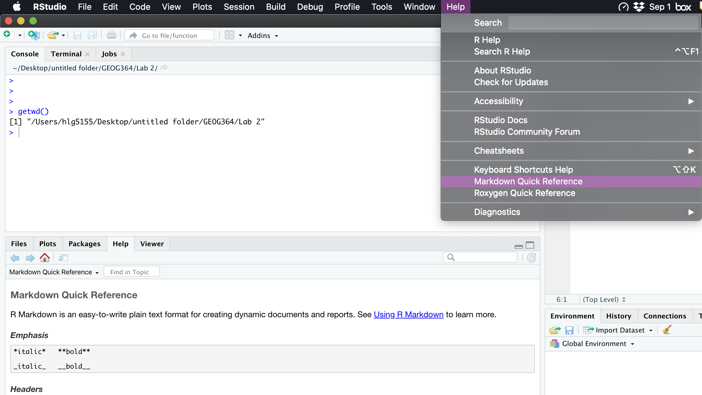

# Lab 2

## Learning objectives {#Lab2learn}

The aim of this lab is to start you out exploring spatial data and to do some basic analysis.  

By the end of this lab, you should be able to: 

 1. Read-in and summarise table/spreadsheet data (data.frames)
 2. Select subsets of a data.frame using square brackets and the $ sign
 3. Plot specific columns of a data.frame against each other (E.g. long/lat)
 4. Understand the main types of spatial data format in R 
 5. Be able to convert your data to either sp or sf format
 6. Load regional and country borders using rnaturalearth
 7. Plot sp data using the base package and interactively using Leaflet
 8. Critically analyse rain-gauge locations in R.
 9. Add a theme, authorship and table of contents to your markdown files.
 
 
## Lab set-up
 
### Create a Lab 2 Project

R Projects are useful because you can easily keep your labs and future projects separate, without losing your code and data. For example,if you want to go back to an old Lab (say Lab 1), you can simply go into the Lab folder and click Lab1.RProj - this will open R and all your old code so you can carry on where you left off.  So, to keep things tidy on your computer, lets create a new R-Project.  

First, make a new project called Lab 2 inside your GEOG364 folder. 

*Hint: Go to the main menu-bar at the very top of the screen, then click: `File` | `New Project` | `New Directory` | `New Project`.  Then call the project `Lab 2` and make sure it's created as a sub-directory of your GEOG-364 folder.  Or follow the instructions in Section \@ref(project).*

Now, go to the File menu/New File/R Notebook to create a new blank lab script. Delete the "friendly text" - see section \@ref(friend) and save it as `GEOG364_Lab2_PSU.ID.Rmd` e.g. `GEOG364_Lab2_hlg5155.Rmd` 

You should see something like the figure below, If you type `getwd()` into the console, it should return the location of the Lab 2 folder on your computer.

```{r, lab2script, echo=FALSE, fig.cap = "What your screen should look like, but the address of getwd() should be the one on your computer. Note that pressing save on the script has automatically made your .nb.html file"}
knitr::include_graphics('images/Fig_2_01_script.png')
```

### Markdown adding a theme

While your lab script is blank, lets focus on the YAML code at the top (lines 1-4).  This makes your html output and there are many ways to customise it.  Your YAML code currently looks like this

```{r,eval=FALSE}
---
title: "R Notebook"
output: html_notebook
---
```

Change the YAML code to look like this (but with your name).  Note, if you copy/paste this and it doesn't work, sometimes the quote marks copy weirdly from the internet - try deleting and retyping the quotes.

```{r,eval=FALSE}
---
title: "Geog-364: Lab 2"
author: "Helen Greatrex"
date: "`r Sys.Date()`"
output:
  html_notebook:
    toc: true
    toc_float: yes
    number_sections: true
    theme: lumen
---
```

The elements we just added are:

 - The title
 - The author
 - Today's date
 - A floating table of contents and numbered sections (this won't appear until you start typing section headings)
 - The document is now in the lumen theme
    
Now, save your file, or click "preview" at the top of the script.  See if it works. 

If you click the knit button to make a html rather than a nb.html, then you will need to add a few extra lines for both output formats.  So yours should look something like this.

```{r, yaml, echo=FALSE, fig.cap = "Where the point & click package install button is"}
knitr::include_graphics('images/Fig_2_00YAML.png')
```

There is a reasonable chance this won't work first time around, as editing the YAML code can be a pain.  It is very case and space sensitive.  For example, the spaces at the start of some lines are important and are created using the TAB KEY, not the space bar.  There is one TAB key before html_notebook (which is now on a new line). There are two TAB KEYS before toc, toc_float, number_sections and theme


*Don't continue until you can make and view your html or nb.html file. If it doesn't work, ask for help before moving on*


**Challenge**

You can view themes for markdown documents here.  https://www.datadreaming.org/post/r-markdown-theme-gallery/

Choose one that works for you and edit your YAML code to load it.


### Installing common spatial packages

Here, we are going to install some of the most common spatial analysis packages: `rgdal`, `raster`, `sp`, `sf`,`leaflet`,`tmap`  and `rnaturalearth`.  This can take some time, so I suggest getting the download running, then returning here to continue reading through the lab notes.

As discussed in the previous lab, you can install these packages EITHER by 

  -  [1] Copy/Pasting this command into the **CONSOLE** (if you put it in a code chunk, it will download and install every single time you run your script, which we don't need):

```{r, eval=FALSE}
install.packages(c("rgdal", "raster", 
                   "sp","sf","rnaturalearth",
                   "leaflet","tmap","remotes"))

 remotes::install_github("AndySouth/rnaturalearthhires")
```

OR  

  -  [2] Going to the Packages menu (next to plots), clicking install, then choosing each package one by one (make sure install dependencies is clicked).

```{r, lab2pack, echo=FALSE, fig.cap = "Where the point & click package install button is"}

```

Once the packages have finished downloading and you can see the `>` symbol again in the console, you can move on.

**In your script, make a new R-code chunk,  Copy this code inside and run it.**  
   
```{r,message=FALSE,Warning=FALSE}
library(rgdal)
library(sf)
library(raster)
library(knitr)
library(sp)
library(raster)
library(leaflet)
library(tmap)
library(rnaturalearth)
```

You should see similar messages to ones that come up here. 

```{r, packagesr, echo=FALSE, fig.cap = "Common friendly messages"}
knitr::include_graphics('images/Fig_2_05_packages.png')
```

If instead of this, you see loads of red error code:

  1. Re-run the code chunk.  Sometimes that clears it up
  2. Check you have spelt everything correctly
  3. Try to re-install the package, then re-run the code chunk
  4. If you are still seeing errors, ask for help.


### Download data for this lab

Now you need to download some data from Dr Greatrex's github repository:

 - A table of weather station locations in Ghana.  
 
Copy/Paste this code either into the console to download the files.

```{r, eval=FALSE}
## Note, the structure of an R command.  We have a function (a command), download.file().  
## R knows it is a function because it has parentheses after it.
## Inside the parentheses are the arguments that R needs to carry out the command 
## (e.g. the address and the filename), separated by commas

filelocation <- "https://raw.githubusercontent.com/hgreatrex/GEOG364_Labs/master/Lab_2/Lab02_GhanaMetStations.csv"

download.file(filelocation, destfile = "Lab02_GhanaMetStations.csv" , verbose=TRUE)
```

The file *should* appear in your Lab 2 folder.  If not, you probably didn't create the project above, or your `getwd()` didn't show your Lab 2 folder.

## Data.frames and summary statistics

### Reading in your first file

**In your script, make a new Section heading called "Data Input".** If you can't remember how to do this, see Section \@ref(Format), or pull up the Markdown Quick Reference Guide (see the Figure below)

```{r, markdownref, echo=FALSE, fig.cap = "The incredibly useful Markdown quick reference"}

```

The data you just downloaded, `Lab02_GhanaMetStations.csv` is essentially a basic spreadsheet called a .csv file (each number is separated by a comma).  You can open this in Excel or notepad to have a look, but don't save it there.

First, we need to load, or read, this file into R. To do this, create a new code chunk and copy this code into it, including comments.

```{r}
# The read.csv command reads in a csv table of data into R.  
# We then save the table as a variable called Stations.
Stations <- read.csv("./Lab02_GhanaMetStations.csv",as.is=TRUE)
```

If it doesn't work, double check that the file actually is in your Lab 2 folder.

If it does work, you should see that "Stations" has turned up in your environment area on your screen, probably on the top right.  If you click on its name, you can have a look at the table, which can be a useful cross check to make sure that it all read into R successfully. Or, if you prefer you can print it into the console or into a code chunk, by typing its name into the console.  

In R, this type of data (a table) is called a **data.frame**.  

```{r, stationslook, echo=FALSE, fig.cap = "First look at the Stations data"}

```

### Summarising data

There are several functions that you can use to summarise data, especially data in a table.  These include: 

 - `str(TABLENAME)`
 - `summary(TABLENAME)`

Where TABLENAME is the name of the data.frame variable you wish to explore.

**Challenge**

Create a code chunk and apply the functions above to Stations.  Then in the text below the code chunk, use the results of your code to answer these questions:

1. How many rows of data does the table have?
2. What is the average Longitude of the stations?


### Selecting columns and rows

Sometimes, we do not want to analyse at the entire data.frame.  Instead, we would like to only look at one (or more) columns or rows.

There are several ways we can select data. 

The first is we can use the `$` symbol to select its name.  For example, to select the Latitude column, you can use the command

```{r, eval=FALSE}
# COLUMN NAMES ARE CASE SENSITIVE
Stations$Latitude
```

Secondly, we can use **square** brackets to numerically choose a column. This follows the format:
TABLENAME[ROWS,COLUMNS]


```{r, eval=FALSE}

# This will select the 5th row and 7th column
Stations[5,7]

# This will select the 2nd row and ALL the columns 
Stations[2,]

# This will select the 3rd column and ALL the rows
Stations[,3]

# We can combine our commands, this will print the 13th row of the Longitude column 
# (no comma as we're only looking at one column)
Stations$Longitude[13]

# The : symbol lets you choose a sequence of numbers e.g. 1:5 is 1 2 3 4 5
# So this prints out rows 11 to 15
Stations[11:15,]

# The "c" command allows you to enter whatever numbers you like.  
# So this will print out rows 4,3,7 and all the columns
Stations[c(4,3,7),]
```


**Challenge**

In a new code chunk, write and run the code to: 

1. Select Rows:4,6,2 and Columns:1 and 2 , then assign it to a variable called subset.

2. Print values/rows 45:50 of the Station.Name column (you will just see 5 names as the answer)

3. Apply the `median()` function to the Latitude column and print the output.  E.g. what is the MEDIAN latitude in the Stations dataset?

4. There is one Station.Name that has been duplicated (a common issue). Apply the `table()` function to the appropriate column to work out which station it is.  Write the name of the station as a COMMENT inside the code chunk below your line of code.


### Basic plot

We can now make a basic plot of our data.  Here we can use the `plot` command along with our new found knowledge to select columns.

```{r}
plot(Stations$Longitude,Stations$Latitude)
```

This gives us the basics but it could be made more professional. Type `?par` into the console, or search for par in help, and R will display a load of arguments that can improve the plot.  For example, here, I have changed the  asp (aspect ratio), pch (point shape) and col (point color) arguments.

```{r}
plot(Stations$Longitude,Stations$Latitude, pch=16, col="blue")
```


**Challenge **

Make a new code chunk and make a plot of the station locations.  Your plot should include:

 - Red points 
 - An aspect ratio of 1 (`asp` argument)
 - Better x and y labels (`xlab` and `ylab` arguments)
 - A point size of 0.5 (`cex` arguments)

Although this plot is OK, it's not great.  The next section shows how  to improve using the specific spatial packages available in R.


## Converting to spatial data

R is not clever.  It's a bit like working with a toddler.  *We* might know that the words Longitude and Latitude have special spatial meaning for our Stations table, but R is not intelligent enough to work this out. So, several dedicated packages have been developed in R specifically for spatial data. There are four "mainstream" packages dedicated to dealing with both vector and raster spatial data:

 -  `sp` 
 -  `sf`
 -  `raster`
 -  `terra` (not covered in this course but likely the future)
 
Many package authors will write their commands assuming that your data is in a specific spatial format (e.g. sp).  So understanding how to read in data into different formats is a useful skill.

There are also some very specific packages which are slightly different.  We will touch upon later in the semester, such as the `ppp` package for point pattern analysis, or `ncdf4` for netcdf analysis.  Others might link to google maps or ESRI products.


### Making a data.frame "spatial"

We are now going to focus on two very similar packages, sp and sf. 

**To convert a data.frame to a SF object, we use the st_as_sf command:**

```{r}
#--------------------------------------------------------------------------
# To convert to sf format
# Here, "Longitude" and "Latitude" should be the 
# EXACT CASE-SENSITIVE COLUMN NAMES of your x and y columns in your table.  
# There is nothing special about the words longitude and latitude here
#--------------------------------------------------------------------------
 Stations_sf <- st_as_sf(Stations, coords = c("Longitude", "Latitude"))
 Stations_sf
```

**To convert a data.frame to a SP object (a spatialpointsdataframe), we simply tell it what the coordinates are:**

```{r}
#--------------------------------------------------------------------------
# Or convert the original table to sp format
#--------------------------------------------------------------------------
 coordinates(Stations) <- c("Longitude","Latitude")

# Print out the result.  You can see that R now sees it as a "Spatial Points Data.frame"
 Stations

```

Let's talk about the new information R is providing.  We have

 - **class:** You can have a spatial *points* dataframe, a spatial *lines* dataframe, or a spatial *polygons* dataframe. So you can see what type of vector data you have
 - **features:** How many points are there (equivalent to the number of rows)
 - **extent:** What is the furthest North/South/East/West that the data extends
 - **crs:** The map projection.  See the next section
 - **variables** How many attributes of the data do we have? We just have one, Station.Name
 - **names:** The names of your attributes (the other things you can plot)
 - **min values and max values** Some information about the attributes, in our case the first and last station.


You might find that you run the coordinates command once without error, but the second time around you see something like this:

```{r, coordinates, echo=FALSE, fig.cap = "A common error"}
knitr::include_graphics('images/Fig_2_04b_coordinates.png')
```

This is because the coordinates command changes a TABLE into spatial data.  But if you run it again, you are trying to convert spatial data into more spatial data and R gets confused.  So you can completely ignore this error - it means everything is working fine.


**Challenge **

Make a new heading called "Spatial Analysis" 

Underneath that, create a new code chunk and use the code above to convert your Stations data to **sp** format.  In the console, type plot(Stations). Your plot should now look very different.

Above the code chunk, in the white text, explain what you just did.


```{r, stationplot, echo=FALSE, fig.cap = "Plotting the data now it is sp format"}
knitr::include_graphics('images/Fig_2_06_StationPlot.png')
```

### Reading in vector line data (rnaturalearth)

Let's now also include some vector-line data on top of our points, but adding in some regional administrative boundaries. In later labs, we will learn how to read in vector data from a file, but this time we are going to use data that is already built into R.  

This is part of the `rnaturalearth` package, which links automatically with the "Natural Earth" dataset, found here: https://www.naturalearthdata.com/features/

For administrative border data, we can use the `ne_countries` or the `ne_states`commands. For example, this would load the entire world borders and assign it to a variable called worldborder.

```{r}
# You can choose if you want the output to be sf or sp data
worldborder <- ne_countries(scale = "medium", returnclass = "sp")
plot(worldborder)
```

and this would load the regional boarders for the United Kingdom

```{r}
# You can choose if you want the output to be sf or sp data
UK <- ne_states(country="united kingdom",returnclass = "sp")
plot(UK)
```

**Challenge**

1. In your script, make a new section heading called "Vector data".

2. Now make a new code chunk and use the `ne_states` command to load regional borders for Ghana.  Assign it to a variable called `ghana`.

3. Above the code chunk, in the white text, explain what you just did.


## Assigning a map projection

Map projections and coordinate system are an essential part of spatial statistics.  Also, say we want to overlay country boarders on our points.  In that case, the coordinate systems of the shapefiles need to be identical.  

R makes use of the PROJ4 library which is a set of character strings that defines a coordinate system (a datum and/or map projection definition). The PROJ4 character string syntax consists of a list of parameters, each prefixed with the + character.  For example, 

 - the familiar UTM grid system is defined by `+proj=utm`
 - the specific zone number (e.g., 19) is defined by `+zone=19` 
 - and the datum (e.g., NAD 1983) is defined by `+datum=NAD83` 
 
 Putting these parameters together, we would see something like this:

`"+proj=utm +zone=19 +datum=NAD83 +no_defs +ellps=GRS80 +togrs80"`

A list of a the PROJ4 map projection names and their parameters used in defining a coordinate system can be found here: https://proj.org/operations/projections/index.html.  We will also discuss this in more detail in later labs.

If you are  interested in projections, for a comprehensive guide, use this resource: https://bookdown.org/robinlovelace/geocompr/reproj-geo-data.html

### Checking a projection in the **sp** package

In most cases, dealing with spatial data will involve changing the datum definition, map projection, or one of the map projection parameters (such as the central meridian or standard parallels).  You can check the existing projection using the `projection` command:

```{r, eval=FALSE}
## Here SPATIALDATA is the name of the object you want to examine
projection(SPATIALDATA)
```

**Challenge**

In a new code chunk, print out the projection of `Stations` and also the projection of `ghana`. You should see that one is "NA" and one is a common long-lat projection: `"+proj=longlat +datum=WGS84 +no_defs +ellps=WGS84 +towgs84=0,0,0"`.

Above the code chunk, in the white text, explain what you just did.

This can causes problems!  If our map projections are different for different datasets, then they will not align with each other in any plots or analysis.

So lets change the projection of Stations.


### Assign/changing projections in the sp package

To change a projection:

IF THE PROJECTION IS NA: To set the first ever coordinate system for an **sp** object, you would use the the `CRS` command

```{r, eval=FALSE}
# Nothing should happen when you run the code chunk if there's no error
# Here SPATIALDATA is the name of the object you want to assign a projection to
# proj4string(SPATIALDATA) <- CRS("your projection code")

#e.g. to change the projection of Stations to UTM, the code would be as follows
proj4string(Stations) <- CRS("+proj=utm +zone=19 +datum=NAD83 +no_defs +ellps=GRS80 +togrs80")

# THIS WILL NOT WORK IF YOUR DATA ALREADY HAS A PROJECTION
```

If your data ALREADY HAS A PROJECTION: you can change it using the `spTransform` command

```{r, eval=FALSE}
# Nothing should happen when you run the code chunk if there's no error
# Here SPATIALDATA is the name of the object you want to assign a projection to
Stations <- spTransform(Stations,"+proj=longlat +datum=WGS84")
```

This also means that if you re-run your chunk you might get a warning or an error.  Because you set the original projection once using CRS, but a quirk of R means it will show an error if you try to set the projection of something that already has one assigned.  So again, if you are running twice and see an error you can ignore it.

**Challenge**

In a new code chunk,  assign the projection of your Stations data to be this CRS: `"+proj=longlat +datum=WGS84"`

```{r,echo=FALSE,warning=FALSE, message=FALSE}
# You can choose if you want the output to be sf or sp data
proj4string(Stations) <- CRS("+proj=longlat +datum=WGS84")
ghana <- ne_states(country="ghana",returnclass = "sp")
```


### Map projections in the **sf** package

The same kind of transformations can also take place in sf formats. Unlike with RGDAL, you would use `sf_transform()` for sf formatted data. 


## Interactive Leaflet plots

Let's now see how our data looks plotted.  Create a new sub-heading called "Data Plots", then in a new code chunk enter the following code. You should see a basic plot that looks like this.  If so, congrats!  If not, you need to adjust your projections or something has happened.

```{r}
plot(Stations)
plot(ghana,add=TRUE)
```

The plot above is still pretty basic, so lets explore some of the big packages available to let you make "pretty plots" of spatial data.  There are three big mapping functions in R:  ggmap, tmap and leaflet.  

Today, we are going to make some interactive maps using Leaflet - an interactive mapping tool that goes far beyond R.  Watch the video to get a sense of it.

<iframe width="560" height="315" src="https://www.youtube.com/embed/CUZ6oSLTzlc" frameborder="0" allow="accelerometer; autoplay; encrypted-media; gyroscope; picture-in-picture" allowfullscreen></iframe>

To make our first Leaflet plot, we will ignore the %>% symbol you saw in the video.   Essentially we make a leaflet map by adding layers.  At the end, we print the map by typing its name.  

```{r}
# leaflet makes maps in layers and only at the end, prints out the final map

#LAYER1
mymap <- leaflet(data = Stations)   
#LAYER2
mymap <- addProviderTiles(mymap, providers$Stamen.Toner) 
#LAYER3
mymap <- addCircleMarkers(mymap, label = ~as.character(Station.Name),
                          radius=.3,opacity = 0.8)  # R doesn't care if one command is on 2 lines..
#LAYER4
mymap <- addPolygons(mymap, data=ghana,weight=2,col = 'red',fillOpacity = 0) 
#LAYER5
mymap
```

In this case we have:

 1. LAYER 1: Load the Stations data into leaflet and assign it to a variable called mymap
 2. LAYER 2: Use `addProviderTiles` to add a custom map background onto  mymap. You can find different examples here:  http://leaflet-extras.github.io/leaflet-providers/preview/index.html
 3. LAYER 3: Add custom markers to mymap, each one labeled with the Station.Name (taken from the Station.Name column of the data.frame) 
 4. LAYER 4: Add the country borders from the ghana data. These are actually polygons, so make sure the fillOpacity is 0 to only show the border. 
 4. LAYER 4: Print the final map

**Challenge ** 

Copy the code above into your own code chunk.  Then change the map background to be something more informative (your choice). 

## Describe the Ghana data

Even though we are going to learn some advanced spatial techniques in GEOG-364, **one of the most important ways to analyse spatial data is to look at it and explore its features.**

We often want to map rainfall across the world.  Because rainfall is a field (there is a value everywhere), it would initially make sense to spread your rain-gauges out in a uniform grid.  Yet, in Ghana at least, this is not what is happening.

Examine the Ghana rain-gauge data in your leaflet plot.  Try different map backgrounds (terrain, land-use, others..).  Try to understand *why* the data is spatially distributed the way it is.  Now in your text, explain:

 - What type of data are we looking at?
 - What map projection does it have? 
 - You describe the spatial structure of the data and any key features that it has
 - You describe *why* you think the data looks this way spatially. Provide evidence for your answers (you can have multiple plots if you want)
 - What features in the data would concern you if you were a data scientist?  Can you see any likely errors?


## Show me something new

*This section is going to be a feature of all of your labs in GEOG-364 and likely in GEOG-464.  It is designed to challenge you and push your R programming skills forward. One of the reasons an "A" is set at 90% is so that you can skip this section and still get an A, but I encourage you to try it as often as possible.* 

Create a new section header called "Show me something new".  Beneath this, you need to show some new code or some new aspect of Markdown that goes beyond the lab. It doesn't have to be long. You should also explain in your text or comments what the code does and what you are hoping to achieve.  

So you get used to the concept, in GEOG-364 I will always try to give some suggestions or inspiration.

If you are struggling, you can show me some minor additions to existing code for 2.5/5 marks. For example:

 - Copying code from earlier in the lab to plot the Station data, then changing the point type (pch) to crosses, or making the colors transparent
 - Adding a new YAML element (you will have to do this at the top and describe what you did here)
 - Showing me you know how to do some new markdown format (tables, links), https://rmarkdown.rstudio.com/lesson-6.html
 - Something you think of - be creative!
 
For full marks you need to demonstrates the use of a function or package that was not specifically covered in the handout, lecture, or lab. For example:

  - Plotting the station data / borders using something like ggmap or tmap
  - Loading the RColorBrewer data and using that for your plots
  - Loading a rnaturalearth raster file and plotting that (bonus if it's over Ghana and you can plot your points on top)
  - Loading a relevant shapefile and plotting it over the Ghana data.
  - Do something with a completely new package - this can be fun, like library(emojifont)
  - Or your idea (welcomed)

You will lose 2 marks for not explaining in the text what you are trying to achieve and what the commands are that do so. It should be clear you understand your code.

  
## Lab submission check

**MARKDOWN/CODE STYLE - 5 MARKS**

Your code and document is neat and easy to read. You have section headings, have clearly labeled your answers or described what you are trying to do in the code.
    
**YAML - 10 marks**

You have adjusted your YAML code to include a theme, author, data and table of contents.  This should show up in your final nb.html or html file
     
**R-BASICS - 30 marks**

You correctly answered all the questions in Section 2.3 "Data Frames"

**SPATIAL BASICS - 20 marks**

You checked the projections of Stations and ghana and adjusted the map projection of the Station data to be long/lat  Section 2.10.  You also plotted the ghana and Station data using the standard plot function and Leaflet (where you changed the theme)

**GHANA DESCRIPTION - 20 marks** 

You included a thoughtful, well organized, and articulated response to the question about the Ghana gauges

**SOMETHING NEW - 5 marks**

You made a minor change to an existing piece of code (2.5/5)
OR
You demonstrated the use of a function or concept that was not specifically covered in the handout, lecture, or lab (5/5)

**HTML FILE SUBMISSION - 5 marks**


**RMD CODE SUBMISSION - 5 marks**


[100 marks total]


**THERE IS NO CANVAS QUIZ WITH THIS LAB**


