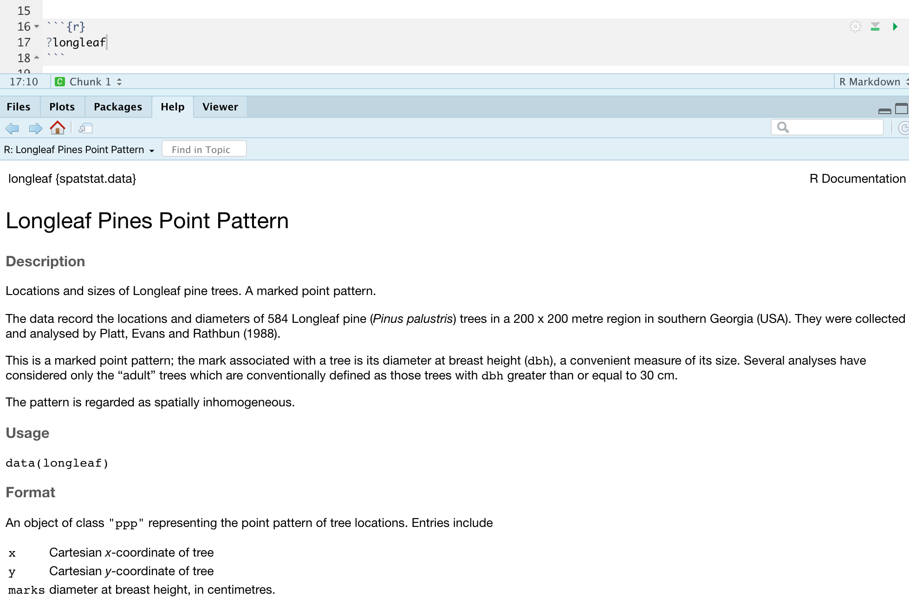

# Lab 3

## Learning objectives {#Lab3learn}

Welcome to Lab 3, where we are going to focus on Point Pattern Analysis. A point pattern dataset events or objects occurring in a defined study region. These events could represent anything with a specific measurable location, from greenhouses to stars.

**Objective:**  The goal of Lab 3 is to learn some introductory spatial statistical approaches for characterizing first-order properties of a point pattern.  We will be focusing on quadrat analysis, kernal analysis and standard ellipses.

**Data-sets:** You will be working with two separate point pattern datasets that are already built into R.

 - The first dataset, called longleaf pine, is a marked point pattern containing locations and diameter measurements of longleaf pint trees in a forest in Georgia.  All your examples here in this lab book will analyse this dataset.
 - The second dataset is called bei and is also related to trees. You will be analysing this one and will find out more as you go


```{r,  ppp0, echo=FALSE, fig.cap = "The two point datasets we are exploring"}
knitr::include_graphics('images/Fig_3_00ppp.jpg')
```


## Lab 3 Set-Up

### Create your Lab 3 project file

Open a new version of R-studio.  Click the file menu, then new project in a new directory.  Select your 364 directory, then name the project Lab 3.  If you are stuck on this process, see the start of Lab 1 and Lab 2.  

You can check this has worked by looking on the file explorer on your computer, then selecting your GEOG364 folder and checking that a Lab 3 folder has appeared with your Lab3.Proj file inside it.


### Install new packages

There are two specialist packages called "spatstat" and "car" which focus on point pattern analysis.

#### Install the spatstat package

To make sure you do not include the install.packages command in your .Rmd file, please install it by clicking the "install button" in the packages menu.   Click on the install button, then start typing spatstat,select it and press install.  

*If you are a Windows user, you will see a message at the beginning of the install process saying that you need to install R-Tools.  IGNORE THIS - You probably don't need to install R-Tools *


```{r, installbutton3, echo=FALSE, fig.cap = "You can click the button and simply type the name if the package you want to install"}
knitr::include_graphics('images/Fig_3_01_install.png')
```

The install might take a few minutes.  Once it has finished, test it has worked by typing `library(spatstat)` into the console.  you should see some messages like this.

```{r, spatstat3, echo=FALSE, fig.cap = "The messages that appear when I load spatstat for the first time"}
knitr::include_graphics('images/Fig_3_02spatstat_library.png')
```


There is a lot of text, but unless you have a load of things that say ERROR, you can ignore it.  (Don't worry about the out of date message).  One way to check is to run the code chunk twice as shown in the screenshot.  If the second time the messages disappear then you don't need to worry.

IF THIS PACKAGE HASN'T LOADED OR INSTALLED CORRECTLY, TALK TO AN INSTRUCTOR.

#### Install the car package

Now, repeat the process for the `car` package.  This might take a while to download.  You should see something like this.

```{r, car3, echo=FALSE, fig.cap = "The messages that appear when I load car for the first time"}
knitr::include_graphics('images/Fig_3_03Car.png')
```


IF THIS PACKAGE HASN'T LOADED OR INSTALLED CORRECTLY, TALK TO AN INSTRUCTOR.

### Create your NoteBook file

1. Now, go to File/New File and create a new R-NOTEBOOK file.
2. Delete the friendly text (everything from line 6 onward)
3. Save your file as ``GEOG364_Lab3_PSU.ID.Rmd`` e.g. `GEOG364_Lab3_hlg5155.Rmd`
4. Follow Section 2.2.2 to modify your YAML code (you can keep lumen as a theme or try your own)


5. Add a new code chunk.  Inside add the following code and run it.

```{r, message=FALSE,warning=FALSE}
library(spatstat)
library(sp)
library(car)
```

The reason we are adding this just after typing it into your console is that these library commands need to be run every time you open R.  So we put them in a code chunk right at the top of your Note Book file.

Now click the Preview Button and make sure everything looks correct.  

IF THERE ARE PROBLEMS, TALK TO AN INSTRUCTOR

## Initial Data exploration

### Loading the data

In this lab, we are going to use two datasets that are already built into the spatstat package.

 - All of the examples in this lab book are based on a dataset called `longleaf` 
 - You will be conducting your analysis on a dataset called `bei`

The advantage of this is that we don't have to worry about file formats or Map Projections for now.

But first, we need to load them into R studio

Below your code chunk, make a new heading called Initial Data Analysis.  Remember to leave a blank white line before and after your headings.  If you can't remember how to do this, go to `Help/Markdown Quick Reference` (where Help is the menu right at the top of your computer screen) or see Lab 1 or 2.

Now make a new code chunk.  Inside add:

```{r}
# This loads the internal dataset from R.
data(longleaf)
data(bei)
```

Run the code chunk and you should see the longleaf and bei datasets appear in your environment quadrant on the screen (top right).  

From now onward, you do not have to run the longleaf examples because you can see the output in this lab script, but the data is there if you want to test examples.

**Your job is to understand the `bei` dataset.**


### Reading more information

Because the longleaf and bei datasets are internal, they have their own help file.  To view the help file for the longleaf data, I create a new code chunk, and run the command:

```{r, eval=FALSE}
# putting a ? at the start means look at the help file
# this will only work for commands and data built into R.
?longleaf  
```

The help file now opens onto my screen:

```{r, helpfile3, echo=FALSE, fig.cap = "The longleaf help file"}

```


We can see a lot of information from this file:

 - My data is a point pattern dataset containing locations and diameter measurements of longleaf pint trees in a US forest in Georgia
 - There are 586 pine trees in the dataset
 - The data was collected and analysed by Platt, Evans and Rathbun in 1988
 - The data is *marked*. So it is not just locations, but it also contains additional information about the diameter of each tree trunk (in cm).
 - The data is stored as a "ppp" object (which is a point pattern file type)
 - The ppp object also contains information on the region (i.e., window) that was chosen for the study. In this case it is a rectangle with an X coordinate range of 0-200 and a Y coordinate range of 0-200, with units in meters.


I then made an initial plot of the longleaf data. Because the data is marked, the size of the circle automatically corresponds to the marks, the diameter of the tree trunk.  

```{r}
plot(longleaf)
```

## Lab-3 Challenge 1

1. Make sure you have a code chunk that loads the packages using library, AND one that loads the data using the data commnd.  If not, go back and reread the section.

2. In a new code chunk, use the instructions above to load the help file for the `bei` data.  Understand what the data is, how much data there is and whether it is marked. You are welcome to write notes here, but you will be assessed on your knowledge of this in the Canvas lab-3 quiz Q1 and Q2.

3.  Create a new code chunk and make a plot of the `bei` data.  Comment underneath the plot about whether you see any spatial autocorrelation (positive/negative/zero), plus which spatial fallacies might cause problems in this lab.


## Mean Centre and Standard Ellipse

Firstly, let's look at some summary statistics.  The easiest thing to consider is the spatial mean, where we take the mean of all the x values vs all the y values.  


```{r}
x.mean.longleaf <- mean(longleaf$x) 
y.mean.longleaf <- mean(longleaf$y)

print(x.mean.longleaf)
print(y.mean.longleaf)
```

We can also add a standard ellipse using the dataEllipse command in the `car` package.

```{r}
dataEllipse(longleaf$x, longleaf$y, levels=0.68, 
            fill=TRUE, fill.alpha=0.1, # Fill the ellipse with transparent grey
            pch=16, cex=.5,            # filled small dots
            xlab="x (m)",ylab="y (m)",         # labels
            col= c(rgb(red=0, green=0, blue=0, alpha = 0.5),"blue")) # Slightly transparent points & blue ellipse

```

The reason this is often useful is that we can see if the overall distribution changes over time e.g. imagine repeating your survey of longleaf pines in 10yrs time and seeing if the distribution has changed with climate change or urbanization.


## Lab-3 Challenge 2

1. Make a new heading called Standard Ellipse

2. Make a new code chunk and find the spatial mean of the `bei` data

3. Create a new code chunk and plot the standard ellipse of the `bei` data.  

This corresponds with questions 3 and 4 in the Canvas Lab 3 quiz.


## Global Density analysis

Let's move beyond summary statistics. In the rest of this Lab, we will study the variation of the observations’ *density* across a study area, essentially giving us clues about the non-uniformity of space

For example, the distribution of trees might vary across a landscape from North to South due to climate conditions, or show a more complex spatial pattern based on underlying soil characteristics.  These underlying factors could easily result in some areas having dense clusters of trees and other areas causing clearings.  

This phenomenon is called **First order** spatial variation. AKA the underlying geography is causing the patterns we see  (rather than a each individual point influencing the other points around it)


```{r, autocorr3, echo=FALSE, fig.cap = "plot from "}
knitr::include_graphics('images/Fig_3_05autocorrelation.png')
```


The first way to look at this is to examine the overall density of points over the entire field, known as the global intensity. This is simply the average number of points per grid-cell.  We say it's "global" because we only calculate one number for the entire study area.  

Mathematically, the overall intensity of a point process can be calculated via the following equation, where n is the number of points within our region and A is the area of the region.

$$\lambda=\frac{n}{A}$$


In R, we can do this simply by looking at the summary command.   For the longleaf data, I am going to make a new code chunk and run

```{r}
summary(longleaf)
```

Where we can see:

 - That the global intensity of the pattern is 0.0146 trees per square metre (note the units). 
 - This also gives us a summary of some information from the help file 
 - It also summarizes our marks. We can see that the thinnest tree trunk has a diameter 2cm and the largest, 75.9cm.  
 Finally it tells us the shape and area of our boundary box containing all our points is 200x200m. Note, this bounding box doesn't *have* to be rectangular.
 
 
## Lab-3 Challenge 3

1. Create a new subheading called global intensity

1. Create a new code chunk and use the example above to work out the global intensity of trees in the bei dataset


## Local intensity - quadrat analysis

Instead of a single number for intensity, we can examine how the point density varies across the study area.  The simplest way to do this is by a technique called *quadrat analysis*.   To do this we will:

1. Divide the region into a series of equally sized quadrats/rectangles
2. Calculate the intensity of the point process in each quadrat, to see how it varies

This can be done in R using the quadratcount command from the spatstat package.

```{r}
Q <- quadratcount(longleaf, nx = 4, ny = 4)
print(Q)
```

The above command divides the longleaf dataset in 16 equally sized square grid-cells, or quadrats. I have specified 4 quadrats in the x direction and 4 in the y direction.  It then returns a count of the number of points in each quadrat as well as the size of each quadrat. 

In this case we can see that the area is 50*50 = 2500m

The above data is for counts, so we can either divide each value by 2500 or simply use the intensity command to print the intensity:

```{r}
# Print the density for each quadrat
# This is literally the counts in each box divided by the area of each box, 2500m^2
intensity(Q)
```

We can also plot this to make it easier to interpret:

```{r}

plot(longleaf,           # I'm plotting the longleaf data
     use.marks = F,      # I didn't want it to plot the different circle sizes so i turned off marks
     cex = 0.5, pch = 4, # point size and shape    
     main="Longleaf quadrat count") # plot title

Q <- quadratcount(longleaf, nx = 4, ny = 4)  # Calculate the quadrat counts.
plot(Q, add = TRUE, cex = 2)  # Now I add Q on top.
```

I can see the there are 15 points in the bottom right quadrat compared to 34 in the top left.  In future labs, we will assess if this variation is statistically significant.

Or we can also plot the intensity, because the colours make it simpler to see patterns.

```{r}
# Plot the intensity
plot(intensity(Q, image=TRUE), main="Point intensity", las=1)  # Plot intensity raster 
plot(longleaf, pch=20, cex=0.6,  add=TRUE)                     # Add points
```

Finally, I am going to calculate the Variance Mean Ratio, which gives an assessment about whether the data is clustered, uniform or random (AKA levels of spatial autocorrelation):


```{r}
# we use the as vector command to convert the data from a spatial ppp object back to a normal number
longleaf.variance <- var(as.vector(Q)) 
longleaf.mean <- mean(as.vector(Q))

longleaf.VMR <- longleaf.variance / longleaf.mean
print(longleaf.VMR)

```

Overall, does this show the data is clustered or not?

## Lab-3 Challenge 4

1. Create a new subheading called quadrat analysis

2. Follow the example above, but replacing longleaf with bei - to create a quadrat analysis for the bei data. You should include:
 - A table of counts
 - A table of intensities
 - A plot of counts
 - A plot of intensities

3. Calculate the Variance Mean Ratio for the bei data.  

You will need these to answer questions in the Lab 3 quiz.


## Issues with quadrat analysis

Quadrat analysis is susceptible to some major spatial fallacies and problems.  As described in the mgimond e-text-book: 

*"The choice of quadrat shape and size will influence the measure of local density and must be chosen with care. If very small quadrat sizes are used you risk having many quadrats with no points which may prove uninformative. If very large quadrat sizes are used, you risk missing subtle changes in spatial density distributions."*

For example, changing the quadrat box size affects the strength of the north-west / south-east gradient we see here.    Equally, there are clear clusters in the underlying data and analysis hasn't really captured those at all.

I want to explore the impact of changing quadrat size with the longleaf data.


```{r}
par(mfrow=c(row=1,col=3),mar=c(1,1,1,3)) # set up 3 subplots in a row 

# 2 x 2 gridcells
Q.A <- quadratcount(longleaf, nx = 2, ny = 2)                   # Split into 2x2 quadrats

plot(intensity(Q.A, image=TRUE), main="", las=1)                # Plot intensity raster
plot(longleaf, pch=20, cex=0.6, col=rgb(0,0,0,.5), add=TRUE)    # Add longleaf points
plot(Q.A, add = TRUE, cex = 2,col="white",font=2)               # Add numbers

####

# 4 x 4 gridcells
Q.B <- quadratcount(longleaf, nx = 4, ny = 4)                   # Split into 4x4 quadrats

plot(intensity(Q.B, image=TRUE), main="", las=1)                # Plot intensity raster
plot(longleaf, pch=20, cex=0.6, col=rgb(0,0,0,.5), add=TRUE  )  # Add longleaf points
plot(Q.B, add = TRUE, cex = 2,col="white",font=2)               # Add numbers

####

# 12 x 3 gridcells
Q.C <- quadratcount(longleaf, nx = 12, ny = 3)                  # Split into 12 x 3 quadrats

plot(intensity(Q.C, image=TRUE), main="", las=1)               # Plot intensity raster
plot(longleaf, pch=20, cex=0.6, col=rgb(0,0,0,.5), add=TRUE)   # Add longleaf points
plot(Q.C, add = TRUE, cex = 1,col="white",font=2)              # Add numbers

```
 
One final important note for quadrat analysis, is that it is typically good to keep the numbers IN EACH QUADRAT to be at least 30.  Otherwise you have an even higher likelihood of seeing patterns just by random chance.

## Lab-3 Challenge 5

1. Create a new code chunk, then copy and paste the code above into it.  Replace all the longleafs with bei (there are 6 instances) and run to check it works

2. Now, modify the code chunk to:

  + Make your subplots in 1 column but in 3 rows (e.g. arranged vertically)
  + plot quadrat counts for 
      + 4 quadrats (2 in the x direction and 2 in the y direction), 
      + 20 quadrats (5 in the x direction and 4 in the y direction), 
      + 100 quadrats (10x10)
      
Below the code chunk, write about the features you observe when modifying the number of quadrats for the bei data.  This is a classic example of a spatial fallacy.  Which one and why?


## Kernel Density Estimation (KDE)

Kernel Density Estimation is another method that we can use to explore point pattern densities.  As described in https://sites.warnercnr.colostate.edu/wtinkham/courses-taught/nr-512-spatial-statistical-modeling/nr-512-exercise-descriptions/nr-512-exercise-3/, 


*"Quadrat counting is useful for characterizing the intensity of an inhomogeneous point process, however there are limitations including:*

– *The choice of origin, quadrat orientation, and quadrat size affects the observed frequency distribution.*
– *A significant amount of spatial data is lost.*

*KDE algorithms use a moving window approach to characterize intensity. This approach tends to preserve a greater amount of spatial detail and does not suffer as much from choices of origin, quadrat orientation, and quadrat size as compared to quadrat counting."*


Conceptually, a smoothly curved surface is fitted over each point. The surface value is highest at the location of the point and diminishes with increasing distance from the point. There will be more about this in the lectures.

To apply it in R, we simply use the density command.  For example, for the longleaf data, I would create a new code chunk and type.


```{r}
PointDensity <- density(longleaf)
plot(PointDensity)

# Individual events can be added to the plot by adding our original points to the plot.
 plot(longleaf, add = TRUE,
      use.marks = F, cex = 0.5,pch=16) # i'm ignoring the tree diameters and want small filled dots
```

So you can see that instead of quadrats, we now have a smooth surface. 

In the density command above, the size & shape of the smoothing window, (known as the "bandwidth") is calculated automatically using a ‘rule of thumb’. It defaults to 0.9 times the minimum of the standard deviation and the interquartile range divided by 1.34 times the sample size to the negative one-fifth power.

However, the bandwidth can be scaled via the sigma parameter within the density command:


```{r}

par(mfrow=c(row=1,col=3),mar=c(1,1,1,1)) # set up 3 subplots in a row

plot (density(longleaf, sigma = 5, # change bandwidth by altering the value assigned to sigma
              main="Bandwidth=5"))
plot(longleaf, add = TRUE,use.marks = F, cex = 0.5,pch=16)

plot (density(longleaf, sigma = 20, # change bandwidth by altering the value assigned to sigma
              main="Bandwidth=20"))
plot(longleaf, add = TRUE,use.marks = F, cex = 0.5,pch=16)

plot (density(longleaf, sigma = 100, # change bandwidth by altering the value assigned to sigma
              main="Bandwidth=100"))
plot(longleaf, add = TRUE,use.marks = F, cex = 0.5,pch=16)
```

## Lab-3 Challenge 6

1. Create a new sub-heading called Kernel Density Estimation

2. Use the example above to run KDE for the bei data and try modifying the bandwidth using the following numbers:  5, 10, 30, 70, 100, 200.  (you just have to edit the bandwidth and discuss the result. YOu do not have to show all 7)

3. Below the code chunk, write what impact modifying the bandwidth has on your results.  What happens at very low vs very high bandwidths?

4.What is the "best" bandwidth?  Make sure your plot shows your final choice  Why did you choose that number?

## Automatically calculating an "optimal" bandwidth

Different statisticians have come up with different ways to automatically calculate the "optimal" bandwidth. For example
1. `bw.diggle()` - minimizes the mean-square error criterion defined by Diggle (1985)
2. `bw.frac()` - uses a quantile of the distance between two independent random points in the window 3. 3. 3. `bw.stoyan()` - sets the standard deviation of the kernel

You can look at the R help to understand in more detail how they work (e.g. type ?bw.diggle into your console)

Here I will apply the diggle() function to estimate a bandwidth for the data 

```{r}
# Report the value of the bandwidth
optimal_diggle <- bw.diggle(longleaf)

# do the density plot
plot (density(longleaf, 
              sigma = optimal_diggle), # use the diggle function to automatically guess bandwidth
              main=paste("Diggle Bandwidth Estimation = ",round(optimal_diggle,3)))

plot(longleaf, add = TRUE,use.marks = F, cex = 0.5,pch=16)

```

## Lab-3 Challenge 7

Apply the code above to your script to calculate and plot an "optimal" bandwidth for the bei data.

Finally, reflect on the lab and look back at the outputs you have made.  If someone asks you about the spatial distribution of trees in the area, what would you tell them and which plots and analyses would you use (or not use!) to provide evidence.  Write your thoughts below the code chunk.


## Lab-3 Show me something new

Make a new sub-heading called Something new.  

You have three options this week:

A - You can show me some minor additions to existing code for 2.5/5 marks. For example:

 - Showing me you know how to do some new markdown format (tables, links - see here for inspiration: https://www.statpower.net/Content/310/R%20Stuff/SampleMarkdown.html)
 - Adding a new minor YAML element (you will have to do this at the top and describe what you did here)
 - Adding contours to the Kernel density data using a command such as 
     + contour(density(bei), add=TRUE, col = "white")
 - Create a 2x2 grid of plots or add a new plotting format.

B - For 5/5 you need to demonstrates the use of a function or package that was not specifically covered in the handout, lecture, or lab. For example:

 - Adding a new colour palette from somewhere like R colorbrewer to your Kernel Density plots
 - Adding country or regional borders to these plots
 - Add a paragraph where you explain quadrat and/or kernel density and properly include equations using the R markdown equation format.  E.g. they should look like mathematical equations in a text book.
 - Reading/loading in a new point pattern, converting to ppp and running one analysis on it
 - Do something with a completely new package or function
 - Delve into some of the more complexities of the analysis - https://mgimond.github.io/Spatial/point-pattern-analysis.html#local-density 
 - Apply one of the other optimal bandwidths to the KDE data e.g. bw.frac or bw.stoyan 
 
 C - For 5/5, complete an optional extra extension to this work where we use quadrat analysis to assess whether elevation impacts the bei data.   

Go to this link: https://sites.warnercnr.colostate.edu/wtinkham/courses-taught/nr-512-spatial-statistical-modeling/nr-512-exercise-descriptions/nr-512-exercise-3/

Then scroll down to the end where it says: "In the quadrat counting example above, we used a series of equally sized quadrats to characterize the intensity of a ppp object. In quadrat counting methods, any choice of quadrats is permissible. From a theoretical viewpoint, the quadrats do not have to be rectangles of equal area, instead they could be regions of any shape. Quadrat counting is more useful if we choose the quadrats in a meaningful way. One way to do this is to define the quadrats using covariate information."  

Work from that point onward to show how quadrat analysis can be used to link a variable such as elevation to your point pattern.


## Lab-3 submission check

    
**HTML FILE SUBMISSION - 5 marks**

**RMD CODE SUBMISSION - 5 marks**

**LAB CHALLENGE 1 to 4 - 10 marks total**

You included all the requested code/analysis and your code runs for the BEI data (not the longleaf data!)

**LAB CHALLENGE 5 - 10 marks**

You thoughtfully explored the impact of changing the quadrat size and shape on the bei data, providing the requested code and outputs.

**LAB CHALLENGE 6 - 10 marks** 

You chose your best bandwidth for the bei data, showed it on your plot and justified your choice.

**LAB CHALLENGE 7 - 10 marks** 

You calculated an optimal bandwidth for the data and included a thoughtful, well organized, and articulated response to your reflections on the lab.

    
**SOMETHING NEW - 5 marks**

You made a minor change to an existing piece of code (2.5/5)
OR
You demonstrated the use of a function or concept that was not specifically covered in the handout, lecture, or lab (5/5)

**MARKDOWN/CODE STYLE - 5 MARKS**

Your code and document is neat and easy to read. You have section headings, have clearly labeled your answers or described what you are trying to do in the code.


[60 marks total]
**THERE IS A CANVAS QUIZ WITH THIS LAB FOR THE OTHER 40 MARKS**
 


