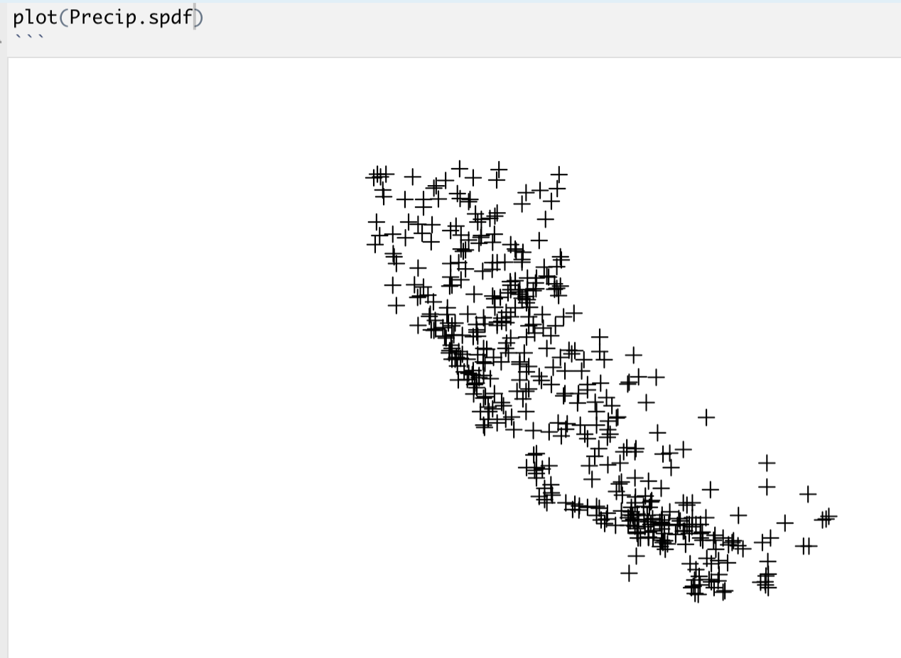
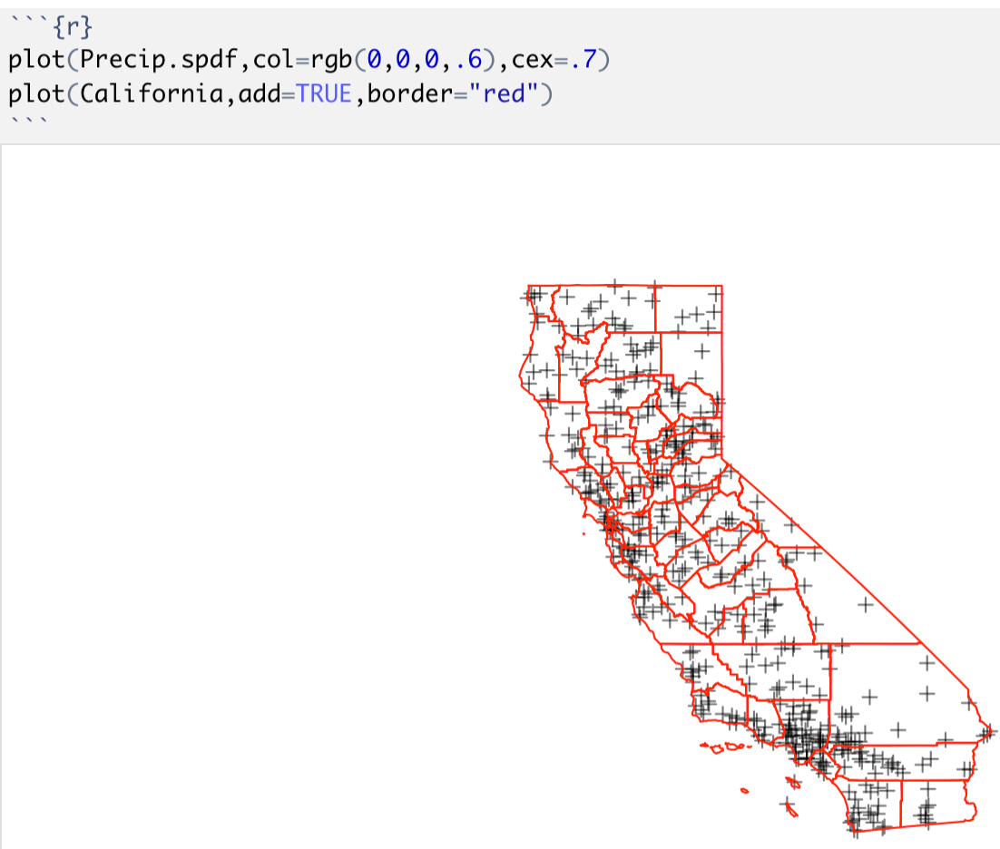

# Lab 5

Welcome to Lab 5, where we are going to focus on interpolation techniques.

**Objective:** The aim of this lab is to look at different ways of interpolating data, specifically Thiessen polygons and inverse distance weighting.  

**Data-sets:**  You will be conducting your analysis on some environmental data in California.


## Lab 5 Set-Up

### Create your Lab 5 project file

 - Open a new version of R-studio.  
 - Click the file menu, then new project in a new directory.  
 - Select your 364 directory, then name the project Lab 5.  

If you are stuck on this process, see the start of previous labs.  You can check this has worked by looking on the file explorer on your computer, then selecting your GEOG364 folder and checking that a Lab 5 folder has appeared with your Lab4.Proj file inside it.

### Create your NoteBook file

Here you have a choice:

Either.. you can create a standard lab script as before:

 - Go to File/New File and create a new R-NOTEBOOK file.
 - Delete the friendly text (everything from line 6 onward)
 - Save your file as `GEOG364_Lab5_PSU.ID.Rmd` e.g. `GEOG364_Lab4_hlg5155.Rmd`
 - Follow Section 2.2.2 to modify your YAML code 
 - *Please make sure that your lab script has a floating table of contents* (section 2.2.2, adding the `toc_float: TRUE` part)

Or..OPTIONAL: 

If you want to explore some new formats, you can try one of the markdown templates stored in R.There are instructions on how to load them on the website here: https://github.com/juba/rmdformats/blob/master/README.md). 

Again, make sure to save your file as `GEOG364_Lab5_PSU.ID.Rmd`. Please also add in a floating table of contents to your YAML code.

### Style guide

A large component of the marks for your labs scripts focuses them being easily readable and easy to follow.  Now you have had experience with R, here are some of the things we expect to get full marks:

1. You include a floating table of contents, title and author in the YAML Code
2. You include a "level 1" heading in your text for every lab challenge e.g. `# Lab challenge 1`
3. It's easy to see where your answers are - so you have full sentences, not just one word answers.
4. You have spell-checked your work!  The spell check button is between the save button and the knit/preview button.
5. You include blank lines before and after each code chunk, or new paragraph, or bullet point set or heading (put many blank lines in markdown files and R can automatically format them correctly).
6. Any written answers are thoughtful and well considered.

As you write your lab, *regularly* click the Preview or Knit Button and make sure everything looks correct and properly formatted.  IF THERE ARE PROBLEMS, TALK TO AN INSTRUCTOR.


### Download and run packages

Follow the instructions in Section 3.2.2. to download and install the following packages

 - `tmap`
 - `dismo`
 
Now add a new code chunk in your script.  Inside add the following code and run it.

```{r, message=FALSE,warning=FALSE}
library(tmap)      # Used for plotting
library(sp)        # Used for the spsample function
library(maptools)  # Used for conversion from SPDF to ppp
library(raster)    # Used to clip out thiessen polygons
library(gstat)     # Use gstat's idw routine
library(dismo)     # Method for thiessen polygons
library(knitr)     # Used for the insert image function
```

This needs to be at the top of your script because the library commands need to be run every time you open R.  Now click the Preview or Knit Button and make sure everything looks correct.  

*Don't continue until you can make and view your html or nb.html file. If it doesn't work, ask for help before moving on*

## Challenge 1: Explore the data

(remember to create a new heading in your text for each challenge)

### Download & load the data

Click on this link to download the data from the internet.  Save it in your lab 5 folder.  

 - https://raw.githubusercontent.com/hgreatrex/GEOG364_Labs/master/Lab_5/Lab5California.rdata

 Now in a new code chunk, open the data in R using the `load` command e.g. `load("Lab5California.rdata")`

This command will load two California data-sets into R:

 1. California   - The boundaries of the State of California
 2. Precip.table - The average rainfall recorded at weather stations in California during each month of the year. 
    
    - Each row represents one weather-station/gauge.  For example, row 1 is the climatology for a weather station situated at Lat:36.47 and Long:-116.87. 
    - Columns
       + The Long/Lat columns represent the longitude and latitude of each gauge
       + The Alt column is the altitude/elevation in m.  
       + The Jan-Dec columns are the monthly average rainfall in mm 
       + and the Annual column is the total rainfall over the year in mm.

### Initial analysis

1. In a new code chunk, look at the summary of the Precip.table data (see previous labs for ideas on how to do this).  

2. Below your code chunk,  in a full sentence, write the value of the maximum rainfall that fell in April across California, including units!

We can also look at some summary plots of the data:

3. In a new code chunk apply the `hist` command to create a histogram of January rainfall (e.g. apply `hist` to the Jan column of Precip.table). If you can't remember how to select a column, see Lab 2, section 2.3.3. 
  
4. Copy the code below into R to make a series of boxplots.

```{r,eval=FALSE}
boxplot(Precip.table[,4:15],
        pch=4,cex=.6,
        cex.axis=.8,las=2,
        tcl=-.25)
```

Underneath the code, explain:

 - What `pch`, `cex` and `las` are doing.  Typing ?par into the console might help
 
 - What the grey box represents for each month (This might help: https://www.khanacademy.org/math/cc-sixth-grade-math/cc-6th-data-statistics/cc-6th-box-whisker-plots/v/reading-box-and-whisker-plots)
 
 *Note, for your show me something new, you could consider making a fancy version of these boxplots, with many ideas here: https://www.r-graph-gallery.com/boxplot.html* 
 
### Convert to spatial data

Remember to add a heading.. this is your last reminder! You now need to convert your table of data to a spatial "sp" format. *(If you wish to learn more about sp vs sf there is a data camp course)*

Copy the code chunk below into your code.  Now replace the X-COORD and Y-COORD with the names of the columns that contain the x and y data in Precip.table.  This is case sensitive and should be contained in quotes.

```{r,eval=FALSE}
#Convert to sp 
Precip.spdf <- Precip.table
coordinates(Precip.spdf) <- c("X-COORD","Y-COORD")
```

Check it works by plotting the data e.g.

```{r, socali, echo=FALSE, fig.cap = "What your plot should look like"}

```

If your plot does not look like this, DO NOT CONTINUE UNTIL IT IS FIXED.

### Add a projection

Now **check** the projection of both `Precip.spdf` and the `California` boundary data. (see Lab 2, section 2.5.1 if you have forgotten).

You should see that Precip.spdf currently doesn't have a map projection.  

**As the x and y columns are longitude and latitude data, use the `proj4string` command to assign the projection of Precip.spdf to be "+proj=longlat +datum=WGS84 +no_defs +ellps=GRS80".  LOOK AT LAB 2 (section 2.5.5) FOR AN EXAMPLE OF HOW TO DO THIS**


For both the California boundary data and the precip data, we now need to set the projection to be something where distance is a conserved property. You could choose the UTM projection over California, but let's see a new one: the Albers Equal-Area Conic projection (https://en.wikipedia.org/wiki/Albers_projection). 

The code for this is

 - "+proj=aea +lat_1=34 +lat_2=40.5 +lat_0=0 +lon_0=-120 +x_0=0 +y_0=-4000000 +datum=NAD83 +units=km +ellps=GRS80"

**In a new code chunk, use the spTransform command twice to change the projection of each of Precip.spdf and the California data to the Albers projection. Again, Lab 2 section 2.5.2 might be useful here.**

If you get warnings like: *"CRS object has comment, which is lost in output"* or *"NULL source CRS comment, falling back to PROJ string"*, or anything else that specifically doesn't say error,ignore them - they're a consequence of the recent R upgrade.

Now if you now run the plot command and also add California, they should plot on top of each other.  DON'T CONTINUE UNTIL YOU CAN REPRODUCE THIS.

```{r, socali2, echo=FALSE, fig.cap = "What your plot should look like"}

```

## Challenge 2: Exploratory analysis

### Make plots in tmap

In this section, you will learn a new package called `tmap` to make some more interesting plots. There is a general tutorial here: https://cran.r-project.org/web/packages/tmap/vignettes/tmap-getstarted.html

I have provided the code for our example.  

 - Copy this into your script (you may have to re-write the "s).
 - Use the tutorial to help you write better comments to explain what is happening

```{r,eval=FALSE}
# WRITE COMMENT HERE. WHAT HAPPENS IF THIS IS SET TO "plot"?
current.mode <- tmap_mode("view")

# Choose the name of the column you want to plot
myColumn = "Aug"

# WRITE COMMENT HERE.  EXPLAIN WHAT THE CODE DOING
tm_basemap("Stamen.Terrain") + 
  tm_shape(Precip.spdf) + 
  tm_dots(col=myColumn, 
          palette = "RdBu",
          title=paste("Total rain (mm):",myColumn), 
          size=0.1,style="cont") 

# WRITE A COMMENT HERE TO EXPLAIN WHAT THE PASTE COMMAND IS DOING

# This is based on leaflet, so you can change the interactive basemap with any from here: 
# http://leaflet-extras.github.io/leaflet-providers/preview/index.html 
# You can also run this command in the console to see all the colour palettes available to you:   
# tmaptools::palette_explorer()
```

### Exploratory analysis

 - Edit the code chunk above and run to look at the data for each month. You can just adjust the chunk above - you do not need to copy/paste or create new code chunks.

 - From this exploratory analysis, briefly describe California's rainfall patterns.  For example, 
 
  + how does rainfall vary spatially in different months? 
  + What link is there to elevation?
  + What factors you think might be causing the differences in rainfall amount across the State?   
  
*Useful resource: you can also look in more detail at the climate for specific places here. https://weatherspark.com/*

## Challenge 3: Thiessen polygons by hand

Now we will move onto interpolation. At the moment we know that rainfall is field data - it has a value at every location.  But we only have the values at our weather stations.  It would be good to interpolate to new areas to create a map.

The first technique we will use is Thiessen, or proximity polygons. These are also called Voronoi diagrams.

1. In your text, briefly describe what Thiessen polygons are. Lectures and these resources might help: http://www.gitta.info/Accessibilit/en/html/UncProxAnaly_learningObject4.html

2. On the separate sheet provided in the lab, calculate and draw the Thiessen polygons for the four points. Take a photo/scan of the sheet and load it into your lab as a screenshot.  There are two ways to do this:
   
   - Following these instructions if you prefer a vector approach: http://www.hydrology.bee.cornell.edu/BEE3710Handouts/ThiessenPoly.pdf
   - Or a second approach is the raster version: for each grid-cell, work out which point it is closest to and build up polygons that way.
   
We are grading you here on whether you explain what Theissen polygons are and if you attempt and upload your screenshot.  Drawing these can be surprisingly hard, so we are *not* grading you on getting the polygons correct/perfect.  "Cheating" is also encouraged! By this I mean: if you if you can work out how to reproduce these points in R, then you can automatically calculate the Thiessen polygons and see what the answer is..


## Challenge 4: Thiessen polygons in R

The command to calculate Thiessen polygons in R comes from the dismo package and is called the voronoi function.  It assumes that the data is a series of points in sp format.  

Apply the `voronoi` command to Precip.spdf and save it as a variable called Precip.Thiessen.

If you need a hand, look at the helpfile for the voronoi function (and scroll to the end for an example) or see here https://rspatial.org/raster/rosu/Chapter11.html

Copy/add the code below to your script.  This plots the output of your voronoi analysis for individual columns of your data.  AKA you can change "Annual" to be any column named in your Precip.Table. (try names(Precip.Table) in the console if you have forgotten them) 

```{r, eval=FALSE}
spplot(Precip.Thiessen,'Annual',col.regions=rev(get_col_regions()))

#The spplot command is yet another way of plotting spatial data in R (there is a tutorial here: #http://www.nickeubank.com/wp-content/uploads/2015/10/RGIS3_MakingMaps_part1_mappingVectorData.html#spplot)
```

Below the plot, explain what it is showing you. What do the colours represent and why are the polygons drawn that way.  Why do the polygons look so strange towards the edge of the plot?

It would be good to crop out California.  We can use the raster package and the following code to do this. Run this code in your script.
```{r,eval=FALSE}
# Add the state boundaries
CaliforniaNew           <- aggregate(California)
Precip.Thiessen.clipped <- intersect(Precip.Thiessen, CaliforniaNew)
spplot(Precip.Thiessen.clipped, 'Annual', col.regions=rev(get_col_regions()))
```

Below the code chunk, explain what are the limitations of Thiessen/proximity polygons, specifically for field data such as rainfall or elevation.  What are the advantages and disadvantages of the final map?


## Challenge 5: Inverse Distance Weighting info

*These resources should help you answer the questions below if needed*

 - *The latest lecture notes*

 - *O'Sullivan/Unwin textbook page 257-261 (the pdf is on the main-course Canvas under files/books)*

 - *https://pro.arcgis.com/en/pro-app/help/analysis/geostatistical-analyst/how-inverse-distance-weighted-interpolation-works.htm*

 - *https://mgimond.github.io/Spatial/spatial-interpolation.html*

1. In this section, describe the process of inverse distance weighting (IDW). You do not need to use equations.

2. **"IDW is an exact interpolator"**  Explain what this statement means. (O'Sullivan/Unwin might be helpful here)

## Challenge 6: Inverse Distance Weighting code

This code will run the inverse distance weighting code for the Annual rainfall California data, with a power of two.  E.g. the weighting is proportional to 

$$\frac{1}{distance^{2}}$$
Copy the code below into R and make sure you can run it.  It should give a plot of California.  If there are errors about CRS, ignore them.

```{r, eval=FALSE}
# Create an empty grid over California
grid            <- as.data.frame(spsample(Precip.spdf, "regular", n=50000))
names(grid)     <- c("X", "Y")
coordinates(grid)<- c("X", "Y")
gridded(grid)   <- TRUE  # Create SpatialPixel object
fullgrid(grid)  <- TRUE  # Create SpatialGrid object

# Add the California projection information to the empty grid
proj4string(grid) <- proj4string(California)

# What inverse distance weighting power would you like?
Power <- 2

# The IDW command calculates the inverse distance weighting
Precip.idw <- gstat::idw(Annual ~ 1,  # Choose the annual column, no trend
                         Precip.spdf, # For the precip sp data
                         newdata=grid,# interpolate onto the new grid 
                         idp=Power)       # Set the power to be the number stored in the Power variable

# Now convert to a raster object & clip to California
Precip.idw.raster <- raster(Precip.idw)
Precip.idw.mask   <- mask(Precip.idw.raster, California)

# And plot to a static plot
current.mode <- tmap_mode("plot")

# A more complex tmap
tm_shape(Precip.idw.mask) + 
  tm_raster(n=10,palette = "RdBu",
            style="cont",
            breaks=seq(from=0,to=2400,length.out=20),
            title=paste("Rain, Power:",Power)) +
  tm_shape(Precip.spdf) + 
  tm_dots(size=0.02) + 
  tm_legend(legend.outside=TRUE)

```

Below the code chunk, answer the following questions.  Please include the questions in your text to make it easy for us to grade your answers.

a. In the output above, for a power of 2, there appear to be "circles" or "bulls-eyes" around each many of the rain-gauges.  Why is this?

b. What happens when you make the power a high number, say 12, and rerun the code chunk?  Why does the map look the way it does?

c. What happens when you make the power to a low number below 1, say 0.5, and rerun the code chunk?  Why does the map look the way it does?


## Challenge 7: Checking accuracy

As described in https://mgimond.github.io/Spatial/spatial-interpolation.html
Finding the "best" power can be subjective. .

One option is to split the points into two sets: we do the interpolation using half the points, then check to see how good it was using the other half of the data. The downside of this is that we are only using half the data, so we might leave out important information.  This is a loss of statistical power. 

A better approach to fine-tune the choice of the power parameter, we can perform a leave-one-out validation routine to measure the error in the interpolated values. Here, we remove one data point from the dataset and estimate its value using all other points and the IDW tecnique.  Then we repeat this process for every point. The interpolated values are then compared with the actual values from the omitted point. This method is sometimes referred to as jackknifing or cross-validation.

We can then create a scatterplot of the predicted vs. expected precipitation values from our dataset. The solid diagonal line represents the one-to-one slope (i.e. if the predicted values matched the true values exactly, then the points would fall on this line). The red dashed line is a linear fit to the points which is here to help guide our eyes along the pattern generated by these points.  We can then calculate the RMSE, the Root Mean Squared Error, to see how far the residuals are from the line.  The smaller the RMSE, the better the fit.

The code below shows the plot and RMSE for the California data and a power of 2. 

```{r, eval=FALSE}
# Change the power here and don't touch the rest
power=2

# Leave-one-out validation routine
IDW.out <- vector(length = length(Precip.spdf))
for (i in 1:length(Precip.spdf)) {
  IDW.out[i] <- suppressWarnings(
                        gstat::idw(Annual ~ 1, 
                                   Precip.spdf[-i,], 
                                   Precip.spdf[i,],
                                   idp=power,debug.level=0)$var1.pred)
}

# Compute RMSE
RMSE <- sqrt( sum((IDW.out - Precip.spdf$Annual)^2) / length(Precip.spdf))

# Plot the differences
  plot(IDW.out ~ Precip.spdf$Annual, 
       asp=1, xlab="Observed", ylab="Predicted", pch=16,
       col=rgb(0,0,0,0.5),main=paste("RMSE:",round(RMSE)))
  abline(lm(IDW.out ~ Precip.spdf$Annual), col="red", lw=2,lty=2)
  abline(0,1)

```

1. Edit the power and keep reruning the code chunk above until you think you have found the lowest RMSE and the "best" fit. Hint - the power does not need to be an integer. It could be 2.4. Below the code chunk confirm the final power that you chose.

*For your show me something new, you are welcome to create a for loop that does this automatically). *


2. Have a look at the IDW map with your final power (by rerunning the earlier code chunk that made the map).  Do you agree that this was the best fit?

3. What are the strengths of this interpolation technique and what are the weaknesses?


## Challenge 8: Your own IDW

Finally, copy the code in lab challenge 6 into a new code chunk.Now modify it to show create an IDW map with a power of 2 for the elevation data (your Alt column in Precip.spdf) 

Your final plot should be properly captioned (e.g. the legend should be talking about elevation in m) and you will have to change the breaks on the color scale to be something that fits the data.

If you don't get this working, don't panic, simply comment out the code chunk by putting a # in front of each line - then your file will still knit and we can see how far you got.


## Challenge 9 Show me something new 

Please describe what you are trying to achieve.

For 2.5/5 marks

 - 3 NEW chapters of a data camp course and include completion screen-shots in your lab script
 - You can make some minor changes, for example, you could use this equation editor - https://www.codecogs.com/latex/eqneditor.php -  and this tutorial - https://www.math.mcgill.ca/yyang/regression/RMarkdown/example.html, you could include a mathematical equation of your choice in your markdown text.
 - You could make some minor changes to some of the code, for example making tmap plots with a new color palette.
 
 
*OR* for 5/5 you can continue to do the classic "something new", where you need to demonstrates the use of a function or package that was not specifically covered in the handout, lecture, or lab.  Remember you actually have to do something new, not repeat what you did in previous weeks
 
Some ideas were included throughout the lab, for example 
 - You could use ggplot2 to do the Thessian polygons instead: https://cran.r-project.org/web/packages/ggvoronoi/vignettes/ggvoronoi.html
 - You could do a linear regression between annual rainfall and elevation
 - You could explore the tmap and spplot tutorials and see other things you could do.
 - More spatial ideas which might work on our data here: https://rspatial.org/raster/rosu/Chapter11.html
 https://tlorusso.github.io/geodata_workshop/tmap_package.  For these, you need to make a meaningful change and add a new feature to the map to get 5/5.
 - You could convert the data to ppp and do one aspect of point pattern analysis on the dataset
 - You successfully managed to write R code to create Thiessen polygons on the small dataset in challenge 3.1.
 
 
 If you want a larger challenge (also for 5/5 but building your skills) 
 - You could look at doing a first order polynomial fit: https://mgimond.github.io/Spatial/interpolation-in-r.html#st-order-polynomial-fit
 - You could explore the akima package for interpolation
 - Applying a for loop to the IDW data (the intermediate R datacamp course helps) 
 - There are lots of ideas in the previous lab suggestions.

 
 
## Lab-5 submission check

This lab is designed to be relatively short, so that you can start thinking about your final projects and your own spatial data.  I will discuss this in future lectures.

For this lab, here is the mark breakdown:
    
**HTML FILE SUBMISSION - 10 marks**

**RMD CODE SUBMISSION - 10 marks**

**WORKING CODE - 10 marks**: Your code works and the output of each code chunk is included in the html file output (e.g. you pressed run-all before you finished)

**EASY TO READ LAB SCRIPT - 10 marks**: You have followed the style guide in section 6.1.

**CHALLENGE 1 - 10 marks**: You answered all the questions, made your histogram/boxplots & converted your data correctly to spatial data

**CHALLENGE 2 - 5 marks**: You thoughtfully used the tmap plots to explore the spatial structure of rainfall over California in different months

**CHALLENGE 3 & 4 - 15 marks**:  You uploaded your "by hand" attempt at the polygons and described what they are.  You then calculated them in R and described their limitations.

**CHALLENGE 5 - 5 marks**:  You explained the process of inverse distance weighting and what was meant by an exact interpolator.

**CHALLENGE 6 - 10 marks**:  You answered the questions to explain the spatial features in the data.  To get full marks you need to refer back to what IDW is actually doing..

**CHALLENGE 7 & 8 - 10 marks**:  You thoughtfully commented on the final power chosen for IDW and the strengths and weaknesses of this technique. You then managed to create an IDW analysis for the elevation column.

**SOMETHING NEW - 5 marks**
You made a minor change to an existing piece of code (2.5/5) or did 3 data camp chapters.
OR
You demonstrated the use of a function or concept that was not specifically covered in the handout, lecture, or lab

[100 marks total]


