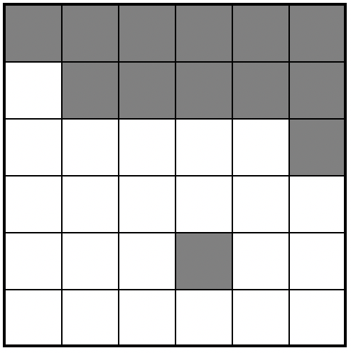
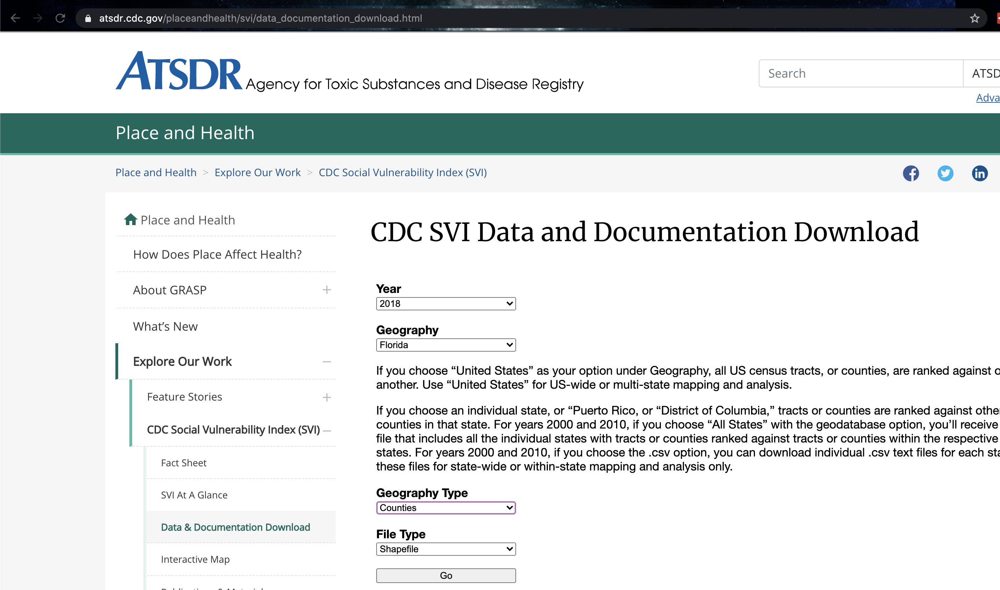
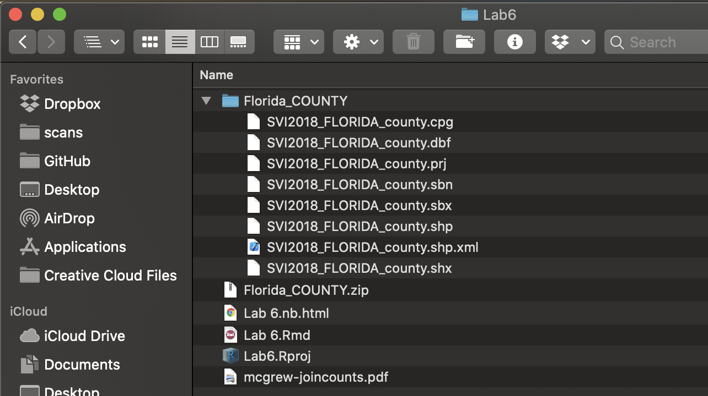
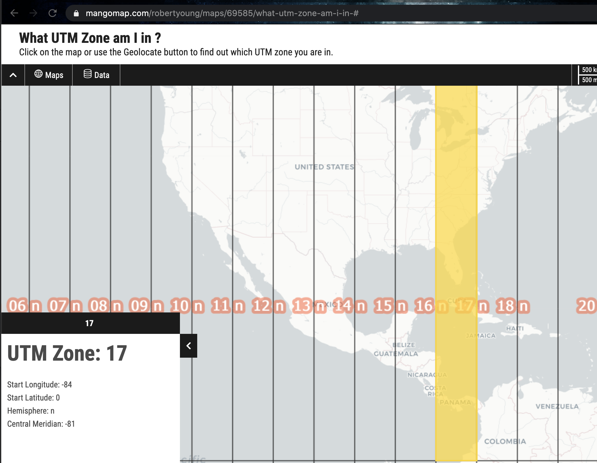
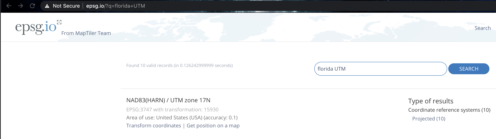

# Lab 6

**Objective:** Welcome to Lab 6, where we are going to focus on spatial autocorrelaton, join counts and Moran's I.  Specifically you will:

 - Read in shapefiles
 - Have the opportunity to make spatial weights matrices
 - Explore the tmap package
 - Look at join counts data
 - Create Moran's I plots and interpret them
 
**Data-sets:**  You will be conducting your analysis on some toy data, then examining your own US based county vulnerability data from the CDC.

**Lab structure:**  Now you are getting more experienced in R, I will provide a worked example then get you to do something similar on your own data.

Although you are of course welcome to copy/paste/run the worked example, YOU SHOULD NOT INCLUDE THE WORKED EXAMPLE IN YOUR FINAL LAB REPORT.   


## Lab 6 Set-Up

### Create your Lab 6 project file

 - Open a new version of R-studio.  
 - Click the file menu, then new project in a new directory.  
 - Select your 364 directory, then name the project Lab 6.  

If you are stuck on this process, see the start of previous labs.  You can check this has worked by looking on the file explorer on your computer, then selecting your GEOG364 folder and checking that a Lab 6 folder has appeared with your Lab4.Proj file inside it.

### Create your NoteBook file

Here you have a choice:

Either.. you can create a standard lab script as before:

 - Go to File/New File and create a new R-NOTEBOOK file.
 - Delete the friendly text (everything from line 6 onward)
 - Save your file as `GEOG364_Lab6_PSU.ID.Rmd` e.g. `GEOG364_Lab6_hlg5155.Rmd`
 - Follow Section 2.2.2 to modify your YAML code 
 - *Please make sure that your lab script has a floating table of contents* (section 2.2.2, adding the `toc_float: TRUE` part)

Or..OPTIONAL: 

If you want to explore some new formats, you can try one of the markdown templates stored in R.There are instructions on how to load them on the website here: https://github.com/juba/rmdformats/blob/master/README.md). 

Again, make sure to save your file as `GEOG364_Lab6_PSU.ID.Rmd`. Please also add in a floating table of contents to your YAML code.

### Style guide

A large component of the marks for your labs scripts focuses them being easily readable and easy to follow.  Now you have had experience with R, here are some of the things we expect to get full marks:

1. You include a floating table of contents, title and author in the YAML Code
2. **You include a "level 1" heading in your text for every lab challenge e.g. `# Lab challenge 1`**
3. It's easy to see where your answers are - so you have full sentences, not just one word answers.
4. You have spell-checked your work!  The spell check button is between the save button and the knit/preview button.
5. You include blank lines before and after each code chunk, or new paragraph, or bullet point set or heading (put many blank lines in markdown files and R can automatically format them correctly).
6. Any written answers are thoughtful and well considered.

As you write your lab, *regularly* click the Preview or Knit Button and make sure everything looks correct and properly formatted.  IF THERE ARE PROBLEMS, TALK TO AN INSTRUCTOR.


### Download and run packages

Follow the instructions in Section 3.2.2. to download and install the following packages

 - `spdep`
 - `USAboundaries`
 
plus any others below that you are missing. Now add a new code chunk in your script.  Inside add the following code and run it.

```{r}
library(rgdal)
library(sp)
library(sf)
library(spdep)
library(tmap)
library(raster)
library(USAboundaries)
```

This needs to be at the top of your script because the library commands need to be run every time you open R.  Now click the Preview or Knit Button and make sure everything looks correct.  

*Don't continue until you can make and view your html or nb.html file. If it doesn't work, ask for help before moving on*

## Tutorial 1: Spatial weights and Join Counts

**First, read the pdf on join counts from canvas - it's only 3 pages but provides crucial background**

### Making the grid 

Join count and autocorrelation statistics are valuable in understanding spatial dependencies among sample
units. This first tutorial focuses on using R to calculate join count statistics using a toy dataset.

The code below creates a grid, or matrix of data that we can use to test Joins Counts. Here's a picture of the grid we are going to make.  In this case, each polygon is a simple grid cell.

```{r, joinmatrix, echo=FALSE}

```


Now, I will make the data in R using a new type of data called a matrix (see data camp intro R for more details)

```{r}
row.1 <- rep(1,6)  
row.2 <- c(0,1,1,1,1,1)
row.3 <- c(rep(0,5),1)
row.4 <- rep(0,6)
row.5 <- c(0,0,0,1,0,0)
row.6 <- rep(0,6)

matrixA <- matrix(c(row.1, row.2, row.3, row.4, row.5, row.6), nrow=6,ncol=6, byrow=TRUE)
matrixA
```
and then we then convert it to spatial data using the raster command.

```{r, fig.width=5}
rasterA <- raster(matrixA)
plot(rasterA)
text(coordinates(rasterA), labels=rasterA[], cex=1.5)
```

### Creating the spatial weights

Our raster data will now easily convert to vector data so that we can determine which grid-cells are “nearby”. To find adjacent polygons, we can use package ‘spdep’. 

  1. First, we covert our raster data to a spatial polygon and it's coordinates
  2. Then we use the poly2nb command to work out the rook's adjacency
  3. Then we plot the data
  4. Finally, we calculate the weights matrix. In this case we use a binary (B) criteria, i.e. there is adjacency (1) or there is no adjacency (0).
  

```{r}
polyA    <- rasterToPolygons(rasterA, dissolve=FALSE)
spA      <- SpatialPolygons(polyA@polygons)

nbA.rook <- poly2nb(spA, queen = FALSE)

plot(spA, border='blue')
plot(nbA.rook, coordinates(spA), col='red', lwd=2, add=TRUE)

weightsA.rook <- nb2listw(nbA.rook, style='B')
```
### Conducting a join-counts analysis

Now, everything is set for the analyses: We have our raster, which shows the presence/absence of green grid cells, plus the weights information (as object ‘weightsA.rook’). 

Finally, we apply the Join Count test to evaluate presence or absence or spatial autocorrelation. This is done using a z-test.  Slightly differently to the textbook and the lecture notes (which looked for green/white), the R version of this  test looks for how likely it is that there are white-to-white joins compared to random chance, but the principle is the same.

So we have:

 - H0: The pattern exhibits complete spatial randomness or is dispersed. The number of Observed "same color" joins (O~White-White~) is no higher than what you would expect from an Independent Random Process:
 O~WW~ = E~WW~

 - H1: The pattern is not random.  The number of "same color" joins is unusually high (AKA the pattern is clustered): O~WW~ > E~WW~

Here is the code for the Z-test

```{r}
jc_testA <- joincount.test(fx= as.factor(polyA$layer), #data
                           listw= weightsA.rook, #weights
                           alternative="greater") 
```
Another thing to note is that you can select which different tailed alternative hypothesis:

 - (default) ‘greater’: the alternative hypothesis that the number of like joins is more than expected by random chance.  *(THIS IS ONLY TRUE IF THE THING YOU ARE TESTING IS WW or GG joins.  The opposite would be the case if you tested GW joins, think through why this is the case)*
 -  ‘less’: the alternative hypothesis that the number of like joins is fewer than expected by random chance (indicating higher levels of dispersion). *(IF THE THING YOU ARE TESTING IS WW or GG joins.  The opposite would be the case if you tested GW joins.)*
 - 'two.sided':  the alternative hypothesis that the number of like joins is simply different to the number you would expect from random chance. This is unusual to use as we are normally looking for either clustering or dispersion.

joincount.test actually does two tests, so we use double square brackets [[ ]] to show the first and second test separately:


```{r}
# White-to-white Join counts
jc_testA[[1]]
```

```{r}
# Green-to-green Join counts
jc_testA[[2]]
```
We can see that there are many more white-white joins / green-green joins than you might expect.  In fact, looking at the low p-value, we can see that it is very unusual to see so many same-color joins, so in this case, most people can can safely reject the null hypothesis.


## Challenge 1: Join Counts

### Challenge 1a

**Have you read the pdf on join counts from canvas? It's only 3 pages but provides crucial background**

Start a new section called Challenge 1, and a new level 2 sub heading called Challenge 1a.

Underneath, summarise what spatial autocorrelation is, referencing:

 - Tobler's law, 
 - What is a global autocorrelation measure 
 - What is a local autocorrelation measure 

 
### Challenge 1b

1. Make a new sub-heading called challenge 1b.

2. Copy/use the code in the tutorial above to conduct your own analysis on your own new matrix that you create called `matrixB`.  

   a. Try to make a grid that has is likely to have negative spatial autocorrelation, but still has a little bit of randomness.
  
   b. Use a queen's weights matrix in your example
  
   c. You should conduct a hypothesis test at a significance level of p-value:5% to see if the data is unusually clustered and interpret what this means.
   
   d.  As part of your answer, you should also explain what the `rep` function which is included in the tutorial.

   e. To get full marks you need neat code, comments and good variable names (we're doing grid B not grid A!).  

## Tutorial 2: Social vulnerability and Moran's I

This next tutorial applies what we have learned to a real life scenario, that of vulnerability modelling in the USA.  

The Centers for Disease Control and Prevention Social Vulnerability Index (SVI) was created to help public health officials and emergency response planners identify and map the communities that will most likely need support before, during, and after a hazardous event.

SVI indicates the relative vulnerability of every U.S. Census tract. Census tracts are subdivisions of counties for which the Census collects statistical data. SVI ranks the tracts on 15 social factors, including unemployment, minority status, and disability, and further groups them into four related themes. Thus, each tract receives a ranking for each Census variable and for each of the four themes, as well as an overall ranking.

I am going to use this data for a specific state to look at the spatial distribution of some of these variables.

### Download the data

First I will find and download the data. I found the SVI data at

 - https://www.atsdr.cdc.gov/placeandhealth/svi/data_documentation_download.html

The **documentation** to understand what the column headings of the data can be found at:

 - https://www.atsdr.cdc.gov/placeandhealth/svi/documentation/pdf/SVI2018Documentation-H.pdf

I then downloaded county level data for Florida for 2018 as an ESRI shapefile.  I saved this to my lab 6 folder, then unzipped it.

```{r, fileloc5, echo=FALSE}

```

```{r, fileloc6, echo=FALSE}

```

### Read the data into R

The `readOGR` command will read a shapefile into R.  You should split your command into the "dsn", the folder containing the data and the "layer", the name of the file with NO extension

In our case, we are using the Lab 6 r-project to set our folder (the "." below), then we just enter the name of the sub-folder and the file.  If you can't make it work, then running file.choose() in the console is a good way to get the correct wording.

NOTE THERE IS NO FORWARD SLASH / DOUBLE BACKSLASH AT THE END OF THE DSN BIT

```{r, eval=FALSE}
# This reads in the shapefile containing the SVI Data and saves it to an sp variable called SVI

SVI  <-  readOGR(dsn="./Florida_COUNTY", 
                 layer="SVI2018_FLORIDA_county")
```

For a windows machine, this might look like

```{r, eval=FALSE}
# the dot means start in the current folder (lab 6), then move into the Florida county sub-folder

SVI  <-  readOGR(dsn=".\\Florida_COUNTY", 
                 layer="SVI2018_FLORIDA_county")

# or if you use file.choose() for the full path - this is the one on Saumya's computer - YOURS WILL LOOK DIFFERENT AND NOT BE ON THE E DRIVE

SVI  <- readOGR(dsn="E:\\GEOG364\\Lab6\\Florida_COUNTY", layer="SVI2018_FLORIDA_county")

# or for Mac OR PC, if the files are in your lab 6 folder and you are running R from the project file, you don't need the dsn at all as R is already looking in the right place

SVI  <- readOGR("SVI2018_FLORIDA_county")
               
```


```{r,include=FALSE}
# This reads in the shapefile containing the SVI Data and saves it to an sp variable called SVI

SVI  <-  readOGR(dsn="/Users/hlg5155/Dropbox/Work/09 Teaching/PSU.GEOG_364/2020 Final/Labs/Lab_Book/Florida_COUNTY", 
                 layer="SVI2018_FLORIDA_county")
```

I will also use the `us_states` command from the USAboundaries package to download the border of Florida.

```{r}
# This downloads the US state border data for my state, it's from the USAboundaries package
State.border <- us_states(states = "Florida")
# convert to sp
State.border <- as(State.border,Class="Spatial")
```

### Change the projection

Now let's check the projection of both and make sure they are the same.  

```{r}
projection(SVI)
projection(State.border)
```

Although they are both equal, I'm now going to change them both to a UTM projection as it's more robust. I found the code by selecting Florida UTM here: 

 - https://mangomap.com/robertyoung/maps/69585/what-utm-zone-am-i-in-#

Then checking the epsg code here:

 - http://epsg.io/

```{r, utm1, echo=FALSE}

```
```{r, utm2, echo=FALSE}

```


```{r}
# I'm using the suppressWarnigngs command to get rid of those CRS messages/warnings
SVI          <- suppressWarnings(spTransform(SVI,CRS("+init=epsg:3747")))
State.border <- suppressWarnings(spTransform(State.border,CRS("+init=epsg:3747")))
```

and check it worked:

```{r}
projection(SVI)
projection(State.border)
```

### Explore the data

Now I can explore the dataset.  I have already looked at the documentation and seen that there are many columns I can look at.  I can see these by showing the column names here:

```{r}
names(SVI)
```
There are lots more non-spatial plots I can make, but for now I will move onto maps.

Today I am going to use tmap.  As you can see, a plot is built up in layers.  Each tm_shape line identifies some data you want to plot, then the indented lines afterwards plot it.

I have chosen to plot one of the many variables that are available to me:E_TOTPOP.  From the documentation I found this represents the population total in each county. 

```{r}
tm_shape(SVI) + 
   tm_polygons(col="E_TOTPOP", style="quantile",
               border.col = "black",
               palette="Spectral") +
   tm_legend(outside = TRUE) + 
tm_shape(State.border) + 
   tm_borders() +
tm_layout(main.title = "Population",  main.title.size = 0.95)

```

Now we have a new problem (this is real life data!).  I expected the data to be numeric - e.g. the average annual income in dollars, but R has not understood this. This is why the colorbar looks weird and why R is giving me the warning message about "too many breaks", when I made the plot above. 

If I print SVI$E_TOTPOP onto the screen then I noticed that each one has quote marks around it, so R thinks its text.  

```{r}
print(SVI$E_TOTPOP)
```
Let's use the as.numeric command to turn that column back into numbers

```{r}
SVI$E_TOTPOP <- as.numeric(SVI$E_TOTPOP)
print(SVI$E_TOTPOP)
```

and now when we plot..

```{r}
tm_shape(SVI) + 
   tm_polygons(col="E_TOTPOP", style="pretty",
               border.col = "black",
               palette="Spectral") +
   tm_legend(outside = TRUE) + 
tm_shape(State.border) + 
   tm_borders() +
tm_layout(main.title = "Total population",  main.title.size = 0.95)

```

That looks better!  So it seems that my population is clustered in the south and mid-way up state.  This makes sense given that the blue area is the Miami-Dade district.

To better understand my data, there are two other ways I might want to use tmap:

Firstly, I might want to compare two maps at once. I can do this by creating two separate maps and instead of plotting them, simply saving them as Map1 and Map2, then plotting them together using the tmap_arrange command.  

I might also want to zoom in on these in the way we earlier made leaflet plot.  In this case, we simply switch map view from "plot" to "view".  I also added a leaflet basemap (code from here: http://leaflet-extras.github.io/leaflet-providers/preview/)

For other color palettes, see here: https://www.r-graph-gallery.com/38-rcolorbrewers-palettes.html

```{r}
tmap_mode("view")

# create map 1
Map1 <- tm_basemap("OpenStreetMap.Mapnik") + # Set the watercolor basemap
        tm_shape(SVI) +                   # plot the SVI data   
           tm_polygons(col="E_TOTPOP",      # name of the column I am plotting
                       style="pretty",      # do i want color breaks, or continous color bar?
                       border.col = NULL,   # no outlines
                       palette="Spectral",  #color palette 
                       title="Population Density", #plot title
                       alpha = .5) +        #slightly transparent
        tm_shape(State.border) +          # Plot the State.border data 
            tm_borders()                    #plot it as borders/lines 

# remember to convert any new numeric variables into numbers
SVI$E_PCI <- as.numeric(SVI$E_PCI)

# create map 2
Map2 <-  tm_basemap("Stamen.Watercolor") +
         tm_shape(SVI) +
           tm_polygons(col="E_PCI",style="pretty", 
                       border.col = NULL,
                       palette="RdBu",
                       title="Average income",
                       alpha = .7) +
         tm_shape(State.border) + 
            tm_borders()

# plot them both
tmap_arrange(Map1,Map2)

```

### Creating a spatial weights matrix

**For the rest of this lab I am going to focus on population density**.

First, I look to see if the population density data looks like it clusters or is dispersed.  I can also look at other data to understand why this might be the case (e.g. is there some underlying reason why our data looks this way). From my perspective and the color scale, it does look like there is clustering of high population areas.

As described in the first part of the lab, before we can formally model the spatial dependency shown in the above map, we must first cover how neighborhoods are spatially connected to one another. That is, what does “near” mean when we say “near things are more related than distant things”? 

For each census tract, we need to define

 - What counts as its neighbor (connectivity)
 - How much does each neighbor matter? (spatial weights)

To do this we again calculate the spatial weights matrix:

```{r}
# calculate the spatial weights matrix
spatial.matrix.rook <-poly2nb(SVI, queen=F)

plot(SVI, border='blue')
plot(spatial.matrix.rook, coordinates(SVI), col='black', lwd=2, add=TRUE)
```


#### Moran's I scatterplot

We can then assign weights to each one based on whether it is a neighbour or not.  Again, I am just using rook's contingency, a binary classification of 1 if a county is a neighbour and 0 if not.

```{r}
# calculate the spatial weights
weights.rook <- nb2listw(spatial.matrix.rook, style='B')
```

and now I will calculate the Moran's scatterplot

```{r}
## and calculate the moran's plot
moran.plot(SVI$E_TOTPOP, weights.rook,
           xlab = "Population",
           ylab = "Neighbors Population",
           labels=SVI$COUNTY)
```

Here we can see that high population counties tend to be clustered together, but that there is not a perfect relationship.  Miami Dade in particular is skewing the relationship.

The "Moran's I" global statistic is essentially a summary of this plot.  We look at the correlation coeffient between the two variables.

```{r, moran, echo=FALSE, fig.cap = "plot from: https://mgimond.github.io/Spatial/spatial-autocorrelation.html"}
include_graphics("Images/Fig_6_06Moran.png")
```

The easiest way to see this in R is to use the Moran.test command, which also assesses the significance of your result:

```{r}
moran.test(SVI$E_TOTPOP, weights.rook)    
```
We find that the Moran’s I is positive (0.30) and statistically significant (p-value < 0.05). Remember from lecture that the Moran’s I is simply a correlation, and correlations go from -1 to 1. A 0.30 correlation is relatively high, indicating some clustering, but not a very strong signal. Moreover, we find that this correlation is statistically significant (p-value basically at 0).

## Challenge 2: Your own spatial analysis

Make a new heading challenge 2.  In here, I would like you to present a spatial autocorrelation analysis of your own.
This will be easier in week 2 after the lecture on Moran's I.

Your job is to repeat this tutorial in your own .rmd file but for a DIFFERENT STATE and for a DIFFERENT VARIABLE. (not Florida and not Population density)
 
Your write up should include:

 - A description of what the SVI data is and why it's important (remember the documentation will help)
 - Why you chose the state that you did.  Is there something interesting there you want to look at?
 - All the relevant code to make the analysis work for you. 
 - What map projection you chose and why.
 - An exploratory analysis of the data and an explanation of why you chose your variable, or your initial thoughts on its spatial distribution (remember the documentation will help)
 - A Moran's analysis with the results explained clearly in the text. 

For full grades, the code will also show some originality e.g. making the plots feel like "yours" (choosing your own color palettes, map backgrounds etc), including markdown elements such as references or equations as relevant, including section sub-headings and thoughtful analysis.


## Lab 6 Show me something new 

Please describe what you are trying to achieve.

For 2.5/5 marks

 - 3 NEW chapters of a data camp course and include completion screen-shots in your lab script
 - You can make some minor changes, for example, you could use this equation editor - https://www.codecogs.com/latex/eqneditor.php -  and this tutorial - https://www.math.mcgill.ca/yyang/regression/RMarkdown/example.html, you could include a mathematical equation of your choice in your markdown text.
 - You could make some minor changes to some of the code, for example adding some new functionality to tmap.
 
 
*OR* for 5/5 you can continue to do the classic "something new", where you need to demonstrates the use of a function or package that was not specifically covered in the handout, lecture, or lab.  Remember you actually have to do something new, not repeat what you did in previous weeks
 
My strong recommendation is to do something cool with the data you have.  For example, you have loads of data you can make scatterplots with.

The easiest way to do this is to make a new table where you remove the "spatial" nature of the data aka

```{r}
SVIdata <- as.data.frame(SVI)
plot(as.numeric(SVIdata$E_TOTPOP), as.numeric(SVIdata$E_POV),xlab="Population total",ylab="Number living in poverty")
```
Now go to R graph gallery and look around.  If you click on a plot you like then it will show you the code of how to re-create it.

Alternatively, there are quite a few tutorials on this which go further than we have:
 - https://crd150.github.io/lab5.html#sf_vs_sp_spatial_objects
 - https://mgimond.github.io/Spatial/spatial-autocorrelation-in-r.html
 - https://rspatial.org/raster/analysis/3-spauto.html

 
## Lab-6 submission check

For this lab, here is the mark breakdown:
    
**HTML FILE SUBMISSION - 10 marks**

**RMD CODE SUBMISSION - 10 marks**

**WORKING CODE - 10 marks**: Your code works and the output of each code chunk is included in the html file output (e.g. you pressed run-all before you finished)

**EASY TO READ LAB SCRIPT - 10 marks**: You have followed the style guide in section 7.1.

**CHALLENGE 1 - 20 marks**: You thoughtfully completed all the questions, and correctly made your spatial weights matrix

**CHALLENGE 2 - 35 marks**: You thoughtfully completed all the questions, and correctly made your Moran's analysis for your own state and your own variable.  Your write up should include:

 - A description of what the SVI data is and why it's important (remember the documentation will help)
 - Why you chose the state that you did.  Is there something interesting there you want to look at?
 - All the relevant code to make the analysis work for you. 
 - What map projection you chose and why.
 - An exploratory analysis of the data and an explanation of why you chose your variable, or your initial thoughts on its spatial distribution (remember the documentation will help)
 - A Moran's analysis with the results explained clearly in the text. 


**SOMETHING NEW - 5 marks**
You made a minor change to an existing piece of code (2.5/5) or did 3 data camp chapters.
OR
You demonstrated the use of a function or concept that was not specifically covered in the handout, lecture, or lab

[100 marks total]


