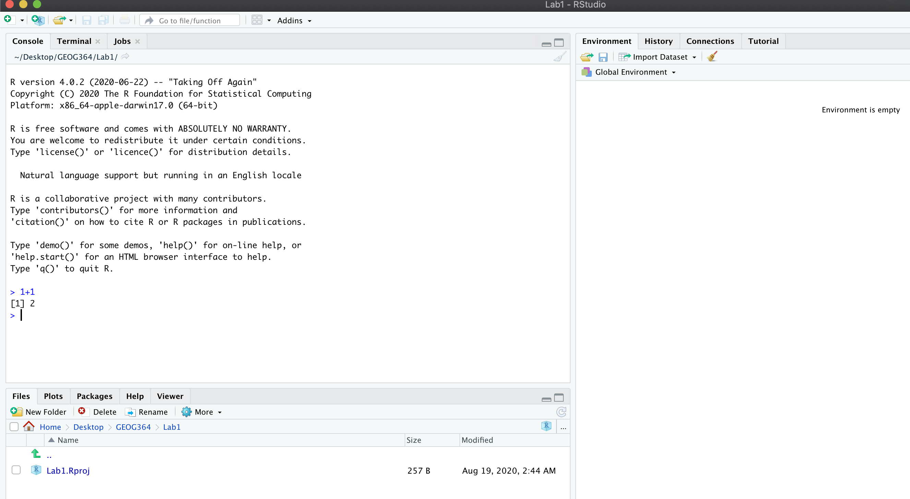
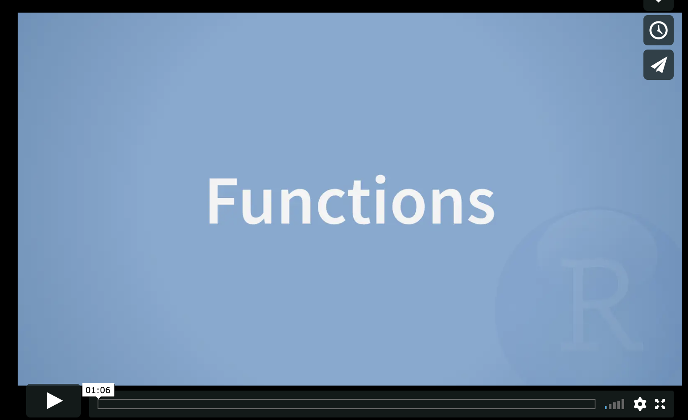
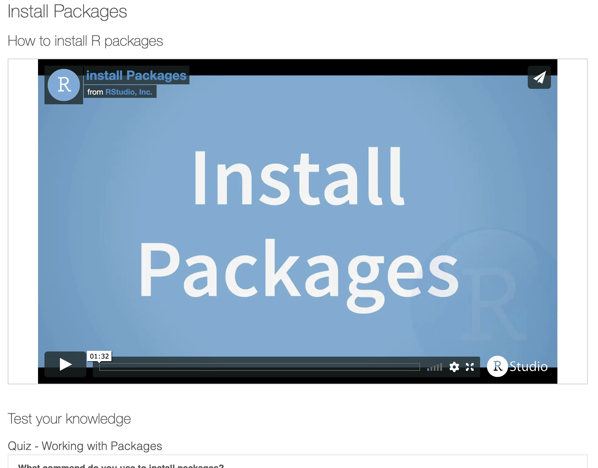
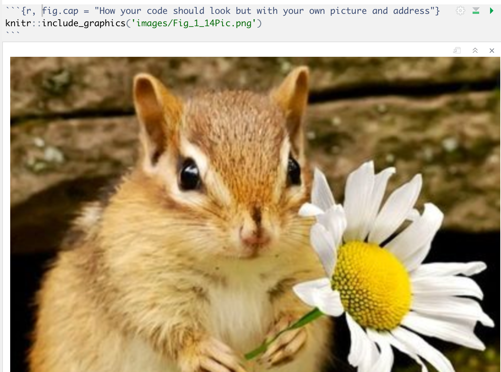
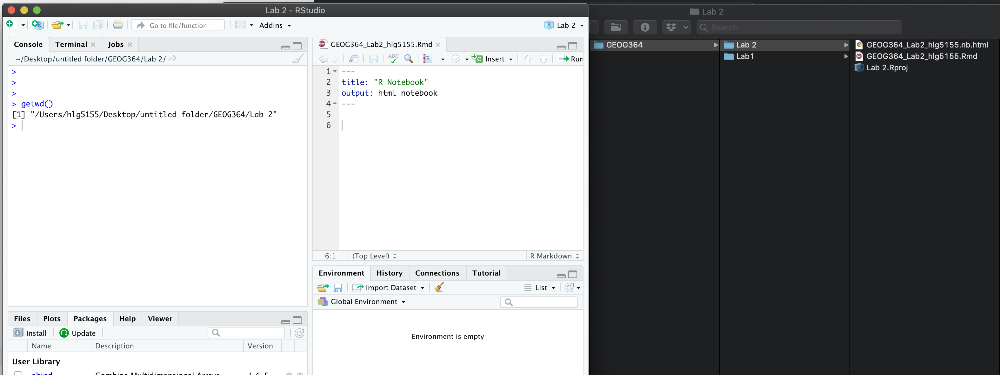
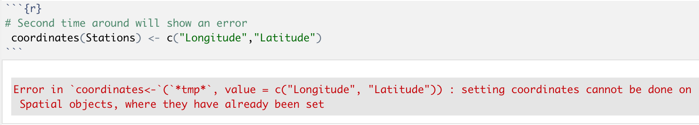
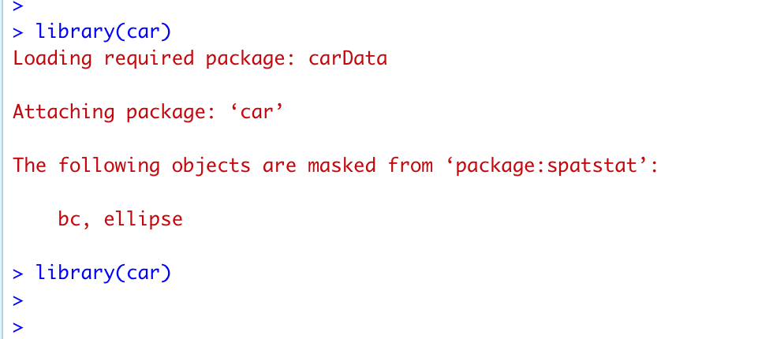
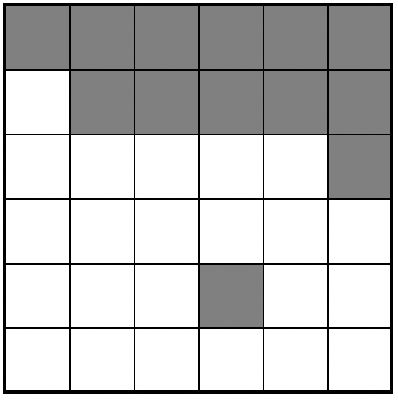
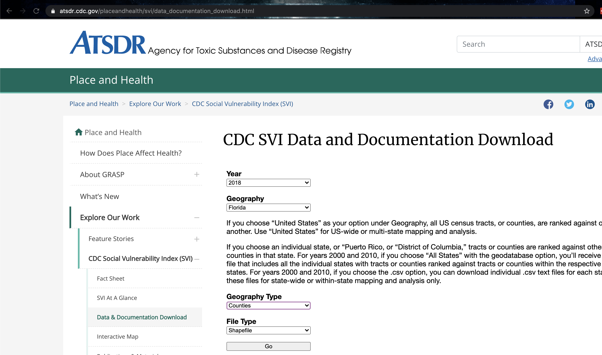

--- 
title: "Geog-364: Introduction to R"
author: "Helen Greatrex"
date: "`r Sys.Date()`"
site: bookdown::bookdown_site
output: bookdown::gitbook
documentclass: book
link-citations: yes
always_allow_html: true
github-repo: rstudio/bookdown-demo
description: "Lab 1 support guide"
---


# Lab 1

## Introduction

### Why is this class in R?

There are many different types of software one can use to analyze spatial data.  We're going to focus on the R programming language because:

  a. It's free and open source.
  b. It allows you to do traditional statistics, machine learning and data analysis.
  c. It's a good introduction to programming, which is great for your resume.
  d. There are some very cool visualization tools including
     + [RMarkdown](https://rmarkdown.rstudio.com/), [Blogdown](https://bookdown.org/yihui/blogdown/) and [Bookdown](https://bookdown.org/), where you can integrate R analysis into your papers, blogs and websites. For example, this lab book is written in Bookdown.
     + [RShiny](https://shiny.rstudio.com/) for very cool interactive dashboards
     + [Leaflet](https://rstudio.github.io/leaflet/) and [RGoogleMaps](https://rpubs.com/nickbearman/r-google-map-making) where you can use beautiful map making tools

You will hopefully be exposed to all of these things throughout the course of the semester.


### What are R and R-studio? 

**R** is a programming language commonly used by statisticians and scientists across the world.  It can be used to analyse data, to visualise results and to develop new software.  It is commonly used in spatial analysis because it is powerful and free, plus it allows you to combine spatial analysis with more traditional statistics.  

When I say R is a programming language, I mean that it is a collection of commands that you can type into the computer in order to analyse and visualise your data. Think of it literally like a language like Spanish or Hindi, so learning it means learning vocabulary and grammar to communicate with your computer. It also means it will get easier with experience and practice..

When you install R on your computer, you are essentially teaching the computer what those the language means along with some very basic Notepad-like software where you could enter the commands.

```{r, Rscreenshot, echo=FALSE, fig.cap = "The basic R screen"}
knitr::include_graphics('images/Fig_1_1Rscreenshot.png')
```
 
More recently, **R-studio** has been designed as a piece of software to make it easier to programme in R. It's what Microsoft Word is compared to notepad - lots more functionality and things to click.  For example, you can easily see help files, run code, see your output and link to all the website/dashboard builders. 

In this course, we are going to use R-Studio as the main software, but you don't *need* it if one day you only have access to R. 

```{r, Rstudio, echo=FALSE, fig.cap = "The basic R-studio screen. Here is the R-Studio website where you can explore some of its features: https://rstudio.com/products/rstudio/features/"}
knitr::include_graphics('images/Fig_1_2BasicRstudio.png')
```

### What are R-Markdown & R-Shiny?

In recent years, people have developed new software in R to allow you to include your analysis in some pretty sophisticated outputs.

**RMarkdown** is an document written in R, where you can combine code, results, equations and text (and photos/video etc).  Essentially R-Markdown is a way to tell a story along with your data analysis, without having to copy and paste screen-shots of diagrams. This will be how you write up your lab reports.   

R-Markdown also goes beyond just interactive documents:

 - **RBookdown** is a book written in RMarkdown.  It is how I wrote this help document
 - **RBlogdown** is a blog written in RMarkdown
 - You can also make entire interactive websites in R-Markdown
 
 You can see examples and more details about R-markdown here: https://rmarkdown.rstudio.com/gallery.html

**RShiny** allows you to make interactive applications and tools in R.  Here are some examples: https://shiny.rstudio.com/gallery/


## Installing R and R-studio

In this class, we would like you to download and install both R and R-Studio onto your own computers.  

**If the labs are causing major problems with your computer or your computer hardware is struggling (or you have any other software issue), Talk to Dr Greatrex**. We can definitely fix this and there are other options for "online R" that you can use. As these all have their own issues, getting it installed on your computer is likely easiest and the one I would like you to try first.

In general, you can reach out to any of the teaching staff if you have any issue at all - we have likely see the errors hundreds of times before and we are happy to help.


### I have R/R-studio installed already

It's great you have them installed!  Many of the packages that we are using rely on the most up-to-date version of R and R-studio, so please update them to the latest version.  To do this, follow these instructions:  https://uvastatlab.github.io/phdplus/installR.html#updateR

(If you know this will lead to issues on another project, talk to Dr Greatrex before you do anything).

 
### Installing R/R-studio for the first time

You need to install two new software programs, one called R and and called R-Shiny.

You can click here for written instructions: https://psu.instructure.com/courses/2057289/pages/how-to-install-or-update-r-and-r-studio?module_item_id=30182767

Or follow these two installation tutorials in video format:

To install R, follow this video:

[](http://vimeo.com/203516510 "Installing R")

To install R-studio, follow this video:

[](http://vimeo.com/203516968 "Installing R-Studio")


## Getting started

### Open R-studio

```{r, rrstudio, echo=FALSE, fig.cap = "Icons of the R program and R-studio"}
knitr::include_graphics('images/Fig_1_3RRStudio.png')
```

**Open R-studio** (NOT R!).  You should be greeted by three panels:

 - The interactive R console (entire left)
 - Environment/History (tabbed in upper right)
 - Files/Plots/Packages/Help/Viewer (tabbed in lower right)

If you click on the View/Panes/Pane Layout menu item, you can move these around.  I tend to like the console to be top left and scripts to be top right, with the plots and environment on the bottom - but this is totally personal choice. 
 
```{r, basicStudio, echo=FALSE, fig.cap = "The basic R-studio screen when you log on"}
knitr::include_graphics('images/Fig_1_4RStudio.png')
```

If you wish to learn more about what these windows do, have a look at this resource, from the Pirates Guide to R: https://bookdown.org/ndphillips/YaRrr/the-four-rstudio-windows.html

**If you have used R before, you might see that there are variables and plots etc already loaded**.  It is always good to clear these before you start a new analysis.  To do this, click the little broom symbol in your environment tab.

### Change a few settings

R-studio wants to be helpful and will try to re-load exactly where you were in a project when you log back in.  This can get really confusing, so we are going to turn this off.

ON A MAC: Click on the R-studio menu button on the top left of the screen, then click Preferences. 

ON A PC: Click on Tools-> Global Options -> Preferences

Now:

 - UNCLICK "Restore most recently opened project at startup"
 - UNCLICK "Restore .RData into workspace at startup"
 - Set "Save workspace to .RData on" exit to Never

```{r, Options, echo=FALSE, fig.cap = "Change these 3 options, then press Apply and OK"}
knitr::include_graphics('images/Fig_1_5Options.png')
```


### Create an R-project {#project}

We are going to use R-projects to store our lab data in.  An R project is a place to store all your commands, data and output in the same place.  R will know that it is all linked.

This is  useful because say you have Lab-2 open, but want to re-open Lab-1 to check some code, clicking the "Lab 1 project file" will load a whole new version of R with everything you did for Lab 1.  

It is ***really*** important that you stay organised in this course, for example making sure you know where you put your data and your labs. You will return to them in your final project, so it pays to be organised now. 

**To encourage this, choose a place that makes sense on your computer, create a folder called GEOG364.You can either do this outside R studio in your file explorer, or inside the "Files tab" in R studio.  You should store all your 364 files inside this folder**

Now we will create our first project (also see the pic):  

 - open R-Studio and click `New Project`, 
 - then click "new directory" 
 - then "new project". 
 - Name your project Lab 1, then browse to your newly created GEOG364 folder and press open.
 - Press OK and your project is created.

```{r, project, echo=FALSE, fig.cap = "Instructions to create an R project"}
knitr::include_graphics('images/Fig_1_6Project.png')
```

Your output should look something like this:

```{r, projectout, echo=FALSE, fig.cap = "Your screen after running the project"}
knitr::include_graphics('images/Fig_1_7FinalOutput.png')
```

Equally, R should now be "looking" inside your Lab 1 folder, making it easier to find your data and output your results.  Try typing this into the console (INCLUDING THE PARANTHESES/BRACKETS) and see if it prints out the location of Lab 1. 

```{r, eval=FALSE}
getwd()
```


##### If you're having issues at this point or haven't managed to get to this step, STOP!  Ask Dr Greatrex, Saumya or Harman for help. {-}


## Lab challenge 1

Now you have opened your project, take a screenshot of your R-studio page. It should look like Figure \@ref(fig:projectout), e.g. with at least R version 4.0.2, with the Lab 1 project and the project stored in your GEOG-364 folder.

 - To take a screenshot on a mac, press Command-3.  The sreenshot will appear on your desktop
 - To take a screenshot on a PC, press Alt + PrtScn  

Rename the screenshot to your "username_Lab1_Fig1"(for example for me it will be hlg5155_Lab1_Fig1), then place it in your Lab 1 sub-folder inside GEOG-364.  This folder was created when you made the project

You will need this later, so don't skip this step.


## R coding basics

So now we FINALLY get to do some R-coding.

### Basic arithmatic

Remember that the aim of R is to type in commands to get R to analyse data.  

The console (see Figure \@ref(fig:basicStudio)) is a space where you can type in those commands and it will directly print out the answer.  You're essentially talking to the computer.  The little ">" symbol in the console means that the computer is waiting for your command.

The simplest thing we could do in R is do arithmetic.  Click on the console and try typing the following. Press enter and R will calculate the answer.

```{r}
1 + 100
```

It should look something like this:

```{r, maths, echo=FALSE, fig.cap = "Starting to enter commands in the console. I choose the sum 1+1"}

```

When using R as a calculator, the order of operations is the same as you would have learned back in school, so use brackets to force a different order.  For example, try typing in each of the the commands below (in grey)

```{r}
3 + 5 * 2
```

will give a different result to 

```{r}
(3 + 5) * 2
```

Really small or large numbers get a scientific notation:

```{r}
2/10000
```
The e is shorthand for “multiplied by $10^{X}$”. So 2e-4 is shorthand for $2\times10^{-4}$


##### What if I press Enter too soon? {-}

If you type in an incomplete command, R will wait for you to complete it.  For example, if you type
`1 +` and press enter, R will know that you need to complete the command  So it will move onto the next line but the `>` will have changed into a `+`, which means its waiting for you to complete the command.  

**If you want to cancel a command you can simply hit the "Esc" key and R studio will reset.**

Pressing escape isn’t only useful for killing incomplete commands: you can also use it to tell R to stop running code (for example if it’s taking much longer than you expect), or to get rid of the code you’re currently writing.


### Comparing things

We can also do comparisons in R.  Here we are asking R whether 1 is equal to 1.

```{r}
# note two equals signs is read as "is equal to"
1 == 1  
```

```{r}
# inequality (read as "is not equal to")
1 != 2  
```

```{r}
# less than
3 < 2 
```

```{r}
# less than or equal to
1 <= 1  
```

```{r}
# greater than
1 > 0  
```

```{r}
# greater than or equal to
1 >= -9 
```


### Variables and assignment

It's great to be able to do maths easily on the screen, but really we want to be able to save our results, or load in data tables etc, so we can do more complex commands.   

In R, we can give things a name.  This is called a variable.  So then, instead of typing the whole command, we can simply type its name and R will recall the answer.

The way we store data into a variable is using the assignment arrow `<-`, which is made up of the left arrow and a dash.  You can also use the equals sign, but it can cause complications later on.  Try typing this command into the console.

```{r}
x <- 1/40
```

Notice that pressing enter did not print a value onto your screen as it did earlier. Instead, we stored it for later in something called a variable, with the name 'x'. 

So our variable `x` is now associated with the value 0.025, or 1/40.  You can print a variable on screen by typing its name, no quotes, or by using the print command.  Try printing out your variable.  You can do this in two ways, either by typing its name, or by using the print command.

```{r}
x
```

```{r}
print(x)
```

Look for the Environment tab in one of the panes of RStudio, and you will see that 'x' and its value have appeared. This 'x' variable can be used in place of a number in any calculation that expects a number. Try typing

```{r}
log(x)
```

Notice also that variables can be reassigned:

```{r}
x <- 100
print(x)
```

x used to contain the value 0.025 and and now it has the value 100.

*Note, the letter x isn't special in any way, it's just a variable name. You can replace it with any word you like as long as it contains no spaces and doesn't begin with a number*.  Different people use different conventions for long variable names, these include

 - periods.between.words.1
 - underscores_between_words
 - camelCaseToSeparateWords

What you use is up to you, but be consistent.

##### Combining variables {-}

You can now use multiple variables together in more complex commands. For example, try these commands:

```{r}
#Take the variable x, add 1 then save it to a new variable called y
y <- x + 1 
# print the multiple of 2yx onto the screen
y
```

Now you can see that there are two variables in your environment tab, x and y.  Where y is the sum of the contents of x plus 1. 

**The way R works is that first it looks for the commands on the right of the arrow.  It runs all of them, calculates the result, then saves that result with the name on the left of the arrow.

The right hand side of the assignment (right of the `<-`) can be any valid R command. The right hand side is fully evaluated before any assignment occurs.The variable only saves the result, not the command itself.

You can even use this to change your original variable .  Try typing the code below in a few times into the console and see what happens.

**A short cut to do this is to type the commands the first time, then use the up-arrow on your keyboard to cycle back through previous commands you have typed**

```{r}
x <- x + 1 #notice how RStudio updates its description of x on the top right tab
x # print the contents of "x" onto the screen
```

Our variables don't have to be numbers. They could refer to tables of data, or a spatial map, or any other complex things.  We will cover this more in future labs.


### Functions

The power of R lies in its many thousands of built in commands, or *functions*. In fact, we have already come across one - the print command.  Some more examples include:

 - `plot(x=1:10,y=1:10)` 
    + This will plot the numbers 1 to 10 against 1 to 10
 - `x <- nchar("hello")` 
    + This will count the number of letters in the word "hello" (e.g. 5), then save it as a variable called x

Watch this short video to learn three important facts about functions:


[](http://vimeo.com/220490105 "Installing R-Studio")

The `file.choose()` command will let you interactively select a file and print the address out onto the screen. Try each of these out in your console for the file.choose() command:
```{r, eval=FALSE}
# Typing this into the console will print out the underlying code
file.choose 

# Typing it WITH parentheses will run the command
file.choose()

# Typing a ? in front will open the help file for that command
?file.choose
```


**The round brackets/parentheses after the name ( ), mean that it is a command.**

Sometimes we need to give the command some additional information.  Anything we wish to tell the command should be included inside the inside the parentheses (separated by commas).  The command will literally only know about the stuff inside the parentheses.

```{r}
sin(1) # trigonometry functions.  Apply the sine function to the number 1. 
```

```{r}
log(10) # natural logarithm.  Take the natural logarithm of the number 10. 
```

This following command will plot the number 1 to 10 against the numbers 12 to 20, along with some axis labels.  When you run this, the plot will show up in the plots tab.  

```{r}
plot(1:10,11:20,col="dark blue", xlab="x values",ylab="GEOG-364 is the best") 
# plot the numbers 1 to 10 against the numbers 11 to 20
```

#### Command help

As mentioned above, typing a ? before the name of a command or function will open the help page for that command in the "environment" box on your screen.  As well as providing a detailed description of the command and how it works, scrolling to the bottom of the help page will usually show a worked example of the code which you can copy into the console.  You can then copy these line by line into the console to understand what is happening. 


```{r, eval=FALSE}
## This provides the help page for file.choose.
?file.choose   
```

```{r, help, echo=FALSE, fig.cap = "What you should see after typing ?file.choose"}
knitr::include_graphics('images/Fig_1_7Help.png')
```

### Packages

There are now several million commands/functions available for you to use in R.  To make sure your computer doesn't get overwhelmed, it doesn't load all of these at once. In fact many need to be downloaded from the internet. 

A close analogy is your phone.  There are several million things you can do on your phone, which are collated into bundles called apps.   To use the features in an app, you need to click on the icon of the app to load it.  Equally you need to download many apps from the internet to start with. 

So we have 

 - R: The programming language itself
 - Functions: Which are specific commands or actions written in the R language
 - Packages: Commands are grouped into bundles called packages, which we need to load every time.

This mini video and tutorial also explains things clearly. Click on the link, work thorugh it and we will install our own packages in the next lab.

[](https://learnr-examples.shinyapps.io/ex-setup-r/#section-install-packages "Installing packages")

### Coding help

Don’t worry about trying to remember every function in R.  In this course, you will be provided with most of the functions you need, but you can also simply look up what you need on Google.  

This cartoon from XKCD is a pretty normal way to think about programming!  One of the most important skills you can learn as a programmer is how to effectively google the information you need...

```{r, xkcd, echo=FALSE, fig.cap = "https://xkcd.com/627/"}
knitr::include_graphics('images/Fig_1_6XKCD.png')
```

## Lab Challenge 2

Now we are going to download some packages from the internet and install them.  You must be connected to the internet to make this happen!  In the console, type the following commands, or click the "Install" button in the packages tab (next to plots) and find the package name. If it asks if you want to install dependencies, say yes.

```{r, eval=FALSE}

install.packages("knitr")
install.packages("rmarkdown")
install.packages("tidyverse")

```

You will see a load of red text appear in the console as it tells you its very detailed status of how it's downloading and installing.  Don't panic!  It might also take several minutes to do this, longer on a bad internet connection.

When you have typed all three commands and waited until they have finished running (remember, when it is done, you should see the little ">" symbol in the console waiting for your next command), we want to check if they have installed successfully onto your computer.

To do this we are going to load them using the library command:
```{r, eval=FALSE}

library("knitr")
library("rmarkdown")
library("tidyverse")

```

If you have managed to install them successfully, often nothing happens - this is great!  It means it loaded the package without errors.

Sometimes, it will tell you friendly messages.  For example, this is what shows up when you install the tidyverse package.  It is telling you the sub-packages that it downloaded and also that some commands, like filter - now have a different meaning.  E.g. originally the filter command did one thing, but now the tidyverse package has made filter do something else.

```{r, tidyverse, echo=FALSE, fig.cap = "Tidyverse install messages"}
knitr::include_graphics('images/Fig_1_15Tidyverse.png')
```

To find out if what you are seeing is a friendly message or an error, run the command again.  If you run it a second time, then nothing should happen.

!  **IMPORTANT**  If you see some red errors here after mulitple attempts running the commands, we will have to fix what your computer is doing together.  If you see errors, then take a screenshot of the full page and talk to a TA or Dr Greatrex, or post on piazza under the Lab 1 tab.


## Create a R-Markdown document

### What is markdown?

So far, we've been typing commands into the console, but these will all be lost once you close R. Equally, it's hard to remember or reproduce the analysis you have done . So we will now move onto writing code commands that you can save and submit.

There are several types of document that you can create and save in R-Studio.

 - A basic script (the filetype is .r).  This is simply just a blank document where you can save code commands (a script is shown in (Figure \@ref(fig:Rscreenshot))).  When you "run" the commands in the script, R simply copy/pastes the commands over to the console.
 
 - An R-Notebook or Markdown document (the filetype is .Rmd).  These are documents you can use to write a report with normal text/pictures, but and also include both your R code and output. You can turn these into reports, websites, blogs, presentations or applications. For example these instructions are created using a markdown document.    
 
In this course we are going to focus on the R-Notebook format.  Watch this 1 min video covers markdown files and leads to a comprehensive guide on how to create them. Markdown and Notebook files are almost identical, so I will use the terms interchangeably for now.

[](https://rmarkdown.rstudio.com/lesson-1.html "1 min Markdown Tutorial"){target="_blank"}


### Creating a notebook document

Time to make your own. Go to the File menu on the top left, then click New File - Notebook.  A file should appear on your screen - your first notebook script.  Essentially, we have some space for text, some space for code, and a space at the top of the file where we can add information about themes/styles etc.  


```{r, markdown, echo=FALSE, fig.cap = "You should see TWO new files appear in your lab 1 folder"}
knitr::include_graphics('images/Fig_1_10Markdown.png')
```

If you click on the little right triangle arrow at the top-right of the code chunk, you can run the plot command, and a picture will appear, running the code.  Note, it no longer runs in the console. You can still copy things into the console, by clicking on the line you want to run and pressing Ctrl-Enter / command-Enter.

Let's try this.  On line 11, delete `plot(cars)` and type `1+1`.  Now press the green arrow and the answer should appear directly under your code chunk.  

Now click at the end of the script, around line 20 and press the green insert button (top right in the script menu icons).  Insert a new R code chunk.  Inside, type `1+2` and run it.  So you can see that you can have text/pictures/videos etc, and code chunks interspersed throughout it.

Finally, click on the script then press the save button. Save it as GEOG364_Lab1_PSU.ID   e.g. GEOG364_Lab1_hlg5155

You will see two files appear in your files tab, and your Lab_1 folder. Click on the LabScript1_abc9999.nb.html file then it will open in your file browser - you should see your code output and your formatted text. You have made your first R-html output - congrats!  

**IMPORTANTLY - If you don't "run" each code chunk by clicking the arrow, or clicking the run-all button in the top right, then that code won't run in your final html output that we grade.  If that is the case we can't see if the code works and cannot award you the marks!  SO - get in the habit of pressing "run-all" before you submit your final html file**

```{r, rmdtwo, echo=FALSE, fig.cap = "You should see TWO new files appear in your lab 1 folder"}
knitr::include_graphics('images/Fig_1_9Rmd.png')
```


### Text formatting (in the white area) {#Format}

If you want to make bold/italic/underline text formatting, or to create section headings in your text, you need a few more commands.  Remember, this is for the text in your final report in the white area - only R commands go in each code chunk!

You need to press enter twice to start a new paragraph.

As another example, if you type 
`*TEXT*`, you will see *TEXT*

On a new line if you type

`# this is a new section header`, then R will interpret that as a new chapter or section header and change the font accordingly. Here is what this text looks like in my script:

```{r, format, echo=FALSE, fig.cap = "My writing"}
knitr::include_graphics('images/Fig_1_12Format.png')
```

The easiest way to learn these is to click the Help/Markdown Quick Reference Menu, which will bring up a cheat-sheet with all the formatting.  Although this feels like a pain, it's actually useful because it makes it very easy for R to change the formatting depending on what output format you need.


```{r, cheat, echo=FALSE, fig.cap = "Bringing up the formatting cheatsheet"}
knitr::include_graphics('images/Fig_1_11Cheatsheet.png')
```
**THERE IS ALSO A SPELL-CHECKER NEXT TO THE SAVE BUTTON - REMEMBER TO USE IT!**


## "Friendly text" {#friend}

Much of what you see on your screen when you open a notebook document is simply a friendly introduction to RStudio.

So your notebook file is essentially a Word document with the ability to add in "mini R-consoles", AKA your code chunks.  Imagine every time you opened a new word document, it included some "friendly text" (*"hi, this is a word document, this is how you do bold text, this is how you save"*). This is great the first time you ever use Word, but kind of a pain after that.   

RStudio actually does this.  Every time you open a notebook file, you actually *do* get this friendly text, explaining how to use a notebook file.  Read it, make sure you understand what it is telling you, then delete all of it. So delete from line 6 to the end.  The stuff left over is your YAML code which tells R how to create the final html file. DON'T TOUCH THAT.

```{r, friendly, echo=FALSE, fig.cap = "You should see TWO new files appear in your lab 1 folder"}
knitr::include_graphics('images/Fig_1_16Friendlytext.png')
```


## Lab Challenge 3

Your final challenge.

1. Delete all the "friendly text" in your script - you should be just left with your YAML code and a blank file (see previous section)


2. Create a new level-1 section header called "R-Basics", then press enter a few times (or your header will not work).  See the formatting help if you are not sure how.

```{r, space, echo=FALSE, fig.cap = "Remember to add a blank line BEFORE AND AFTER your headings"}
knitr::include_graphics('images/Fig_1_13Space.png')
```

   + Now in the space below your header, add an interesting fact or something you learned about R.  Write part of your fact in bold text.
   
   + Below the text, add a code chunk and include some code of your choice that runs without an error. AT A MINIMUM, YOUR CODE CHUNK SHOULD INCLUDE
      + Applying a function to your data
      + Assigning the result to a variable
      + Using the print command to print that variable out
      
A common question is *"but what code should I write?"*. Surprise us!  If you're really new to all of this, you could choose something very similar to the simple exercises above, or if you are more experienced, you could stretch yourself with something more fun and complex (last year, someone made a llama plot..).  

The thing we are testing is that you understand how to create a code chunk and some basic code features.   

3. Below that code chunk, create a new heading called "Project Location"
   
   Remember the screenshot you took in Lab challenge 1?  We are going to add it in here.
   
   + First, lets find the file.  It should be easy as you should have put it in your Lab 1 folder.  R doesn't automatically know which folder to look in, so that file.choose() command can help us find it.
   
   + IN THE CONSOLE, type file.choose()  (including the empty parentheses). A window will pop up.  Find your screenshot then press OK.  You will see in the console the file address has been written down.
   
   + Now, go back to your script. Create a new code chunk and inside type the following, but replace FILEADDRESS with the full address that just appeared on your console (INCLUDING THE QUOTES). 
   
   + Now click run and the chunk should load your screenshot inside your R-script.  As described in Lab challenge 1, we are checking the version of R, that you have created the project and stored it in the right place.
   
   
```{r, eval=FALSE}
# Load the knitr library
library(knitr)
#Add your screenshot
knitr::include_graphics("FILEADDRESS")
```
   
```{r, pic, echo=FALSE, fig.cap = "How your code should look but with your own picture and address"}

```
     
*Pictures are a little weird in R, which is why we're taking our time with this lab.  If your picture does not show up in the final nb.html:*

   + *Did you run the code chunk in the R-script so that it showed up just below the code chunk? (not in the plots tab) If not, run the code chunk then save again*
   
   + *You can "knit" the file by clicking knit (near the save button), which will create a html rather than a nb.html.  This should include the picture.  You are 100% fine to submit the html instead of the nb.html*
  
   + *If it STILL doesn't work, click in the text oart (outside the code chunk), create a new line and try the command ``, where FILEADDRESS is the output of file.choose() in the console*
   
   
4. **CLICK RUN-ALL, then save your file.**
Go to your Lab 1 folder and click on the nb.html file.  This should now be a professional html file of your work.  If you have issues, try pressing the knit button and look at the html file (either are fine to submit) Go to Canvas, complete the Canvas course and submit.

Congratulations on making it through a long document.  The first time in a new programming language is always tough, so nice work for making it this far.

## Online courses and resources
 
If you want to practice the basics,then there are several places you can take free introductory tutorials - all of which I recommend.  These include:
 
   - https://bookdown.org/ndphillips/YaRrr/ The Pirate's Guide to R.
   - FREE linkedin learning for R (Penn State log-in required): https://www.linkedin.com/learning/learning-r-2/r-for-data-science?u=76811570
   - FREE (basic account) code academy - https://www.codecademy.com/courses/learn-r/lessons/introduction-to-r/
   - Data Camp: First chapter is free - https://www.datacamp.com/courses/free-introduction-to-r

**If you're completely lost - it's OK! This is pretty normal at this stage.  Talk to the instructors and we can point you in the direction of resources to make you feel more comfortable using R.**


<!--chapter:end:index.Rmd-->

# Lab 2

## Learning objectives {#Lab2learn}

The aim of this lab is to start you out exploring spatial data and to do some basic analysis.  

By the end of this lab, you should be able to: 

 1. Read-in and summarise table/spreadsheet data (data.frames)
 2. Select subsets of a data.frame using square brackets and the $ sign
 3. Plot specific columns of a data.frame against each other (E.g. long/lat)
 4. Understand the main types of spatial data format in R 
 5. Be able to convert your data to either sp or sf format
 6. Load regional and country borders using rnaturalearth
 7. Plot sp data using the base package and interactively using Leaflet
 8. Critically analyse rain-gauge locations in R.
 9. Add a theme, authorship and table of contents to your markdown files.
 
 
## Lab set-up
 
### Create a Lab 2 Project

R Projects are useful because you can easily keep your labs and future projects separate, without losing your code and data. For example,if you want to go back to an old Lab (say Lab 1), you can simply go into the Lab folder and click Lab1.RProj - this will open R and all your old code so you can carry on where you left off.  So, to keep things tidy on your computer, lets create a new R-Project.  

First, make a new project called Lab 2 inside your GEOG364 folder. 

*Hint: Go to the main menu-bar at the very top of the screen, then click: `File` | `New Project` | `New Directory` | `New Project`.  Then call the project `Lab 2` and make sure it's created as a sub-directory of your GEOG-364 folder.  Or follow the instructions in Section \@ref(project).*

Now, go to the File menu/New File/R Notebook to create a new blank lab script. Delete the "friendly text" - see section \@ref(friend) and save it as `GEOG364_Lab2_PSU.ID.Rmd` e.g. `GEOG364_Lab2_hlg5155.Rmd` 

You should see something like the figure below, If you type `getwd()` into the console, it should return the location of the Lab 2 folder on your computer.

```{r, lab2script, echo=FALSE, fig.cap = "What your screen should look like, but the address of getwd() should be the one on your computer. Note that pressing save on the script has automatically made your .nb.html file"}

```

### Markdown adding a theme

While your lab script is blank, lets focus on the YAML code at the top (lines 1-4).  This makes your html output and there are many ways to customise it.  Your YAML code currently looks like this

```{r,eval=FALSE}
---
title: "R Notebook"
output: html_notebook
---
```

Change the YAML code to look like this (but with your name).  Note, if you copy/paste this and it doesn't work, sometimes the quote marks copy weirdly from the internet - try deleting and retyping the quotes.

```{r,eval=FALSE}
---
title: "Geog-364: Lab 2"
author: "Helen Greatrex"
date: "`r Sys.Date()`"
output:
  html_notebook:
    toc: true
    toc_float: yes
    number_sections: true
    theme: lumen
---
```

The elements we just added are:

 - The title
 - The author
 - Today's date
 - A floating table of contents and numbered sections (this won't appear until you start typing section headings)
 - The document is now in the lumen theme
    
Now, save your file, or click "preview" at the top of the script.  See if it works. 

If you click the knit button to make a html rather than a nb.html, then you will need to add a few extra lines for both output formats.  So yours should look something like this.

```{r, yaml, echo=FALSE, fig.cap = "Where the point & click package install button is"}
knitr::include_graphics('images/Fig_2_00YAML.png')
```

There is a reasonable chance this won't work first time around, as editing the YAML code can be a pain.  It is very case and space sensitive.  For example, the spaces at the start of some lines are important and are created using the TAB KEY, not the space bar.  There is one TAB key before html_notebook (which is now on a new line). There are two TAB KEYS before toc, toc_float, number_sections and theme


*Don't continue until you can make and view your html or nb.html file. If it doesn't work, ask for help before moving on*


**Challenge**

You can view themes for markdown documents here.  https://www.datadreaming.org/post/r-markdown-theme-gallery/

Choose one that works for you and edit your YAML code to load it.


### Installing common spatial packages

Here, we are going to install some of the most common spatial analysis packages: `rgdal`, `raster`, `sp`, `sf`,`leaflet`,`tmap`  and `rnaturalearth`.  This can take some time, so I suggest getting the download running, then returning here to continue reading through the lab notes.

As discussed in the previous lab, you can install these packages EITHER by 

  -  [1] Copy/Pasting this command into the **CONSOLE** (if you put it in a code chunk, it will download and install every single time you run your script, which we don't need):

```{r, eval=FALSE}
install.packages(c("rgdal", "raster", 
                   "sp","sf","rnaturalearth",
                   "leaflet","tmap","remotes"))

 remotes::install_github("AndySouth/rnaturalearthhires")
```

OR  

  -  [2] Going to the Packages menu (next to plots), clicking install, then choosing each package one by one (make sure install dependencies is clicked).

```{r, lab2pack, echo=FALSE, fig.cap = "Where the point & click package install button is"}
knitr::include_graphics('images/Fig_2_02_packages.png')
```

Once the packages have finished downloading and you can see the `>` symbol again in the console, you can move on.

**In your script, make a new R-code chunk,  Copy this code inside and run it.**  
   
```{r,message=FALSE,Warning=FALSE}
library(rgdal)
library(sf)
library(raster)
library(knitr)
library(sp)
library(raster)
library(leaflet)
library(tmap)
library(rnaturalearth)
```

You should see similar messages to ones that come up here. 

```{r, packagesr, echo=FALSE, fig.cap = "Common friendly messages"}
knitr::include_graphics('images/Fig_2_05_packages.png')
```

If instead of this, you see loads of red error code:

  1. Re-run the code chunk.  Sometimes that clears it up
  2. Check you have spelt everything correctly
  3. Try to re-install the package, then re-run the code chunk
  4. If you are still seeing errors, ask for help.


### Download data for this lab

Now you need to download some data from Dr Greatrex's github repository:

 - A table of weather station locations in Ghana.  
 
Copy/Paste this code either into the console to download the files.

```{r, eval=FALSE}
## Note, the structure of an R command.  We have a function (a command), download.file().  
## R knows it is a function because it has parentheses after it.
## Inside the parentheses are the arguments that R needs to carry out the command 
## (e.g. the address and the filename), separated by commas

filelocation <- "https://raw.githubusercontent.com/hgreatrex/GEOG364_Labs/master/Lab_2/Lab02_GhanaMetStations.csv"

download.file(filelocation, destfile = "Lab02_GhanaMetStations.csv" , verbose=TRUE)
```

The file *should* appear in your Lab 2 folder.  If not, you probably didn't create the project above, or your `getwd()` didn't show your Lab 2 folder.

## Data.frames and summary statistics

### Reading in your first file

**In your script, make a new Section heading called "Data Input".** If you can't remember how to do this, see Section \@ref(Format), or pull up the Markdown Quick Reference Guide (see the Figure below)

```{r, markdownref, echo=FALSE, fig.cap = "The incredibly useful Markdown quick reference"}
knitr::include_graphics('images/Fig_2_03_markdownref.png')
```

The data you just downloaded, `Lab02_GhanaMetStations.csv` is essentially a basic spreadsheet called a .csv file (each number is separated by a comma).  You can open this in Excel or notepad to have a look, but don't save it there.

First, we need to load, or read, this file into R. To do this, create a new code chunk and copy this code into it, including comments.

```{r}
# The read.csv command reads in a csv table of data into R.  
# We then save the table as a variable called Stations.
Stations <- read.csv("./Lab02_GhanaMetStations.csv",as.is=TRUE)
```

If it doesn't work, double check that the file actually is in your Lab 2 folder.

If it does work, you should see that "Stations" has turned up in your environment area on your screen, probably on the top right.  If you click on its name, you can have a look at the table, which can be a useful cross check to make sure that it all read into R successfully. Or, if you prefer you can print it into the console or into a code chunk, by typing its name into the console.  

In R, this type of data (a table) is called a **data.frame**.  

```{r, stationslook, echo=FALSE, fig.cap = "First look at the Stations data"}
knitr::include_graphics('images/Fig_2_04_Stations.png')
```

### Summarising data

There are several functions that you can use to summarise data, especially data in a table.  These include: 

 - `str(TABLENAME)`
 - `summary(TABLENAME)`

Where TABLENAME is the name of the data.frame variable you wish to explore.

**Challenge**

Create a code chunk and apply the functions above to Stations.  Then in the text below the code chunk, use the results of your code to answer these questions:

1. How many rows of data does the table have?
2. What is the average Longitude of the stations?


### Selecting columns and rows

Sometimes, we do not want to analyse at the entire data.frame.  Instead, we would like to only look at one (or more) columns or rows.

There are several ways we can select data. 

The first is we can use the `$` symbol to select its name.  For example, to select the Latitude column, you can use the command

```{r, eval=FALSE}
# COLUMN NAMES ARE CASE SENSITIVE
Stations$Latitude
```

Secondly, we can use **square** brackets to numerically choose a column. This follows the format:
TABLENAME[ROWS,COLUMNS]


```{r, eval=FALSE}

# This will select the 5th row and 7th column
Stations[5,7]

# This will select the 2nd row and ALL the columns 
Stations[2,]

# This will select the 3rd column and ALL the rows
Stations[,3]

# We can combine our commands, this will print the 13th row of the Longitude column 
# (no comma as we're only looking at one column)
Stations$Longitude[13]

# The : symbol lets you choose a sequence of numbers e.g. 1:5 is 1 2 3 4 5
# So this prints out rows 11 to 15
Stations[11:15,]

# The "c" command allows you to enter whatever numbers you like.  
# So this will print out rows 4,3,7 and all the columns
Stations[c(4,3,7),]
```


**Challenge**

In a new code chunk, write and run the code to: 

1. Select Rows:4,6,2 and Columns:1 and 2 , then assign it to a variable called subset.

2. Print values/rows 45:50 of the Station.Name column (you will just see 5 names as the answer)

3. Apply the `median()` function to the Latitude column and print the output.  E.g. what is the MEDIAN latitude in the Stations dataset?

4. There is one Station.Name that has been duplicated (a common issue). Apply the `table()` function to the appropriate column to work out which station it is.  Write the name of the station as a COMMENT inside the code chunk below your line of code.


### Basic plot

We can now make a basic plot of our data.  Here we can use the `plot` command along with our new found knowledge to select columns.

```{r}
plot(Stations$Longitude,Stations$Latitude)
```

This gives us the basics but it could be made more professional. Type `?par` into the console, or search for par in help, and R will display a load of arguments that can improve the plot.  For example, here, I have changed the  asp (aspect ratio), pch (point shape) and col (point color) arguments.

```{r}
plot(Stations$Longitude,Stations$Latitude, pch=16, col="blue")
```


**Challenge **

Make a new code chunk and make a plot of the station locations.  Your plot should include:

 - Red points 
 - An aspect ratio of 1 (`asp` argument)
 - Better x and y labels (`xlab` and `ylab` arguments)
 - A point size of 0.5 (`cex` arguments)

Although this plot is OK, it's not great.  The next section shows how  to improve using the specific spatial packages available in R.


## Converting to spatial data

R is not clever.  It's a bit like working with a toddler.  *We* might know that the words Longitude and Latitude have special spatial meaning for our Stations table, but R is not intelligent enough to work this out. So, several dedicated packages have been developed in R specifically for spatial data. There are four "mainstream" packages dedicated to dealing with both vector and raster spatial data:

 -  `sp` 
 -  `sf`
 -  `raster`
 -  `terra` (not covered in this course but likely the future)
 
Many package authors will write their commands assuming that your data is in a specific spatial format (e.g. sp).  So understanding how to read in data into different formats is a useful skill.

There are also some very specific packages which are slightly different.  We will touch upon later in the semester, such as the `ppp` package for point pattern analysis, or `ncdf4` for netcdf analysis.  Others might link to google maps or ESRI products.


### Making a data.frame "spatial"

We are now going to focus on two very similar packages, sp and sf. 

**To convert a data.frame to a SF object, we use the st_as_sf command:**

```{r}
#--------------------------------------------------------------------------
# To convert to sf format
# Here, "Longitude" and "Latitude" should be the 
# EXACT CASE-SENSITIVE COLUMN NAMES of your x and y columns in your table.  
# There is nothing special about the words longitude and latitude here
#--------------------------------------------------------------------------
 Stations_sf <- st_as_sf(Stations, coords = c("Longitude", "Latitude"))
 Stations_sf
```

**To convert a data.frame to a SP object (a spatialpointsdataframe), we simply tell it what the coordinates are:**

```{r}
#--------------------------------------------------------------------------
# Or convert the original table to sp format
#--------------------------------------------------------------------------
 coordinates(Stations) <- c("Longitude","Latitude")

# Print out the result.  You can see that R now sees it as a "Spatial Points Data.frame"
 Stations

```

Let's talk about the new information R is providing.  We have

 - **class:** You can have a spatial *points* dataframe, a spatial *lines* dataframe, or a spatial *polygons* dataframe. So you can see what type of vector data you have
 - **features:** How many points are there (equivalent to the number of rows)
 - **extent:** What is the furthest North/South/East/West that the data extends
 - **crs:** The map projection.  See the next section
 - **variables** How many attributes of the data do we have? We just have one, Station.Name
 - **names:** The names of your attributes (the other things you can plot)
 - **min values and max values** Some information about the attributes, in our case the first and last station.


You might find that you run the coordinates command once without error, but the second time around you see something like this:

```{r, coordinates, echo=FALSE, fig.cap = "A common error"}

```

This is because the coordinates command changes a TABLE into spatial data.  But if you run it again, you are trying to convert spatial data into more spatial data and R gets confused.  So you can completely ignore this error - it means everything is working fine.


**Challenge **

Make a new heading called "Spatial Analysis" 

Underneath that, create a new code chunk and use the code above to convert your Stations data to **sp** format.  In the console, type plot(Stations). Your plot should now look very different.

Above the code chunk, in the white text, explain what you just did.


```{r, stationplot, echo=FALSE, fig.cap = "Plotting the data now it is sp format"}
knitr::include_graphics('images/Fig_2_06_StationPlot.png')
```

### Reading in vector line data (rnaturalearth)

Let's now also include some vector-line data on top of our points, but adding in some regional administrative boundaries. In later labs, we will learn how to read in vector data from a file, but this time we are going to use data that is already built into R.  

This is part of the `rnaturalearth` package, which links automatically with the "Natural Earth" dataset, found here: https://www.naturalearthdata.com/features/

For administrative border data, we can use the `ne_countries` or the `ne_states`commands. For example, this would load the entire world borders and assign it to a variable called worldborder.

```{r}
# You can choose if you want the output to be sf or sp data
worldborder <- ne_countries(scale = "medium", returnclass = "sp")
plot(worldborder)
```

and this would load the regional boarders for the United Kingdom

```{r}
# You can choose if you want the output to be sf or sp data
UK <- ne_states(country="united kingdom",returnclass = "sp")
plot(UK)
```

**Challenge**

1. In your script, make a new section heading called "Vector data".

2. Now make a new code chunk and use the `ne_states` command to load regional borders for Ghana.  Assign it to a variable called `ghana`.

3. Above the code chunk, in the white text, explain what you just did.


## Assigning a map projection

Map projections and coordinate system are an essential part of spatial statistics.  Also, say we want to overlay country boarders on our points.  In that case, the coordinate systems of the shapefiles need to be identical.  

R makes use of the PROJ4 library which is a set of character strings that defines a coordinate system (a datum and/or map projection definition). The PROJ4 character string syntax consists of a list of parameters, each prefixed with the + character.  For example, 

 - the familiar UTM grid system is defined by `+proj=utm`
 - the specific zone number (e.g., 19) is defined by `+zone=19` 
 - and the datum (e.g., NAD 1983) is defined by `+datum=NAD83` 
 
 Putting these parameters together, we would see something like this:

`"+proj=utm +zone=19 +datum=NAD83 +no_defs +ellps=GRS80 +togrs80"`

A list of a the PROJ4 map projection names and their parameters used in defining a coordinate system can be found here: https://proj.org/operations/projections/index.html.  We will also discuss this in more detail in later labs.

If you are  interested in projections, for a comprehensive guide, use this resource: https://bookdown.org/robinlovelace/geocompr/reproj-geo-data.html

### Checking a projection in the **sp** package

In most cases, dealing with spatial data will involve changing the datum definition, map projection, or one of the map projection parameters (such as the central meridian or standard parallels).  You can check the existing projection using the `projection` command:

```{r, eval=FALSE}
## Here SPATIALDATA is the name of the object you want to examine
projection(SPATIALDATA)
```

**Challenge**

In a new code chunk, print out the projection of `Stations` and also the projection of `ghana`. You should see that one is "NA" and one is a common long-lat projection: `"+proj=longlat +datum=WGS84 +no_defs +ellps=WGS84 +towgs84=0,0,0"`.

Above the code chunk, in the white text, explain what you just did.

This can causes problems!  If our map projections are different for different datasets, then they will not align with each other in any plots or analysis.

So lets change the projection of Stations.


### Assign/changing projections in the sp package

To change a projection:

IF THE PROJECTION IS NA: To set the first ever coordinate system for an **sp** object, you would use the the `CRS` command

```{r, eval=FALSE}
# Nothing should happen when you run the code chunk if there's no error
# Here SPATIALDATA is the name of the object you want to assign a projection to
# proj4string(SPATIALDATA) <- CRS("your projection code")

#e.g. to change the projection of Stations to UTM, the code would be as follows
proj4string(Stations) <- CRS("+proj=utm +zone=19 +datum=NAD83 +no_defs +ellps=GRS80 +togrs80")

# THIS WILL NOT WORK IF YOUR DATA ALREADY HAS A PROJECTION
```

If your data ALREADY HAS A PROJECTION: you can change it using the `spTransform` command

```{r, eval=FALSE}
# Nothing should happen when you run the code chunk if there's no error
# Here SPATIALDATA is the name of the object you want to assign a projection to
Stations <- spTransform(Stations,"+proj=longlat +datum=WGS84")
```

This also means that if you re-run your chunk you might get a warning or an error.  Because you set the original projection once using CRS, but a quirk of R means it will show an error if you try to set the projection of something that already has one assigned.  So again, if you are running twice and see an error you can ignore it.

**Challenge**

In a new code chunk,  assign the projection of your Stations data to be this CRS: `"+proj=longlat +datum=WGS84"`

```{r,echo=FALSE,warning=FALSE, message=FALSE}
# You can choose if you want the output to be sf or sp data
proj4string(Stations) <- CRS("+proj=longlat +datum=WGS84")
ghana <- ne_states(country="ghana",returnclass = "sp")
```


### Map projections in the **sf** package

The same kind of transformations can also take place in sf formats. Unlike with RGDAL, you would use `sf_transform()` for sf formatted data. 


## Interactive Leaflet plots

Let's now see how our data looks plotted.  Create a new sub-heading called "Data Plots", then in a new code chunk enter the following code. You should see a basic plot that looks like this.  If so, congrats!  If not, you need to adjust your projections or something has happened.

```{r}
plot(Stations)
plot(ghana,add=TRUE)
```

The plot above is still pretty basic, so lets explore some of the big packages available to let you make "pretty plots" of spatial data.  There are three big mapping functions in R:  ggmap, tmap and leaflet.  

Today, we are going to make some interactive maps using Leaflet - an interactive mapping tool that goes far beyond R.  Watch the video to get a sense of it.

<iframe width="560" height="315" src="https://www.youtube.com/embed/CUZ6oSLTzlc" frameborder="0" allow="accelerometer; autoplay; encrypted-media; gyroscope; picture-in-picture" allowfullscreen></iframe>

To make our first Leaflet plot, we will ignore the %>% symbol you saw in the video.   Essentially we make a leaflet map by adding layers.  At the end, we print the map by typing its name.  

```{r}
# leaflet makes maps in layers and only at the end, prints out the final map

#LAYER1
mymap <- leaflet(data = Stations)   
#LAYER2
mymap <- addProviderTiles(mymap, providers$Stamen.Toner) 
#LAYER3
mymap <- addCircleMarkers(mymap, label = ~as.character(Station.Name),
                          radius=.3,opacity = 0.8)  # R doesn't care if one command is on 2 lines..
#LAYER4
mymap <- addPolygons(mymap, data=ghana,weight=2,col = 'red',fillOpacity = 0) 
#LAYER5
mymap
```

In this case we have:

 1. LAYER 1: Load the Stations data into leaflet and assign it to a variable called mymap
 2. LAYER 2: Use `addProviderTiles` to add a custom map background onto  mymap. You can find different examples here:  http://leaflet-extras.github.io/leaflet-providers/preview/index.html
 3. LAYER 3: Add custom markers to mymap, each one labeled with the Station.Name (taken from the Station.Name column of the data.frame) 
 4. LAYER 4: Add the country borders from the ghana data. These are actually polygons, so make sure the fillOpacity is 0 to only show the border. 
 4. LAYER 4: Print the final map

**Challenge ** 

Copy the code above into your own code chunk.  Then change the map background to be something more informative (your choice). 

## Describe the Ghana data

Even though we are going to learn some advanced spatial techniques in GEOG-364, **one of the most important ways to analyse spatial data is to look at it and explore its features.**

We often want to map rainfall across the world.  Because rainfall is a field (there is a value everywhere), it would initially make sense to spread your rain-gauges out in a uniform grid.  Yet, in Ghana at least, this is not what is happening.

Examine the Ghana rain-gauge data in your leaflet plot.  Try different map backgrounds (terrain, land-use, others..).  Try to understand *why* the data is spatially distributed the way it is.  Now in your text, explain:

 - What type of data are we looking at?
 - What map projection does it have? 
 - You describe the spatial structure of the data and any key features that it has
 - You describe *why* you think the data looks this way spatially. Provide evidence for your answers (you can have multiple plots if you want)
 - What features in the data would concern you if you were a data scientist?  Can you see any likely errors?


## Show me something new

*This section is going to be a feature of all of your labs in GEOG-364 and likely in GEOG-464.  It is designed to challenge you and push your R programming skills forward. One of the reasons an "A" is set at 90% is so that you can skip this section and still get an A, but I encourage you to try it as often as possible.* 

Create a new section header called "Show me something new".  Beneath this, you need to show some new code or some new aspect of Markdown that goes beyond the lab. It doesn't have to be long. You should also explain in your text or comments what the code does and what you are hoping to achieve.  

So you get used to the concept, in GEOG-364 I will always try to give some suggestions or inspiration.

If you are struggling, you can show me some minor additions to existing code for 2.5/5 marks. For example:

 - Copying code from earlier in the lab to plot the Station data, then changing the point type (pch) to crosses, or making the colors transparent
 - Adding a new YAML element (you will have to do this at the top and describe what you did here)
 - Showing me you know how to do some new markdown format (tables, links), https://rmarkdown.rstudio.com/lesson-6.html
 - Something you think of - be creative!
 
For full marks you need to demonstrates the use of a function or package that was not specifically covered in the handout, lecture, or lab. For example:

  - Plotting the station data / borders using something like ggmap or tmap
  - Loading the RColorBrewer data and using that for your plots
  - Loading a rnaturalearth raster file and plotting that (bonus if it's over Ghana and you can plot your points on top)
  - Loading a relevant shapefile and plotting it over the Ghana data.
  - Do something with a completely new package - this can be fun, like library(emojifont)
  - Or your idea (welcomed)

You will lose 2 marks for not explaining in the text what you are trying to achieve and what the commands are that do so. It should be clear you understand your code.

  
## Lab submission check

**MARKDOWN/CODE STYLE - 5 MARKS**

Your code and document is neat and easy to read. You have section headings, have clearly labeled your answers or described what you are trying to do in the code.
    
**YAML - 10 marks**

You have adjusted your YAML code to include a theme, author, data and table of contents.  This should show up in your final nb.html or html file
     
**R-BASICS - 30 marks**

You correctly answered all the questions in Section 2.3 "Data Frames"

**SPATIAL BASICS - 20 marks**

You checked the projections of Stations and ghana and adjusted the map projection of the Station data to be long/lat  Section 2.10.  You also plotted the ghana and Station data using the standard plot function and Leaflet (where you changed the theme)

**GHANA DESCRIPTION - 20 marks** 

You included a thoughtful, well organized, and articulated response to the question about the Ghana gauges

**SOMETHING NEW - 5 marks**

You made a minor change to an existing piece of code (2.5/5)
OR
You demonstrated the use of a function or concept that was not specifically covered in the handout, lecture, or lab (5/5)

**HTML FILE SUBMISSION - 5 marks**


**RMD CODE SUBMISSION - 5 marks**


[100 marks total]


**THERE IS NO CANVAS QUIZ WITH THIS LAB**


<!--chapter:end:02-Lab02.Rmd-->

# Lab 3

## Learning objectives {#Lab3learn}

Welcome to Lab 3, where we are going to focus on Point Pattern Analysis. A point pattern dataset events or objects occurring in a defined study region. These events could represent anything with a specific measurable location, from greenhouses to stars.

**Objective:**  The goal of Lab 3 is to learn some introductory spatial statistical approaches for characterizing first-order properties of a point pattern.  We will be focusing on quadrat analysis, kernal analysis and standard ellipses.

**Data-sets:** You will be working with two separate point pattern datasets that are already built into R.

 - The first dataset, called longleaf pine, is a marked point pattern containing locations and diameter measurements of longleaf pint trees in a forest in Georgia.  All your examples here in this lab book will analyse this dataset.
 - The second dataset is called bei and is also related to trees. You will be analysing this one and will find out more as you go


```{r,  ppp0, echo=FALSE, fig.cap = "The two point datasets we are exploring"}

```


## Lab 3 Set-Up

### Create your Lab 3 project file

Open a new version of R-studio.  Click the file menu, then new project in a new directory.  Select your 364 directory, then name the project Lab 3.  If you are stuck on this process, see the start of Lab 1 and Lab 2.  

You can check this has worked by looking on the file explorer on your computer, then selecting your GEOG364 folder and checking that a Lab 3 folder has appeared with your Lab3.Proj file inside it.


### Install new packages

There are two specialist packages called "spatstat" and "car" which focus on point pattern analysis.

#### Install the spatstat package

To make sure you do not include the install.packages command in your .Rmd file, please install it by clicking the "install button" in the packages menu.   Click on the install button, then start typing spatstat,select it and press install.  

*If you are a Windows user, you will see a message at the beginning of the install process saying that you need to install R-Tools.  IGNORE THIS - You probably don't need to install R-Tools *


```{r, installbutton3, echo=FALSE, fig.cap = "You can click the button and simply type the name if the package you want to install"}
knitr::include_graphics('images/Fig_3_01_install.png')
```

The install might take a few minutes.  Once it has finished, test it has worked by typing `library(spatstat)` into the console.  you should see some messages like this.

```{r, spatstat3, echo=FALSE, fig.cap = "The messages that appear when I load spatstat for the first time"}
knitr::include_graphics('images/Fig_3_02spatstat_library.png')
```


There is a lot of text, but unless you have a load of things that say ERROR, you can ignore it.  (Don't worry about the out of date message).  One way to check is to run the code chunk twice as shown in the screenshot.  If the second time the messages disappear then you don't need to worry.

IF THIS PACKAGE HASN'T LOADED OR INSTALLED CORRECTLY, TALK TO AN INSTRUCTOR.

#### Install the car package

Now, repeat the process for the `car` package.  This might take a while to download.  You should see something like this.

```{r, car3, echo=FALSE, fig.cap = "The messages that appear when I load car for the first time"}

```


IF THIS PACKAGE HASN'T LOADED OR INSTALLED CORRECTLY, TALK TO AN INSTRUCTOR.

### Create your NoteBook file

1. Now, go to File/New File and create a new R-NOTEBOOK file.
2. Delete the friendly text (everything from line 6 onward)
3. Save your file as ``GEOG364_Lab3_PSU.ID.Rmd`` e.g. `GEOG364_Lab3_hlg5155.Rmd`
4. Follow Section 2.2.2 to modify your YAML code (you can keep lumen as a theme or try your own)


5. Add a new code chunk.  Inside add the following code and run it.

```{r, message=FALSE,warning=FALSE}
library(spatstat)
library(sp)
library(car)
```

The reason we are adding this just after typing it into your console is that these library commands need to be run every time you open R.  So we put them in a code chunk right at the top of your Note Book file.

Now click the Preview Button and make sure everything looks correct.  

IF THERE ARE PROBLEMS, TALK TO AN INSTRUCTOR

## Initial Data exploration

### Loading the data

In this lab, we are going to use two datasets that are already built into the spatstat package.

 - All of the examples in this lab book are based on a dataset called `longleaf` 
 - You will be conducting your analysis on a dataset called `bei`

The advantage of this is that we don't have to worry about file formats or Map Projections for now.

But first, we need to load them into R studio

Below your code chunk, make a new heading called Initial Data Analysis.  Remember to leave a blank white line before and after your headings.  If you can't remember how to do this, go to `Help/Markdown Quick Reference` (where Help is the menu right at the top of your computer screen) or see Lab 1 or 2.

Now make a new code chunk.  Inside add:

```{r}
# This loads the internal dataset from R.
data(longleaf)
data(bei)
```

Run the code chunk and you should see the longleaf and bei datasets appear in your environment quadrant on the screen (top right).  

From now onward, you do not have to run the longleaf examples because you can see the output in this lab script, but the data is there if you want to test examples.

**Your job is to understand the `bei` dataset.**


### Reading more information

Because the longleaf and bei datasets are internal, they have their own help file.  To view the help file for the longleaf data, I create a new code chunk, and run the command:

```{r, eval=FALSE}
# putting a ? at the start means look at the help file
# this will only work for commands and data built into R.
?longleaf  
```

The help file now opens onto my screen:

```{r, helpfile3, echo=FALSE, fig.cap = "The longleaf help file"}
knitr::include_graphics('images/Fig_3_04Helpfile.png')
```


We can see a lot of information from this file:

 - My data is a point pattern dataset containing locations and diameter measurements of longleaf pint trees in a US forest in Georgia
 - There are 586 pine trees in the dataset
 - The data was collected and analysed by Platt, Evans and Rathbun in 1988
 - The data is *marked*. So it is not just locations, but it also contains additional information about the diameter of each tree trunk (in cm).
 - The data is stored as a "ppp" object (which is a point pattern file type)
 - The ppp object also contains information on the region (i.e., window) that was chosen for the study. In this case it is a rectangle with an X coordinate range of 0-200 and a Y coordinate range of 0-200, with units in meters.


I then made an initial plot of the longleaf data. Because the data is marked, the size of the circle automatically corresponds to the marks, the diameter of the tree trunk.  

```{r}
plot(longleaf)
```

## Lab-3 Challenge 1

1. Make sure you have a code chunk that loads the packages using library, AND one that loads the data using the data commnd.  If not, go back and reread the section.

2. In a new code chunk, use the instructions above to load the help file for the `bei` data.  Understand what the data is, how much data there is and whether it is marked. You are welcome to write notes here, but you will be assessed on your knowledge of this in the Canvas lab-3 quiz Q1 and Q2.

3.  Create a new code chunk and make a plot of the `bei` data.  Comment underneath the plot about whether you see any spatial autocorrelation (positive/negative/zero), plus which spatial fallacies might cause problems in this lab.


## Mean Centre and Standard Ellipse

Firstly, let's look at some summary statistics.  The easiest thing to consider is the spatial mean, where we take the mean of all the x values vs all the y values.  


```{r}
x.mean.longleaf <- mean(longleaf$x) 
y.mean.longleaf <- mean(longleaf$y)

print(x.mean.longleaf)
print(y.mean.longleaf)
```

We can also add a standard ellipse using the dataEllipse command in the `car` package.

```{r}
dataEllipse(longleaf$x, longleaf$y, levels=0.68, 
            fill=TRUE, fill.alpha=0.1, # Fill the ellipse with transparent grey
            pch=16, cex=.5,            # filled small dots
            xlab="x (m)",ylab="y (m)",         # labels
            col= c(rgb(red=0, green=0, blue=0, alpha = 0.5),"blue")) # Slightly transparent points & blue ellipse

```

The reason this is often useful is that we can see if the overall distribution changes over time e.g. imagine repeating your survey of longleaf pines in 10yrs time and seeing if the distribution has changed with climate change or urbanization.


## Lab-3 Challenge 2

1. Make a new heading called Standard Ellipse

2. Make a new code chunk and find the spatial mean of the `bei` data

3. Create a new code chunk and plot the standard ellipse of the `bei` data.  

This corresponds with questions 3 and 4 in the Canvas Lab 3 quiz.


## Global Density analysis

Let's move beyond summary statistics. In the rest of this Lab, we will study the variation of the observations’ *density* across a study area, essentially giving us clues about the non-uniformity of space

For example, the distribution of trees might vary across a landscape from North to South due to climate conditions, or show a more complex spatial pattern based on underlying soil characteristics.  These underlying factors could easily result in some areas having dense clusters of trees and other areas causing clearings.  

This phenomenon is called **First order** spatial variation. AKA the underlying geography is causing the patterns we see  (rather than a each individual point influencing the other points around it)


```{r, autocorr3, echo=FALSE, fig.cap = "plot from "}
knitr::include_graphics('images/Fig_3_05autocorrelation.png')
```


The first way to look at this is to examine the overall density of points over the entire field, known as the global intensity. This is simply the average number of points per grid-cell.  We say it's "global" because we only calculate one number for the entire study area.  

Mathematically, the overall intensity of a point process can be calculated via the following equation, where n is the number of points within our region and A is the area of the region.

$$\lambda=\frac{n}{A}$$


In R, we can do this simply by looking at the summary command.   For the longleaf data, I am going to make a new code chunk and run

```{r}
summary(longleaf)
```

Where we can see:

 - That the global intensity of the pattern is 0.0146 trees per square metre (note the units). 
 - This also gives us a summary of some information from the help file 
 - It also summarizes our marks. We can see that the thinnest tree trunk has a diameter 2cm and the largest, 75.9cm.  
 Finally it tells us the shape and area of our boundary box containing all our points is 200x200m. Note, this bounding box doesn't *have* to be rectangular.
 
 
## Lab-3 Challenge 3

1. Create a new subheading called global intensity

1. Create a new code chunk and use the example above to work out the global intensity of trees in the bei dataset


## Local intensity - quadrat analysis

Instead of a single number for intensity, we can examine how the point density varies across the study area.  The simplest way to do this is by a technique called *quadrat analysis*.   To do this we will:

1. Divide the region into a series of equally sized quadrats/rectangles
2. Calculate the intensity of the point process in each quadrat, to see how it varies

This can be done in R using the quadratcount command from the spatstat package.

```{r}
Q <- quadratcount(longleaf, nx = 4, ny = 4)
print(Q)
```

The above command divides the longleaf dataset in 16 equally sized square grid-cells, or quadrats. I have specified 4 quadrats in the x direction and 4 in the y direction.  It then returns a count of the number of points in each quadrat as well as the size of each quadrat. 

In this case we can see that the area is 50*50 = 2500m

The above data is for counts, so we can either divide each value by 2500 or simply use the intensity command to print the intensity:

```{r}
# Print the density for each quadrat
# This is literally the counts in each box divided by the area of each box, 2500m^2
intensity(Q)
```

We can also plot this to make it easier to interpret:

```{r}

plot(longleaf,           # I'm plotting the longleaf data
     use.marks = F,      # I didn't want it to plot the different circle sizes so i turned off marks
     cex = 0.5, pch = 4, # point size and shape    
     main="Longleaf quadrat count") # plot title

Q <- quadratcount(longleaf, nx = 4, ny = 4)  # Calculate the quadrat counts.
plot(Q, add = TRUE, cex = 2)  # Now I add Q on top.
```

I can see the there are 15 points in the bottom right quadrat compared to 34 in the top left.  In future labs, we will assess if this variation is statistically significant.

Or we can also plot the intensity, because the colours make it simpler to see patterns.

```{r}
# Plot the intensity
plot(intensity(Q, image=TRUE), main="Point intensity", las=1)  # Plot intensity raster 
plot(longleaf, pch=20, cex=0.6,  add=TRUE)                     # Add points
```

Finally, I am going to calculate the Variance Mean Ratio, which gives an assessment about whether the data is clustered, uniform or random (AKA levels of spatial autocorrelation):


```{r}
# we use the as vector command to convert the data from a spatial ppp object back to a normal number
longleaf.variance <- var(as.vector(Q)) 
longleaf.mean <- mean(as.vector(Q))

longleaf.VMR <- longleaf.variance / longleaf.mean
print(longleaf.VMR)

```

Overall, does this show the data is clustered or not?

## Lab-3 Challenge 4

1. Create a new subheading called quadrat analysis

2. Follow the example above, but replacing longleaf with bei - to create a quadrat analysis for the bei data. You should include:
 - A table of counts
 - A table of intensities
 - A plot of counts
 - A plot of intensities

3. Calculate the Variance Mean Ratio for the bei data.  

You will need these to answer questions in the Lab 3 quiz.


## Issues with quadrat analysis

Quadrat analysis is susceptible to some major spatial fallacies and problems.  As described in the mgimond e-text-book: 

*"The choice of quadrat shape and size will influence the measure of local density and must be chosen with care. If very small quadrat sizes are used you risk having many quadrats with no points which may prove uninformative. If very large quadrat sizes are used, you risk missing subtle changes in spatial density distributions."*

For example, changing the quadrat box size affects the strength of the north-west / south-east gradient we see here.    Equally, there are clear clusters in the underlying data and analysis hasn't really captured those at all.

I want to explore the impact of changing quadrat size with the longleaf data.


```{r}
par(mfrow=c(row=1,col=3),mar=c(1,1,1,3)) # set up 3 subplots in a row 

# 2 x 2 gridcells
Q.A <- quadratcount(longleaf, nx = 2, ny = 2)                   # Split into 2x2 quadrats

plot(intensity(Q.A, image=TRUE), main="", las=1)                # Plot intensity raster
plot(longleaf, pch=20, cex=0.6, col=rgb(0,0,0,.5), add=TRUE)    # Add longleaf points
plot(Q.A, add = TRUE, cex = 2,col="white",font=2)               # Add numbers

####

# 4 x 4 gridcells
Q.B <- quadratcount(longleaf, nx = 4, ny = 4)                   # Split into 4x4 quadrats

plot(intensity(Q.B, image=TRUE), main="", las=1)                # Plot intensity raster
plot(longleaf, pch=20, cex=0.6, col=rgb(0,0,0,.5), add=TRUE  )  # Add longleaf points
plot(Q.B, add = TRUE, cex = 2,col="white",font=2)               # Add numbers

####

# 12 x 3 gridcells
Q.C <- quadratcount(longleaf, nx = 12, ny = 3)                  # Split into 12 x 3 quadrats

plot(intensity(Q.C, image=TRUE), main="", las=1)               # Plot intensity raster
plot(longleaf, pch=20, cex=0.6, col=rgb(0,0,0,.5), add=TRUE)   # Add longleaf points
plot(Q.C, add = TRUE, cex = 1,col="white",font=2)              # Add numbers

```
 
One final important note for quadrat analysis, is that it is typically good to keep the numbers IN EACH QUADRAT to be at least 30.  Otherwise you have an even higher likelihood of seeing patterns just by random chance.

## Lab-3 Challenge 5

1. Create a new code chunk, then copy and paste the code above into it.  Replace all the longleafs with bei (there are 6 instances) and run to check it works

2. Now, modify the code chunk to:

  + Make your subplots in 1 column but in 3 rows (e.g. arranged vertically)
  + plot quadrat counts for 
      + 4 quadrats (2 in the x direction and 2 in the y direction), 
      + 20 quadrats (5 in the x direction and 4 in the y direction), 
      + 100 quadrats (10x10)
      
Below the code chunk, write about the features you observe when modifying the number of quadrats for the bei data.  This is a classic example of a spatial fallacy.  Which one and why?


## Kernel Density Estimation (KDE)

Kernel Density Estimation is another method that we can use to explore point pattern densities.  As described in https://sites.warnercnr.colostate.edu/wtinkham/courses-taught/nr-512-spatial-statistical-modeling/nr-512-exercise-descriptions/nr-512-exercise-3/, 


*"Quadrat counting is useful for characterizing the intensity of an inhomogeneous point process, however there are limitations including:*

– *The choice of origin, quadrat orientation, and quadrat size affects the observed frequency distribution.*
– *A significant amount of spatial data is lost.*

*KDE algorithms use a moving window approach to characterize intensity. This approach tends to preserve a greater amount of spatial detail and does not suffer as much from choices of origin, quadrat orientation, and quadrat size as compared to quadrat counting."*


Conceptually, a smoothly curved surface is fitted over each point. The surface value is highest at the location of the point and diminishes with increasing distance from the point. There will be more about this in the lectures.

To apply it in R, we simply use the density command.  For example, for the longleaf data, I would create a new code chunk and type.


```{r}
PointDensity <- density(longleaf)
plot(PointDensity)

# Individual events can be added to the plot by adding our original points to the plot.
 plot(longleaf, add = TRUE,
      use.marks = F, cex = 0.5,pch=16) # i'm ignoring the tree diameters and want small filled dots
```

So you can see that instead of quadrats, we now have a smooth surface. 

In the density command above, the size & shape of the smoothing window, (known as the "bandwidth") is calculated automatically using a ‘rule of thumb’. It defaults to 0.9 times the minimum of the standard deviation and the interquartile range divided by 1.34 times the sample size to the negative one-fifth power.

However, the bandwidth can be scaled via the sigma parameter within the density command:


```{r}

par(mfrow=c(row=1,col=3),mar=c(1,1,1,1)) # set up 3 subplots in a row

plot (density(longleaf, sigma = 5, # change bandwidth by altering the value assigned to sigma
              main="Bandwidth=5"))
plot(longleaf, add = TRUE,use.marks = F, cex = 0.5,pch=16)

plot (density(longleaf, sigma = 20, # change bandwidth by altering the value assigned to sigma
              main="Bandwidth=20"))
plot(longleaf, add = TRUE,use.marks = F, cex = 0.5,pch=16)

plot (density(longleaf, sigma = 100, # change bandwidth by altering the value assigned to sigma
              main="Bandwidth=100"))
plot(longleaf, add = TRUE,use.marks = F, cex = 0.5,pch=16)
```

## Lab-3 Challenge 6

1. Create a new sub-heading called Kernel Density Estimation

2. Use the example above to run KDE for the bei data and try modifying the bandwidth using the following numbers:  5, 10, 30, 70, 100, 200.  (you just have to edit the bandwidth and discuss the result. YOu do not have to show all 7)

3. Below the code chunk, write what impact modifying the bandwidth has on your results.  What happens at very low vs very high bandwidths?

4.What is the "best" bandwidth?  Make sure your plot shows your final choice  Why did you choose that number?

## Automatically calculating an "optimal" bandwidth

Different statisticians have come up with different ways to automatically calculate the "optimal" bandwidth. For example
1. `bw.diggle()` - minimizes the mean-square error criterion defined by Diggle (1985)
2. `bw.frac()` - uses a quantile of the distance between two independent random points in the window 3. 3. 3. `bw.stoyan()` - sets the standard deviation of the kernel

You can look at the R help to understand in more detail how they work (e.g. type ?bw.diggle into your console)

Here I will apply the diggle() function to estimate a bandwidth for the data 

```{r}
# Report the value of the bandwidth
optimal_diggle <- bw.diggle(longleaf)

# do the density plot
plot (density(longleaf, 
              sigma = optimal_diggle), # use the diggle function to automatically guess bandwidth
              main=paste("Diggle Bandwidth Estimation = ",round(optimal_diggle,3)))

plot(longleaf, add = TRUE,use.marks = F, cex = 0.5,pch=16)

```

## Lab-3 Challenge 7

Apply the code above to your script to calculate and plot an "optimal" bandwidth for the bei data.

Finally, reflect on the lab and look back at the outputs you have made.  If someone asks you about the spatial distribution of trees in the area, what would you tell them and which plots and analyses would you use (or not use!) to provide evidence.  Write your thoughts below the code chunk.


## Lab-3 Show me something new

Make a new sub-heading called Something new.  

You have three options this week:

A - You can show me some minor additions to existing code for 2.5/5 marks. For example:

 - Showing me you know how to do some new markdown format (tables, links - see here for inspiration: https://www.statpower.net/Content/310/R%20Stuff/SampleMarkdown.html)
 - Adding a new minor YAML element (you will have to do this at the top and describe what you did here)
 - Adding contours to the Kernel density data using a command such as 
     + contour(density(bei), add=TRUE, col = "white")
 - Create a 2x2 grid of plots or add a new plotting format.

B - For 5/5 you need to demonstrates the use of a function or package that was not specifically covered in the handout, lecture, or lab. For example:

 - Adding a new colour palette from somewhere like R colorbrewer to your Kernel Density plots
 - Adding country or regional borders to these plots
 - Add a paragraph where you explain quadrat and/or kernel density and properly include equations using the R markdown equation format.  E.g. they should look like mathematical equations in a text book.
 - Reading/loading in a new point pattern, converting to ppp and running one analysis on it
 - Do something with a completely new package or function
 - Delve into some of the more complexities of the analysis - https://mgimond.github.io/Spatial/point-pattern-analysis.html#local-density 
 - Apply one of the other optimal bandwidths to the KDE data e.g. bw.frac or bw.stoyan 
 
 C - For 5/5, complete an optional extra extension to this work where we use quadrat analysis to assess whether elevation impacts the bei data.   

Go to this link: https://sites.warnercnr.colostate.edu/wtinkham/courses-taught/nr-512-spatial-statistical-modeling/nr-512-exercise-descriptions/nr-512-exercise-3/

Then scroll down to the end where it says: "In the quadrat counting example above, we used a series of equally sized quadrats to characterize the intensity of a ppp object. In quadrat counting methods, any choice of quadrats is permissible. From a theoretical viewpoint, the quadrats do not have to be rectangles of equal area, instead they could be regions of any shape. Quadrat counting is more useful if we choose the quadrats in a meaningful way. One way to do this is to define the quadrats using covariate information."  

Work from that point onward to show how quadrat analysis can be used to link a variable such as elevation to your point pattern.


## Lab-3 submission check

    
**HTML FILE SUBMISSION - 5 marks**

**RMD CODE SUBMISSION - 5 marks**

**LAB CHALLENGE 1 to 4 - 10 marks total**

You included all the requested code/analysis and your code runs for the BEI data (not the longleaf data!)

**LAB CHALLENGE 5 - 10 marks**

You thoughtfully explored the impact of changing the quadrat size and shape on the bei data, providing the requested code and outputs.

**LAB CHALLENGE 6 - 10 marks** 

You chose your best bandwidth for the bei data, showed it on your plot and justified your choice.

**LAB CHALLENGE 7 - 10 marks** 

You calculated an optimal bandwidth for the data and included a thoughtful, well organized, and articulated response to your reflections on the lab.

    
**SOMETHING NEW - 5 marks**

You made a minor change to an existing piece of code (2.5/5)
OR
You demonstrated the use of a function or concept that was not specifically covered in the handout, lecture, or lab (5/5)

**MARKDOWN/CODE STYLE - 5 MARKS**

Your code and document is neat and easy to read. You have section headings, have clearly labeled your answers or described what you are trying to do in the code.


[60 marks total]
**THERE IS A CANVAS QUIZ WITH THIS LAB FOR THE OTHER 40 MARKS**
 


<!--chapter:end:03-Lab03.Rmd-->


# TEST 1 

## Set up the data

```{r}
library(spatstat)

```


```{r}
lanternfly <- read.csv("./tmp1.csv")
beetle <- read.csv("./tmp2.csv")
   
par(mfrow=c(1,2))
plot(lanternfly,pch=20,main="Lanternfly sightings",xlim=c(0,5),ylim=c(0,5))
plot(beetle,pch=20,main="Beetle sightings",xlim=c(0,5),ylim=c(0,5))

```

## Lanternfly analysis

```{r}
lanternfly.ppp <- as.ppp(lanternfly,c(0,5,0,5))

# Count the number of points
Q.counts <- quadratcount(lanternfly.ppp,nx=5,ny=5)  

# we use the as vector command to convert the data from a spatial ppp object back to a normal number
Q.variance <- var(as.vector(Q.counts))
Q.mean <- mean(as.vector(Q.counts))
Q.VMR <- Q.variance / Q.mean
print(paste("VMR: " ,Q.VMR))
```


```{r}
plot(lanternfly.ppp,           # I'm plotting the longleaf data
     use.marks = F,      # I didn't want it to plot the different circle sizes so i turned off marks
     cex = 1, pch = 4, # point size and shape
     main="Grid 1") # plot title
plot(Q.counts, add = TRUE, cex = 2)  # Now I add Q on top.

plot(intensity(Q.counts, image=TRUE), main="Point intensity of lanternfly distribution", las=1)  # Plot intensity raster
plot(lanternfly.ppp, pch=20, cex=0.6,  add=TRUE)                     # Add points


```


```{r}
Q.test.fly <- quadrat.test(lanternfly.ppp, nx = 5, ny = 5)  # Calculate the quadrat counts.
Q.test.fly

```

## Beetle analysis

```{r}
beetle.ppp <- as.ppp(beetle,c(0,5,0,5))

# Count the number of points
Q.counts <- quadratcount(beetle.ppp,nx=5,ny=5)  

# we use the as vector command to convert the data from a spatial ppp object back to a normal number
Q.variance <- var(as.vector(Q.counts))
Q.mean <- mean(as.vector(Q.counts))
Q.VMR <- Q.variance / Q.mean
print(paste("VMR: ", Q.VMR))
```

```{r}
plot(beetle.ppp,           # I'm plotting the longleaf data
     use.marks = F,      # I didn't want it to plot the different circle sizes so i turned off marks
     cex = 1, pch = 4, # point size and shape
     main="Beetle distribution") # plot title
plot(Q.counts, add = TRUE, cex = 2)  # Now I add Q on top.

plot(intensity(Q.counts, image=TRUE), main="Point intensity of beetle distribution", las=1)  # Plot intensity raster
plot(beetle.ppp, pch=20, cex=0.6,  add=TRUE)                     # Add points


```

```{r}
Q.test.beetle <- quadrat.test(beetle.ppp, nx = 5, ny = 5)  # Calculate the quadrat counts.
Q.test.beetle
```


<!--chapter:end:03-Lab03b.Rmd-->


# Lab 4

Welcome to Lab 4, where we are going to continue to focus on Point Pattern Analysis.  Specifically, we are going to move onto distance based approaches.

**Objective:** The goal of Lab 4 is to learn some introductory spatial statistical approaches for characterizing second-order properties of a point pattern. We will be focusing on nearest neighbour analysis and the F, G, K and L functions.

**Data-sets:**  You will be conducting your analysis on a dataset on fossils in Pennsylvania.  The data comes from a Paleobiology database that is maintained by an international non-governmental group of paleontologists. Members of the Paleobiology database add fossil occurrence data into the database from scientific publications
If you wish to know more about the fossil data, you can see and explore it here: https://paleobiodb.org/#/ 

## Lab 4 Set-Up

### Create your Lab 4 project file

Open a new version of R-studio.  Click the file menu, then new project in a new directory.  Select your 364 directory, then name the project Lab 4.  If you are stuck on this process, see the start of previous labs  

You can check this has worked by looking on the file explorer on your computer, then selecting your GEOG364 folder and checking that a Lab 4 folder has appeared with your Lab4.Proj file inside it.

### Create your NoteBook file

1. Now, go to File/New File and create a new R-NOTEBOOK file.
2. Delete the friendly text (everything from line 6 onward)
3. Save your file as ``GEOG364_Lab4_PSU.ID.Rmd`` e.g. `GEOG364_Lab4_hlg5155.Rmd`
4. Follow Section 2.2.2 to modify your YAML code (you can keep lumen as a theme or try your own)

### Download and run packages

Follow the instructions in Section 3.2.2. to download and install the following packages

 - `USAboundaries`
 - `elevatr`
 
Now add a new code chunk in your script.  Inside add the following code and run it.

```{r, message=FALSE,warning=FALSE}
 library(maptools)
 library(spatstat)
 library(sp)
 library(raster)
 library(USAboundaries)
 library(sf)
 library(elevatr)
```

The reason we are adding this just after typing it into your console is that these library commands need to be run every time you open R.  So we put them in a code chunk right at the top of your Note Book file.

Now click the Preview Button and make sure everything looks correct.  IF THERE ARE PROBLEMS, TALK TO AN INSTRUCTOR

*Don't continue until you can make and view your html or nb.html file. If it doesn't work, ask for help before moving on*

## Challenge 1, Exploratory analysis

*Have you read and followed the lab set up above? (esp the code chunk) If not, go back and do that! You should also be inside your Lab 4 R project*

The data you will be analyzing comes from here https://paleobiodb.org. I downloaded every record they had for Pennsylvania.

1. Look around the website (including. the FAQ).
2. Make a new sub heading in your script called Data Description 
3. Explain what the data is showing and where it comes from

For full marks for this section, include:

 - A bullet pointed list
 - A screenshot of something interesting with a caption
 
For including captions, see section 9.5.1 here: https://rmd4sci.njtierney.com/figures-tables-captions-.html#figures. Remember you also have the markdown quick reference guide by going to the help menu at the very top of your screen, then Markdown quick reference.
 

## Challenge 2, set up the data

### A. Read in and explore the point data

I have provided the code to read in your data.  Create a new code chunk and copy the code below into your R-script.  Replace the "WRITE YOUR COMMENTS HERE.." with your description of what is happening in the code

```{r, message=FALSE,warning=FALSE}
#------------------------------------------------------------------------------------------------
#  WRITE YOUR COMMENTS HERE TO DESCRIBE WHAT IS HAPPENING
#------------------------------------------------------------------------------------------------
 filelocation <- "https://raw.githubusercontent.com/hgreatrex/GEOG364_Labs/master/Lab_4/PA_fossils.csv"
 download.file(filelocation, destfile = "PA_fossils.csv" , verbose=TRUE)
 mydata <- read.csv("PA_fossils.csv")
```

Create a new code chunk and use the dim, names and summary commands to work out how many rows and columns the data has.  Use the table command on the period column (or your own method) to see how many fossils were found in the Mississippian time-period.

### B. Read in the other data and set projections

I have provided the code to read in your data.  Create a new code chunk and copy the code below into your R-script.  

```{r, message=FALSE,warning=FALSE}
#------------------------------------------------------------------------------------------------
#  WRITE YOUR COMMENTS HERE TO DESCRIBE WHAT IS HAPPENING
#  us_states is from the USAboundaries package
#------------------------------------------------------------------------------------------------
 state.border <- us_states(states = "pennsylvania")
 state.border <- st_transform(state.border,6346)

#------------------------------------------------------------------------------------------------
#  WRITE YOUR COMMENTS HERE TO DESCRIBE WHAT IS HAPPENING
#  get_elev_raster is from the elevatr package
#------------------------------------------------------------------------------------------------
 elevation <- get_elev_raster(state.border, z = 5,clip="locations")

#------------------------------------------------------------------------------------------------
#  WRITE YOUR COMMENTS HERE TO DESCRIBE WHAT IS HAPPENING
#------------------------------------------------------------------------------------------------
 mydata_sf <- st_as_sf(mydata, coords = c("Long", "Lat"),crs=4326)
 mydata_sf <- st_transform(mydata_sf,6346)
 
```

As before, your job is to describe what is happening in each section of the code.  Replace the "WRITE YOUR COMMENTS HERE.." with your description of each section of code.  Remember if you are not sure what a command does:

 - you can google it
 - you can look at its helpfile by typing a ? before its name into the console e.g.`?st_as_sf`
 - or you might have seen it in previous labs.

Now, in a new code chunk, use the projection command to check the map projection of elevation, mydata_sf and state.border. They should be identical. 

Below the code chunk, explain why I chose this map projection for the data.  You can use this website to find out more about its projection by searching for its "EPSG code" https://epsg.io/ (the code I chose for this projection is 6346).

## Challenge 3, Make data ppp

Similar to last week, we are now going to analyse the data using commands from the spatstat package. This package of commands we use for point pattern data requires that we convert the data into a data-format called ppp.

To create a ppp object we need to use the as.ppp() command in R.

Look at the help file for the ppp command by typing ?ppp into the console or searching the help tab for ppp.
By examining the help file we see that the ppp command requires 4 types of information:
 - x coordinates of each event and y coordinates of each event (or a "sp" data format)
 - window size (i.e., region size),
 - any marks (i.e., values/data for each event).

```{r}
#------------------------------------------------------------------------------------------------
# Create the boundary for the ppp data (the state border), then create the ppp file
#------------------------------------------------------------------------------------------------
 # This just converts stateowin to the correct file format. 
 stateowin <- as(as_Spatial(state.border), "owin")

 # This reads the data into a ppp format, then sets the window
 my.ppp <- as.ppp(mydata_sf)
 Window(my.ppp) <- stateowin

 #and then we plot
 plot(elevation)
 plot(my.ppp,use.marks = F,cex = 1, pch = 4,add=TRUE)

```

Copy the code above into a new code chunk and make sure it runs.  You might get errors about *Discarded datum Unknown based on GRS80 ellipsoid in CRS definition*, or *only first attribute column is used for marks*.  Ignore them.

Look at the output of the plot, which shows the points plotted over elevation data.  Below the code chunk, write your assessment of the spatial structure of the fossils.  In your opinion are they clustered/random or uniform?


## Challenge 4, quadrat analysis

Create a new heading called Quadrat Analysis. Use the code in Lab 3 and Test 1, to conduct a quadrat analysis on the data.  You should include:

 - The Variance Mean Ratio (and interpretation of the result)
 - A plot of the quadrat counts.
 - A hypothesis test (written up in English, but using the output of quadrat.test)
 - A plot of the density of the points

You can choose a number of grid squares that seem reasonable (enough to show variation, not so many that there are a load of zeros)

## Challenge 5, elevation links

Create a new heading called Elevation and below this, copy across the two code chunks below.

```{r}
# Set up 3 plots in a column
par(mfrow = c(1,2))

#------------------------------------------------------------------------------------------------
# First plot the density
#------------------------------------------------------------------------------------------------
 plot(density(my.ppp),main=NULL)
 plot(my.ppp,cex = .5, pch = 4,add=TRUE)
  
#------------------------------------------------------------------------------------------------
# Then plot the elevation
#------------------------------------------------------------------------------------------------
 plot(elevation)
```


```{r}
#------------------------------------------------------------------------------------------------
# and see if elevation is linked to the point density
#------------------------------------------------------------------------------------------------
# convert the elevation to a ppp image
 elev.img <- as.im.RasterLayer(elevation)
 #and look at the relationship with the points
 plot(rhohat(unmark(my.ppp), elev.img))
 par(mfrow = c(1, 1))
```

From this output, write what appears to be the relationships between elevation and fossils.  Do you think there might be a physical reason for this?  When you look at the point data, do you see any other things you would like to compare the data to?


## Challenge 6 Nearest neighbour

Create a new heading called nearest neighbour (spelled either the American or British way!)

1. The `nndist` command calculates the distance of the nearest neighbour for every point.  Create a code chunk and run the nndist command on your ppp point pattern data. Assign the answer to a variable called myNNDist.

2. Now, make a histogram of the NNDist output using the command `hist(myNNDist,br=50)`

3. Underneath the code, explain what the output of the code is showing you. What units are the distances in? (hint, think what you learned about your map projection)

We can now easily calculate the average nearest neighbor distance and the ratio. Note, the command for the ratio is named after the people who invented it, Clarke & Evans. Type ?clarkevans into the help file for more details.

Create a code chunk and add/run the following

```{r,eval=FALSE}
#------------------------------------------------------------------------------------------------
# Mean nearest neighbour
#------------------------------------------------------------------------------------------------
 print("The mean nearest neighbour distance is:")
 print(mean(round(myNNDist,3)))

#------------------------------------------------------------------------------------------------
# R ratio
#------------------------------------------------------------------------------------------------
 R.Ratio <- clarkevans(my.ppp)
 print("The R ratio is:")
 print(R.Ratio)
```

The output of the R.Ratio likely gives you two values, naive and cdf.  CDF is simply a mathematical way of taking into account edge effects.  Below the code chunk output, write a sentence or two to describe why edge effects might be an issue in this case.

Then write your interpretion of the output. 

 - Does this show the data is clustered, random or dispersed?
 - What would R typically be for very disperse data?
 - What would R typically be for very clustered data? 


## Challenge 7 L Analysis

We will now conduct an L-Function analysis on the data.  Make a new heading called L-function,  Below, make a new code chunk and copy over this code and run it

```{r}
#------------------------------------------------------------------------------------------------
# Calculate the L function and its uncertainty envelope
#------------------------------------------------------------------------------------------------
L.DATA <- Lest(my.ppp)

#------------------------------------------------------------------------------------------------
# Rather than simply saying something is “clustered” or “uniform” 
# depending on how it subjectively looks to the
# IRP line, we can instead use Monte Carlo simulation to assess our data 
# against many L patterns that were caused by an Independent Random Pattern. 
# Here we generate 500 CSRs and calculate the L function for each one
#------------------------------------------------------------------------------------------------
  L_DATA_envelope <- envelope(my.ppp, Lest, correction = "Ripley", 
                              verbose = F,
                              nsim=500, nrank=1, 
                              savepatterns = TRUE, savefuns = TRUE)
  
#------------------------------------------------------------------------------------------------
# Plot the raw L-function data for different edge effects.  Ignore any warnings
#------------------------------------------------------------------------------------------------
  plot(L.DATA, . - r ~ r,
       ylim=c(0-(max(L.DATA$iso-L.DATA$r)),max(L.DATA-L.DATA$r)))
  # Add the uncertainty envelope.
  plot(L_DATA_envelope, . - r ~ r,add=TRUE)
  
```

Under the code chunk output, explain what is happening in the plot.

 - What does the gray area represent? 
 - How many simulations were used to create the plot. 
 - What does it mean if the observed black line falls in the gray area?  What does it mean if it’s above/below the gray area? 


## Challenge 8 Show me something new 

Here you have a choice.  I have just signed the entire class onto data camp, so you now have access to all the courses.  If you feel that you are struggling with R and need to get a better grasp of the basics, if you complete at least 3 chapters of the "Introduction to R" data camp course and include completion screen-shots in your lab script, you can have the 5 marks.  (https://www.datacamp.com/courses/free-introduction-to-r, but you will need to sign up using the link I sent)
 
*OR*, you can continue to do the classic "something new".  Remember you actually have to do something new, not repeat what you did in previous weeks
 
 - You could look at some other point pattern tutorials because they are all linked into spatstat. There are loads of things you could do to build your knowledge of point pattern analysis
    
   - http://spatstat.org/Melb2018/solutions/solution03.html (density)
   - http://spatstat.org/Melb2018/solutions/solution04.html (poisson)
   - http://spatstat.org/Melb2018/solutions/solution05.html (marked)
   - http://spatstat.org/Melb2018/solutions/solution06.html (K and L functions)
   - https://mgimond.github.io/Spatial/point-pattern-analysis-in-r.html 

 - You could try downloading and reading in a shapefile for PA and plotting it over your points.

 - You could try making some cool plots using tutorials like this: Cool mapping tutorial: https://bhaskarvk.github.io/user2017.geodataviz/notebooks/02-Static-Maps.nb.html  

 - There are lots of ideas in the previous lab suggestions.

 
 
## Lab-4 submission check

    
**HTML FILE SUBMISSION - 10 marks**

**RMD CODE SUBMISSION - 10 marks**

**WORKING CODE - 10 marks**: Your code works and the output of each code chunk is included in the html file output (e.g. you pressed run-all before you finished)

**EASY TO READ LAB SCRIPT - 10 marks**: Your final html file is neat and easy to read. For example, your headings are working, you have included any relevant formatting, new paragraphs are on new lines etc.

**CHALLENGE 1 - 5 marks**: You thoughtfully explored and described the paleobiology data in Lab Challenge 1

**CHALLENGE 2 & 3-10 marks**: You thoughtfully and correctly answered all the questions and read your data into Rstudio

**CHALLENGE 4-20 marks**:  You correctly completed your quadrat analysis with all the required components of the quadrat analysis

**CHALLENGE 5-10 marks**:  You correctly completed your elevation analysis with all the required components

**CHALLENGE 6&7 10 marks**:  You correctly completed your nearest neighbour/L analysis with all the required components

**SOMETHING NEW - 5 marks**

You made a minor change to an existing piece of code (2.5/5)
OR
You demonstrated the use of a function or concept that was not specifically covered in the handout, lecture, or lab, OR completed 3/5 chapters of a data camp course (5/5)

[100 marks total]


<!--chapter:end:04-Lab04.Rmd-->


# Lab 5

Welcome to Lab 5, where we are going to focus on interpolation techniques.

**Objective:** The aim of this lab is to look at different ways of interpolating data, specifically Thiessen polygons and inverse distance weighting.  

**Data-sets:**  You will be conducting your analysis on some environmental data in California.


## Lab 5 Set-Up

### Create your Lab 5 project file

 - Open a new version of R-studio.  
 - Click the file menu, then new project in a new directory.  
 - Select your 364 directory, then name the project Lab 5.  

If you are stuck on this process, see the start of previous labs.  You can check this has worked by looking on the file explorer on your computer, then selecting your GEOG364 folder and checking that a Lab 5 folder has appeared with your Lab4.Proj file inside it.

### Create your NoteBook file

Here you have a choice:

Either.. you can create a standard lab script as before:

 - Go to File/New File and create a new R-NOTEBOOK file.
 - Delete the friendly text (everything from line 6 onward)
 - Save your file as `GEOG364_Lab5_PSU.ID.Rmd` e.g. `GEOG364_Lab4_hlg5155.Rmd`
 - Follow Section 2.2.2 to modify your YAML code 
 - *Please make sure that your lab script has a floating table of contents* (section 2.2.2, adding the `toc_float: TRUE` part)

Or..OPTIONAL: 

If you want to explore some new formats, you can try one of the markdown templates stored in R.There are instructions on how to load them on the website here: https://github.com/juba/rmdformats/blob/master/README.md). 

Again, make sure to save your file as `GEOG364_Lab5_PSU.ID.Rmd`. Please also add in a floating table of contents to your YAML code.

### Style guide

A large component of the marks for your labs scripts focuses them being easily readable and easy to follow.  Now you have had experience with R, here are some of the things we expect to get full marks:

1. You include a floating table of contents, title and author in the YAML Code
2. You include a "level 1" heading in your text for every lab challenge e.g. `# Lab challenge 1`
3. It's easy to see where your answers are - so you have full sentences, not just one word answers.
4. You have spell-checked your work!  The spell check button is between the save button and the knit/preview button.
5. You include blank lines before and after each code chunk, or new paragraph, or bullet point set or heading (put many blank lines in markdown files and R can automatically format them correctly).
6. Any written answers are thoughtful and well considered.

As you write your lab, *regularly* click the Preview or Knit Button and make sure everything looks correct and properly formatted.  IF THERE ARE PROBLEMS, TALK TO AN INSTRUCTOR.


### Download and run packages

Follow the instructions in Section 3.2.2. to download and install the following packages

 - `tmap`
 - `dismo`
 
Now add a new code chunk in your script.  Inside add the following code and run it.

```{r, message=FALSE,warning=FALSE}
library(tmap)      # Used for plotting
library(sp)        # Used for the spsample function
library(maptools)  # Used for conversion from SPDF to ppp
library(raster)    # Used to clip out thiessen polygons
library(gstat)     # Use gstat's idw routine
library(dismo)     # Method for thiessen polygons
library(knitr)     # Used for the insert image function
```

This needs to be at the top of your script because the library commands need to be run every time you open R.  Now click the Preview or Knit Button and make sure everything looks correct.  

*Don't continue until you can make and view your html or nb.html file. If it doesn't work, ask for help before moving on*

## Challenge 1: Explore the data

(remember to create a new heading in your text for each challenge)

### Download & load the data

Click on this link to download the data from the internet.  Save it in your lab 5 folder.  

 - https://raw.githubusercontent.com/hgreatrex/GEOG364_Labs/master/Lab_5/Lab5California.rdata

 Now in a new code chunk, open the data in R using the `load` command e.g. `load("Lab5California.rdata")`

This command will load two California data-sets into R:

 1. California   - The boundaries of the State of California
 2. Precip.table - The average rainfall recorded at weather stations in California during each month of the year. 
    
    - Each row represents one weather-station/gauge.  For example, row 1 is the climatology for a weather station situated at Lat:36.47 and Long:-116.87. 
    - Columns
       + The Long/Lat columns represent the longitude and latitude of each gauge
       + The Alt column is the altitude/elevation in m.  
       + The Jan-Dec columns are the monthly average rainfall in mm 
       + and the Annual column is the total rainfall over the year in mm.

### Initial analysis

1. In a new code chunk, look at the summary of the Precip.table data (see previous labs for ideas on how to do this).  

2. Below your code chunk,  in a full sentence, write the value of the maximum rainfall that fell in April across California, including units!

We can also look at some summary plots of the data:

3. In a new code chunk apply the `hist` command to create a histogram of January rainfall (e.g. apply `hist` to the Jan column of Precip.table). If you can't remember how to select a column, see Lab 2, section 2.3.3. 
  
4. Copy the code below into R to make a series of boxplots.

```{r,eval=FALSE}
boxplot(Precip.table[,4:15],
        pch=4,cex=.6,
        cex.axis=.8,las=2,
        tcl=-.25)
```

Underneath the code, explain:

 - What `pch`, `cex` and `las` are doing.  Typing ?par into the console might help
 
 - What the grey box represents for each month (This might help: https://www.khanacademy.org/math/cc-sixth-grade-math/cc-6th-data-statistics/cc-6th-box-whisker-plots/v/reading-box-and-whisker-plots)
 
 *Note, for your show me something new, you could consider making a fancy version of these boxplots, with many ideas here: https://www.r-graph-gallery.com/boxplot.html* 
 
### Convert to spatial data

Remember to add a heading.. this is your last reminder! You now need to convert your table of data to a spatial "sp" format. *(If you wish to learn more about sp vs sf there is a data camp course)*

Copy the code chunk below into your code.  Now replace the X-COORD and Y-COORD with the names of the columns that contain the x and y data in Precip.table.  This is case sensitive and should be contained in quotes.

```{r,eval=FALSE}
#Convert to sp 
Precip.spdf <- Precip.table
coordinates(Precip.spdf) <- c("X-COORD","Y-COORD")
```

Check it works by plotting the data e.g.

```{r, socali, echo=FALSE, fig.cap = "What your plot should look like"}
knitr::include_graphics('images/Fig_5_01Cali.png')
```

If your plot does not look like this, DO NOT CONTINUE UNTIL IT IS FIXED.

### Add a projection

Now **check** the projection of both `Precip.spdf` and the `California` boundary data. (see Lab 2, section 2.5.1 if you have forgotten).

You should see that Precip.spdf currently doesn't have a map projection.  

**As the x and y columns are longitude and latitude data, use the `proj4string` command to assign the projection of Precip.spdf to be "+proj=longlat +datum=WGS84 +no_defs +ellps=GRS80".  LOOK AT LAB 2 (section 2.5.5) FOR AN EXAMPLE OF HOW TO DO THIS**


For both the California boundary data and the precip data, we now need to set the projection to be something where distance is a conserved property. You could choose the UTM projection over California, but let's see a new one: the Albers Equal-Area Conic projection (https://en.wikipedia.org/wiki/Albers_projection). 

The code for this is

 - "+proj=aea +lat_1=34 +lat_2=40.5 +lat_0=0 +lon_0=-120 +x_0=0 +y_0=-4000000 +datum=NAD83 +units=km +ellps=GRS80"

**In a new code chunk, use the spTransform command twice to change the projection of each of Precip.spdf and the California data to the Albers projection. Again, Lab 2 section 2.5.2 might be useful here.**

If you get warnings like: *"CRS object has comment, which is lost in output"* or *"NULL source CRS comment, falling back to PROJ string"*, or anything else that specifically doesn't say error,ignore them - they're a consequence of the recent R upgrade.

Now if you now run the plot command and also add California, they should plot on top of each other.  DON'T CONTINUE UNTIL YOU CAN REPRODUCE THIS.

```{r, socali2, echo=FALSE, fig.cap = "What your plot should look like"}
knitr::include_graphics('images/FIg_5_02_caliborder.png')
```

## Challenge 2: Exploratory analysis

### Make plots in tmap

In this section, you will learn a new package called `tmap` to make some more interesting plots. There is a general tutorial here: https://cran.r-project.org/web/packages/tmap/vignettes/tmap-getstarted.html

I have provided the code for our example.  

 - Copy this into your script (you may have to re-write the "s).
 - Use the tutorial to help you write better comments to explain what is happening

```{r,eval=FALSE}
# WRITE COMMENT HERE. WHAT HAPPENS IF THIS IS SET TO "plot"?
current.mode <- tmap_mode("view")

# Choose the name of the column you want to plot
myColumn = "Aug"

# WRITE COMMENT HERE.  EXPLAIN WHAT THE CODE DOING
tm_basemap("Stamen.Terrain") + 
  tm_shape(Precip.spdf) + 
  tm_dots(col=myColumn, 
          palette = "RdBu",
          title=paste("Total rain (mm):",myColumn), 
          size=0.1,style="cont") 

# WRITE A COMMENT HERE TO EXPLAIN WHAT THE PASTE COMMAND IS DOING

# This is based on leaflet, so you can change the interactive basemap with any from here: 
# http://leaflet-extras.github.io/leaflet-providers/preview/index.html 
# You can also run this command in the console to see all the colour palettes available to you:   
# tmaptools::palette_explorer()
```

### Exploratory analysis

 - Edit the code chunk above and run to look at the data for each month. You can just adjust the chunk above - you do not need to copy/paste or create new code chunks.

 - From this exploratory analysis, briefly describe California's rainfall patterns.  For example, 
 
  + how does rainfall vary spatially in different months? 
  + What link is there to elevation?
  + What factors you think might be causing the differences in rainfall amount across the State?   
  
*Useful resource: you can also look in more detail at the climate for specific places here. https://weatherspark.com/*

## Challenge 3: Thiessen polygons by hand

Now we will move onto interpolation. At the moment we know that rainfall is field data - it has a value at every location.  But we only have the values at our weather stations.  It would be good to interpolate to new areas to create a map.

The first technique we will use is Thiessen, or proximity polygons. These are also called Voronoi diagrams.

1. In your text, briefly describe what Thiessen polygons are. Lectures and these resources might help: http://www.gitta.info/Accessibilit/en/html/UncProxAnaly_learningObject4.html

2. On the separate sheet provided in the lab, calculate and draw the Thiessen polygons for the four points. Take a photo/scan of the sheet and load it into your lab as a screenshot.  There are two ways to do this:
   
   - Following these instructions if you prefer a vector approach: http://www.hydrology.bee.cornell.edu/BEE3710Handouts/ThiessenPoly.pdf
   - Or a second approach is the raster version: for each grid-cell, work out which point it is closest to and build up polygons that way.
   
We are grading you here on whether you explain what Theissen polygons are and if you attempt and upload your screenshot.  Drawing these can be surprisingly hard, so we are *not* grading you on getting the polygons correct/perfect.  "Cheating" is also encouraged! By this I mean: if you if you can work out how to reproduce these points in R, then you can automatically calculate the Thiessen polygons and see what the answer is..


## Challenge 4: Thiessen polygons in R

The command to calculate Thiessen polygons in R comes from the dismo package and is called the voronoi function.  It assumes that the data is a series of points in sp format.  

Apply the `voronoi` command to Precip.spdf and save it as a variable called Precip.Thiessen.

If you need a hand, look at the helpfile for the voronoi function (and scroll to the end for an example) or see here https://rspatial.org/raster/rosu/Chapter11.html

Copy/add the code below to your script.  This plots the output of your voronoi analysis for individual columns of your data.  AKA you can change "Annual" to be any column named in your Precip.Table. (try names(Precip.Table) in the console if you have forgotten them) 

```{r, eval=FALSE}
spplot(Precip.Thiessen,'Annual',col.regions=rev(get_col_regions()))

#The spplot command is yet another way of plotting spatial data in R (there is a tutorial here: #http://www.nickeubank.com/wp-content/uploads/2015/10/RGIS3_MakingMaps_part1_mappingVectorData.html#spplot)
```

Below the plot, explain what it is showing you. What do the colours represent and why are the polygons drawn that way.  Why do the polygons look so strange towards the edge of the plot?

It would be good to crop out California.  We can use the raster package and the following code to do this. Run this code in your script.
```{r,eval=FALSE}
# Add the state boundaries
CaliforniaNew           <- aggregate(California)
Precip.Thiessen.clipped <- intersect(Precip.Thiessen, CaliforniaNew)
spplot(Precip.Thiessen.clipped, 'Annual', col.regions=rev(get_col_regions()))
```

Below the code chunk, explain what are the limitations of Thiessen/proximity polygons, specifically for field data such as rainfall or elevation.  What are the advantages and disadvantages of the final map?


## Challenge 5: Inverse Distance Weighting info

*These resources should help you answer the questions below if needed*

 - *The latest lecture notes*

 - *O'Sullivan/Unwin textbook page 257-261 (the pdf is on the main-course Canvas under files/books)*

 - *https://pro.arcgis.com/en/pro-app/help/analysis/geostatistical-analyst/how-inverse-distance-weighted-interpolation-works.htm*

 - *https://mgimond.github.io/Spatial/spatial-interpolation.html*

1. In this section, describe the process of inverse distance weighting (IDW). You do not need to use equations.

2. **"IDW is an exact interpolator"**  Explain what this statement means. (O'Sullivan/Unwin might be helpful here)

## Challenge 6: Inverse Distance Weighting code

This code will run the inverse distance weighting code for the Annual rainfall California data, with a power of two.  E.g. the weighting is proportional to 

$$\frac{1}{distance^{2}}$$
Copy the code below into R and make sure you can run it.  It should give a plot of California.  If there are errors about CRS, ignore them.

```{r, eval=FALSE}
# Create an empty grid over California
grid            <- as.data.frame(spsample(Precip.spdf, "regular", n=50000))
names(grid)     <- c("X", "Y")
coordinates(grid)<- c("X", "Y")
gridded(grid)   <- TRUE  # Create SpatialPixel object
fullgrid(grid)  <- TRUE  # Create SpatialGrid object

# Add the California projection information to the empty grid
proj4string(grid) <- proj4string(California)

# What inverse distance weighting power would you like?
Power <- 2

# The IDW command calculates the inverse distance weighting
Precip.idw <- gstat::idw(Annual ~ 1,  # Choose the annual column, no trend
                         Precip.spdf, # For the precip sp data
                         newdata=grid,# interpolate onto the new grid 
                         idp=Power)       # Set the power to be the number stored in the Power variable

# Now convert to a raster object & clip to California
Precip.idw.raster <- raster(Precip.idw)
Precip.idw.mask   <- mask(Precip.idw.raster, California)

# And plot to a static plot
current.mode <- tmap_mode("plot")

# A more complex tmap
tm_shape(Precip.idw.mask) + 
  tm_raster(n=10,palette = "RdBu",
            style="cont",
            breaks=seq(from=0,to=2400,length.out=20),
            title=paste("Rain, Power:",Power)) +
  tm_shape(Precip.spdf) + 
  tm_dots(size=0.02) + 
  tm_legend(legend.outside=TRUE)

```

Below the code chunk, answer the following questions.  Please include the questions in your text to make it easy for us to grade your answers.

a. In the output above, for a power of 2, there appear to be "circles" or "bulls-eyes" around each many of the rain-gauges.  Why is this?

b. What happens when you make the power a high number, say 12, and rerun the code chunk?  Why does the map look the way it does?

c. What happens when you make the power to a low number below 1, say 0.5, and rerun the code chunk?  Why does the map look the way it does?


## Challenge 7: Checking accuracy

As described in https://mgimond.github.io/Spatial/spatial-interpolation.html
Finding the "best" power can be subjective. .

One option is to split the points into two sets: we do the interpolation using half the points, then check to see how good it was using the other half of the data. The downside of this is that we are only using half the data, so we might leave out important information.  This is a loss of statistical power. 

A better approach to fine-tune the choice of the power parameter, we can perform a leave-one-out validation routine to measure the error in the interpolated values. Here, we remove one data point from the dataset and estimate its value using all other points and the IDW tecnique.  Then we repeat this process for every point. The interpolated values are then compared with the actual values from the omitted point. This method is sometimes referred to as jackknifing or cross-validation.

We can then create a scatterplot of the predicted vs. expected precipitation values from our dataset. The solid diagonal line represents the one-to-one slope (i.e. if the predicted values matched the true values exactly, then the points would fall on this line). The red dashed line is a linear fit to the points which is here to help guide our eyes along the pattern generated by these points.  We can then calculate the RMSE, the Root Mean Squared Error, to see how far the residuals are from the line.  The smaller the RMSE, the better the fit.

The code below shows the plot and RMSE for the California data and a power of 2. 

```{r, eval=FALSE}
# Change the power here and don't touch the rest
power=2

# Leave-one-out validation routine
IDW.out <- vector(length = length(Precip.spdf))
for (i in 1:length(Precip.spdf)) {
  IDW.out[i] <- suppressWarnings(
                        gstat::idw(Annual ~ 1, 
                                   Precip.spdf[-i,], 
                                   Precip.spdf[i,],
                                   idp=power,debug.level=0)$var1.pred)
}

# Compute RMSE
RMSE <- sqrt( sum((IDW.out - Precip.spdf$Annual)^2) / length(Precip.spdf))

# Plot the differences
  plot(IDW.out ~ Precip.spdf$Annual, 
       asp=1, xlab="Observed", ylab="Predicted", pch=16,
       col=rgb(0,0,0,0.5),main=paste("RMSE:",round(RMSE)))
  abline(lm(IDW.out ~ Precip.spdf$Annual), col="red", lw=2,lty=2)
  abline(0,1)

```

1. Edit the power and keep reruning the code chunk above until you think you have found the lowest RMSE and the "best" fit. Hint - the power does not need to be an integer. It could be 2.4. Below the code chunk confirm the final power that you chose.

*For your show me something new, you are welcome to create a for loop that does this automatically). *


2. Have a look at the IDW map with your final power (by rerunning the earlier code chunk that made the map).  Do you agree that this was the best fit?

3. What are the strengths of this interpolation technique and what are the weaknesses?


## Challenge 8: Your own IDW

Finally, copy the code in lab challenge 6 into a new code chunk.Now modify it to show create an IDW map with a power of 2 for the elevation data (your Alt column in Precip.spdf) 

Your final plot should be properly captioned (e.g. the legend should be talking about elevation in m) and you will have to change the breaks on the color scale to be something that fits the data.

If you don't get this working, don't panic, simply comment out the code chunk by putting a # in front of each line - then your file will still knit and we can see how far you got.


## Challenge 9 Show me something new 

Please describe what you are trying to achieve.

For 2.5/5 marks

 - 3 NEW chapters of a data camp course and include completion screen-shots in your lab script
 - You can make some minor changes, for example, you could use this equation editor - https://www.codecogs.com/latex/eqneditor.php -  and this tutorial - https://www.math.mcgill.ca/yyang/regression/RMarkdown/example.html, you could include a mathematical equation of your choice in your markdown text.
 - You could make some minor changes to some of the code, for example making tmap plots with a new color palette.
 
 
*OR* for 5/5 you can continue to do the classic "something new", where you need to demonstrates the use of a function or package that was not specifically covered in the handout, lecture, or lab.  Remember you actually have to do something new, not repeat what you did in previous weeks
 
Some ideas were included throughout the lab, for example 
 - You could use ggplot2 to do the Thessian polygons instead: https://cran.r-project.org/web/packages/ggvoronoi/vignettes/ggvoronoi.html
 - You could do a linear regression between annual rainfall and elevation
 - You could explore the tmap and spplot tutorials and see other things you could do.
 - More spatial ideas which might work on our data here: https://rspatial.org/raster/rosu/Chapter11.html
 https://tlorusso.github.io/geodata_workshop/tmap_package.  For these, you need to make a meaningful change and add a new feature to the map to get 5/5.
 - You could convert the data to ppp and do one aspect of point pattern analysis on the dataset
 - You successfully managed to write R code to create Thiessen polygons on the small dataset in challenge 3.1.
 
 
 If you want a larger challenge (also for 5/5 but building your skills) 
 - You could look at doing a first order polynomial fit: https://mgimond.github.io/Spatial/interpolation-in-r.html#st-order-polynomial-fit
 - You could explore the akima package for interpolation
 - Applying a for loop to the IDW data (the intermediate R datacamp course helps) 
 - There are lots of ideas in the previous lab suggestions.

 
 
## Lab-5 submission check

This lab is designed to be relatively short, so that you can start thinking about your final projects and your own spatial data.  I will discuss this in future lectures.

For this lab, here is the mark breakdown:
    
**HTML FILE SUBMISSION - 10 marks**

**RMD CODE SUBMISSION - 10 marks**

**WORKING CODE - 10 marks**: Your code works and the output of each code chunk is included in the html file output (e.g. you pressed run-all before you finished)

**EASY TO READ LAB SCRIPT - 10 marks**: You have followed the style guide in section 6.1.

**CHALLENGE 1 - 10 marks**: You answered all the questions, made your histogram/boxplots & converted your data correctly to spatial data

**CHALLENGE 2 - 5 marks**: You thoughtfully used the tmap plots to explore the spatial structure of rainfall over California in different months

**CHALLENGE 3 & 4 - 15 marks**:  You uploaded your "by hand" attempt at the polygons and described what they are.  You then calculated them in R and described their limitations.

**CHALLENGE 5 - 5 marks**:  You explained the process of inverse distance weighting and what was meant by an exact interpolator.

**CHALLENGE 6 - 10 marks**:  You answered the questions to explain the spatial features in the data.  To get full marks you need to refer back to what IDW is actually doing..

**CHALLENGE 7 & 8 - 10 marks**:  You thoughtfully commented on the final power chosen for IDW and the strengths and weaknesses of this technique. You then managed to create an IDW analysis for the elevation column.

**SOMETHING NEW - 5 marks**
You made a minor change to an existing piece of code (2.5/5) or did 3 data camp chapters.
OR
You demonstrated the use of a function or concept that was not specifically covered in the handout, lecture, or lab

[100 marks total]


<!--chapter:end:05-Lab05.Rmd-->


# Lab 6

**Objective:** Welcome to Lab 6, where we are going to focus on spatial autocorrelaton, join counts and Moran's I.  Specifically you will:

 - Read in shapefiles
 - Have the opportunity to make spatial weights matrices
 - Explore the tmap package
 - Look at join counts data
 - Create Moran's I plots and interpret them
 
**Data-sets:**  You will be conducting your analysis on some toy data, then examining your own US based county vulnerability data from the CDC.

**Lab structure:**  Now you are getting more experienced in R, I will provide a worked example then get you to do something similar on your own data.

Although you are of course welcome to copy/paste/run the worked example, YOU SHOULD NOT INCLUDE THE WORKED EXAMPLE IN YOUR FINAL LAB REPORT.   


## Lab 6 Set-Up

### Create your Lab 6 project file

 - Open a new version of R-studio.  
 - Click the file menu, then new project in a new directory.  
 - Select your 364 directory, then name the project Lab 6.  

If you are stuck on this process, see the start of previous labs.  You can check this has worked by looking on the file explorer on your computer, then selecting your GEOG364 folder and checking that a Lab 6 folder has appeared with your Lab4.Proj file inside it.

### Create your NoteBook file

Here you have a choice:

Either.. you can create a standard lab script as before:

 - Go to File/New File and create a new R-NOTEBOOK file.
 - Delete the friendly text (everything from line 6 onward)
 - Save your file as `GEOG364_Lab6_PSU.ID.Rmd` e.g. `GEOG364_Lab6_hlg5155.Rmd`
 - Follow Section 2.2.2 to modify your YAML code 
 - *Please make sure that your lab script has a floating table of contents* (section 2.2.2, adding the `toc_float: TRUE` part)

Or..OPTIONAL: 

If you want to explore some new formats, you can try one of the markdown templates stored in R.There are instructions on how to load them on the website here: https://github.com/juba/rmdformats/blob/master/README.md). 

Again, make sure to save your file as `GEOG364_Lab6_PSU.ID.Rmd`. Please also add in a floating table of contents to your YAML code.

### Style guide

A large component of the marks for your labs scripts focuses them being easily readable and easy to follow.  Now you have had experience with R, here are some of the things we expect to get full marks:

1. You include a floating table of contents, title and author in the YAML Code
2. **You include a "level 1" heading in your text for every lab challenge e.g. `# Lab challenge 1`**
3. It's easy to see where your answers are - so you have full sentences, not just one word answers.
4. You have spell-checked your work!  The spell check button is between the save button and the knit/preview button.
5. You include blank lines before and after each code chunk, or new paragraph, or bullet point set or heading (put many blank lines in markdown files and R can automatically format them correctly).
6. Any written answers are thoughtful and well considered.

As you write your lab, *regularly* click the Preview or Knit Button and make sure everything looks correct and properly formatted.  IF THERE ARE PROBLEMS, TALK TO AN INSTRUCTOR.


### Download and run packages

Follow the instructions in Section 3.2.2. to download and install the following packages

 - `spdep`
 - `USAboundaries`
 
plus any others below that you are missing. Now add a new code chunk in your script.  Inside add the following code and run it.

```{r}
library(rgdal)
library(sp)
library(sf)
library(spdep)
library(tmap)
library(raster)
library(USAboundaries)
```

This needs to be at the top of your script because the library commands need to be run every time you open R.  Now click the Preview or Knit Button and make sure everything looks correct.  

*Don't continue until you can make and view your html or nb.html file. If it doesn't work, ask for help before moving on*

## Tutorial 1: Spatial weights and Join Counts

**First, read the pdf on join counts from canvas - it's only 3 pages but provides crucial background**

### Making the grid 

Join count and autocorrelation statistics are valuable in understanding spatial dependencies among sample
units. This first tutorial focuses on using R to calculate join count statistics using a toy dataset.

The code below creates a grid, or matrix of data that we can use to test Joins Counts. Here's a picture of the grid we are going to make.  In this case, each polygon is a simple grid cell.

```{r, joinmatrix, echo=FALSE}

```


Now, I will make the data in R using a new type of data called a matrix (see data camp intro R for more details)

```{r}
row.1 <- rep(1,6)  
row.2 <- c(0,1,1,1,1,1)
row.3 <- c(rep(0,5),1)
row.4 <- rep(0,6)
row.5 <- c(0,0,0,1,0,0)
row.6 <- rep(0,6)

matrixA <- matrix(c(row.1, row.2, row.3, row.4, row.5, row.6), nrow=6,ncol=6, byrow=TRUE)
matrixA
```
and then we then convert it to spatial data using the raster command.

```{r, fig.width=5}
rasterA <- raster(matrixA)
plot(rasterA)
text(coordinates(rasterA), labels=rasterA[], cex=1.5)
```

### Creating the spatial weights

Our raster data will now easily convert to vector data so that we can determine which grid-cells are “nearby”. To find adjacent polygons, we can use package ‘spdep’. 

  1. First, we covert our raster data to a spatial polygon and it's coordinates
  2. Then we use the poly2nb command to work out the rook's adjacency
  3. Then we plot the data
  4. Finally, we calculate the weights matrix. In this case we use a binary (B) criteria, i.e. there is adjacency (1) or there is no adjacency (0).
  

```{r}
polyA    <- rasterToPolygons(rasterA, dissolve=FALSE)
spA      <- SpatialPolygons(polyA@polygons)

nbA.rook <- poly2nb(spA, queen = FALSE)

plot(spA, border='blue')
plot(nbA.rook, coordinates(spA), col='red', lwd=2, add=TRUE)

weightsA.rook <- nb2listw(nbA.rook, style='B')
```
### Conducting a join-counts analysis

Now, everything is set for the analyses: We have our raster, which shows the presence/absence of green grid cells, plus the weights information (as object ‘weightsA.rook’). 

Finally, we apply the Join Count test to evaluate presence or absence or spatial autocorrelation. This is done using a z-test.  Slightly differently to the textbook and the lecture notes (which looked for green/white), the R version of this  test looks for how likely it is that there are white-to-white joins compared to random chance, but the principle is the same.

So we have:

 - H0: The pattern exhibits complete spatial randomness or is dispersed. The number of Observed "same color" joins (O~White-White~) is no higher than what you would expect from an Independent Random Process:
 O~WW~ = E~WW~

 - H1: The pattern is not random.  The number of "same color" joins is unusually high (AKA the pattern is clustered): O~WW~ > E~WW~

Here is the code for the Z-test

```{r}
jc_testA <- joincount.test(fx= as.factor(polyA$layer), #data
                           listw= weightsA.rook, #weights
                           alternative="greater") 
```
Another thing to note is that you can select which different tailed alternative hypothesis:

 - (default) ‘greater’: the alternative hypothesis that the number of like joins is more than expected by random chance.  *(THIS IS ONLY TRUE IF THE THING YOU ARE TESTING IS WW or GG joins.  The opposite would be the case if you tested GW joins, think through why this is the case)*
 -  ‘less’: the alternative hypothesis that the number of like joins is fewer than expected by random chance (indicating higher levels of dispersion). *(IF THE THING YOU ARE TESTING IS WW or GG joins.  The opposite would be the case if you tested GW joins.)*
 - 'two.sided':  the alternative hypothesis that the number of like joins is simply different to the number you would expect from random chance. This is unusual to use as we are normally looking for either clustering or dispersion.

joincount.test actually does two tests, so we use double square brackets [[ ]] to show the first and second test separately:


```{r}
# White-to-white Join counts
jc_testA[[1]]
```

```{r}
# Green-to-green Join counts
jc_testA[[2]]
```
We can see that there are many more white-white joins / green-green joins than you might expect.  In fact, looking at the low p-value, we can see that it is very unusual to see so many same-color joins, so in this case, most people can can safely reject the null hypothesis.


## Challenge 1: Join Counts

### Challenge 1a

**Have you read the pdf on join counts from canvas? It's only 3 pages but provides crucial background**

Start a new section called Challenge 1, and a new level 2 sub heading called Challenge 1a.

Underneath, summarise what spatial autocorrelation is, referencing:

 - Tobler's law, 
 - What is a global autocorrelation measure 
 - What is a local autocorrelation measure 

 
### Challenge 1b

1. Make a new sub-heading called challenge 1b.

2. Copy/use the code in the tutorial above to conduct your own analysis on your own new matrix that you create called `matrixB`.  

   a. Try to make a grid that has is likely to have negative spatial autocorrelation, but still has a little bit of randomness.
  
   b. Use a queen's weights matrix in your example
  
   c. You should conduct a hypothesis test at a significance level of p-value:5% to see if the data is unusually clustered and interpret what this means.
   
   d.  As part of your answer, you should also explain what the `rep` function which is included in the tutorial.

   e. To get full marks you need neat code, comments and good variable names (we're doing grid B not grid A!).  

## Tutorial 2: Social vulnerability and Moran's I

This next tutorial applies what we have learned to a real life scenario, that of vulnerability modelling in the USA.  

The Centers for Disease Control and Prevention Social Vulnerability Index (SVI) was created to help public health officials and emergency response planners identify and map the communities that will most likely need support before, during, and after a hazardous event.

SVI indicates the relative vulnerability of every U.S. Census tract. Census tracts are subdivisions of counties for which the Census collects statistical data. SVI ranks the tracts on 15 social factors, including unemployment, minority status, and disability, and further groups them into four related themes. Thus, each tract receives a ranking for each Census variable and for each of the four themes, as well as an overall ranking.

I am going to use this data for a specific state to look at the spatial distribution of some of these variables.

### Download the data

First I will find and download the data. I found the SVI data at

 - https://www.atsdr.cdc.gov/placeandhealth/svi/data_documentation_download.html

The **documentation** to understand what the column headings of the data can be found at:

 - https://www.atsdr.cdc.gov/placeandhealth/svi/documentation/pdf/SVI2018Documentation-H.pdf

I then downloaded county level data for Florida for 2018 as an ESRI shapefile.  I saved this to my lab 6 folder, then unzipped it.

```{r, fileloc5, echo=FALSE}

```

```{r, fileloc6, echo=FALSE}
knitr::include_graphics('images/Fig_6_03_Fileloc.png')
```

### Read the data into R

The `readOGR` command will read a shapefile into R.  You should split your command into the "dsn", the folder containing the data and the "layer", the name of the file with NO extension

In our case, we are using the Lab 6 r-project to set our folder (the "." below), then we just enter the name of the sub-folder and the file.  If you can't make it work, then running file.choose() in the console is a good way to get the correct wording.

NOTE THERE IS NO FORWARD SLASH / DOUBLE BACKSLASH AT THE END OF THE DSN BIT

```{r, eval=FALSE}
# This reads in the shapefile containing the SVI Data and saves it to an sp variable called SVI

SVI  <-  readOGR(dsn="./Florida_COUNTY", 
                 layer="SVI2018_FLORIDA_county")
```

For a windows machine, this might look like

```{r, eval=FALSE}
# the dot means start in the current folder (lab 6), then move into the Florida county sub-folder

SVI  <-  readOGR(dsn=".\\Florida_COUNTY", 
                 layer="SVI2018_FLORIDA_county")

# or if you use file.choose() for the full path - this is the one on Saumya's computer - YOURS WILL LOOK DIFFERENT AND NOT BE ON THE E DRIVE

SVI  <- readOGR(dsn="E:\\GEOG364\\Lab6\\Florida_COUNTY", layer="SVI2018_FLORIDA_county")

# or for Mac OR PC, if the files are in your lab 6 folder and you are running R from the project file, you don't need the dsn at all as R is already looking in the right place

SVI  <- readOGR("SVI2018_FLORIDA_county")
               
```


```{r,include=FALSE}
# This reads in the shapefile containing the SVI Data and saves it to an sp variable called SVI

SVI  <-  readOGR(dsn="/Users/hlg5155/Dropbox/Work/09 Teaching/PSU.GEOG_364/2020 Final/Labs/Lab_Book/Florida_COUNTY", 
                 layer="SVI2018_FLORIDA_county")
```

I will also use the `us_states` command from the USAboundaries package to download the border of Florida.

```{r}
# This downloads the US state border data for my state, it's from the USAboundaries package
State.border <- us_states(states = "Florida")
# convert to sp
State.border <- as(State.border,Class="Spatial")
```

### Change the projection

Now let's check the projection of both and make sure they are the same.  

```{r}
projection(SVI)
projection(State.border)
```

Although they are both equal, I'm now going to change them both to a UTM projection as it's more robust. I found the code by selecting Florida UTM here: 

 - https://mangomap.com/robertyoung/maps/69585/what-utm-zone-am-i-in-#

Then checking the epsg code here:

 - http://epsg.io/

```{r, utm1, echo=FALSE}
knitr::include_graphics('images/Fig_6_04UTM.png')
```
```{r, utm2, echo=FALSE}
knitr::include_graphics('images/Fig_6_05UTM2.png')
```


```{r}
# I'm using the suppressWarnigngs command to get rid of those CRS messages/warnings
SVI          <- suppressWarnings(spTransform(SVI,CRS("+init=epsg:3747")))
State.border <- suppressWarnings(spTransform(State.border,CRS("+init=epsg:3747")))
```

and check it worked:

```{r}
projection(SVI)
projection(State.border)
```

### Explore the data

Now I can explore the dataset.  I have already looked at the documentation and seen that there are many columns I can look at.  I can see these by showing the column names here:

```{r}
names(SVI)
```
There are lots more non-spatial plots I can make, but for now I will move onto maps.

Today I am going to use tmap.  As you can see, a plot is built up in layers.  Each tm_shape line identifies some data you want to plot, then the indented lines afterwards plot it.

I have chosen to plot one of the many variables that are available to me:E_TOTPOP.  From the documentation I found this represents the population total in each county. 

```{r}
tm_shape(SVI) + 
   tm_polygons(col="E_TOTPOP", style="quantile",
               border.col = "black",
               palette="Spectral") +
   tm_legend(outside = TRUE) + 
tm_shape(State.border) + 
   tm_borders() +
tm_layout(main.title = "Population",  main.title.size = 0.95)

```

Now we have a new problem (this is real life data!).  I expected the data to be numeric - e.g. the average annual income in dollars, but R has not understood this. This is why the colorbar looks weird and why R is giving me the warning message about "too many breaks", when I made the plot above. 

If I print SVI$E_TOTPOP onto the screen then I noticed that each one has quote marks around it, so R thinks its text.  

```{r}
print(SVI$E_TOTPOP)
```
Let's use the as.numeric command to turn that column back into numbers

```{r}
SVI$E_TOTPOP <- as.numeric(SVI$E_TOTPOP)
print(SVI$E_TOTPOP)
```

and now when we plot..

```{r}
tm_shape(SVI) + 
   tm_polygons(col="E_TOTPOP", style="pretty",
               border.col = "black",
               palette="Spectral") +
   tm_legend(outside = TRUE) + 
tm_shape(State.border) + 
   tm_borders() +
tm_layout(main.title = "Total population",  main.title.size = 0.95)

```

That looks better!  So it seems that my population is clustered in the south and mid-way up state.  This makes sense given that the blue area is the Miami-Dade district.

To better understand my data, there are two other ways I might want to use tmap:

Firstly, I might want to compare two maps at once. I can do this by creating two separate maps and instead of plotting them, simply saving them as Map1 and Map2, then plotting them together using the tmap_arrange command.  

I might also want to zoom in on these in the way we earlier made leaflet plot.  In this case, we simply switch map view from "plot" to "view".  I also added a leaflet basemap (code from here: http://leaflet-extras.github.io/leaflet-providers/preview/)

For other color palettes, see here: https://www.r-graph-gallery.com/38-rcolorbrewers-palettes.html

```{r}
tmap_mode("view")

# create map 1
Map1 <- tm_basemap("OpenStreetMap.Mapnik") + # Set the watercolor basemap
        tm_shape(SVI) +                   # plot the SVI data   
           tm_polygons(col="E_TOTPOP",      # name of the column I am plotting
                       style="pretty",      # do i want color breaks, or continous color bar?
                       border.col = NULL,   # no outlines
                       palette="Spectral",  #color palette 
                       title="Population Density", #plot title
                       alpha = .5) +        #slightly transparent
        tm_shape(State.border) +          # Plot the State.border data 
            tm_borders()                    #plot it as borders/lines 

# remember to convert any new numeric variables into numbers
SVI$E_PCI <- as.numeric(SVI$E_PCI)

# create map 2
Map2 <-  tm_basemap("Stamen.Watercolor") +
         tm_shape(SVI) +
           tm_polygons(col="E_PCI",style="pretty", 
                       border.col = NULL,
                       palette="RdBu",
                       title="Average income",
                       alpha = .7) +
         tm_shape(State.border) + 
            tm_borders()

# plot them both
tmap_arrange(Map1,Map2)

```

### Creating a spatial weights matrix

**For the rest of this lab I am going to focus on population density**.

First, I look to see if the population density data looks like it clusters or is dispersed.  I can also look at other data to understand why this might be the case (e.g. is there some underlying reason why our data looks this way). From my perspective and the color scale, it does look like there is clustering of high population areas.

As described in the first part of the lab, before we can formally model the spatial dependency shown in the above map, we must first cover how neighborhoods are spatially connected to one another. That is, what does “near” mean when we say “near things are more related than distant things”? 

For each census tract, we need to define

 - What counts as its neighbor (connectivity)
 - How much does each neighbor matter? (spatial weights)

To do this we again calculate the spatial weights matrix:

```{r}
# calculate the spatial weights matrix
spatial.matrix.rook <-poly2nb(SVI, queen=F)

plot(SVI, border='blue')
plot(spatial.matrix.rook, coordinates(SVI), col='black', lwd=2, add=TRUE)
```


#### Moran's I scatterplot

We can then assign weights to each one based on whether it is a neighbour or not.  Again, I am just using rook's contingency, a binary classification of 1 if a county is a neighbour and 0 if not.

```{r}
# calculate the spatial weights
weights.rook <- nb2listw(spatial.matrix.rook, style='B')
```

and now I will calculate the Moran's scatterplot

```{r}
## and calculate the moran's plot
moran.plot(SVI$E_TOTPOP, weights.rook,
           xlab = "Population",
           ylab = "Neighbors Population",
           labels=SVI$COUNTY)
```

Here we can see that high population counties tend to be clustered together, but that there is not a perfect relationship.  Miami Dade in particular is skewing the relationship.

The "Moran's I" global statistic is essentially a summary of this plot.  We look at the correlation coeffient between the two variables.

```{r, moran, echo=FALSE, fig.cap = "plot from: https://mgimond.github.io/Spatial/spatial-autocorrelation.html"}
include_graphics("Images/Fig_6_06Moran.png")
```

The easiest way to see this in R is to use the Moran.test command, which also assesses the significance of your result:

```{r}
moran.test(SVI$E_TOTPOP, weights.rook)    
```
We find that the Moran’s I is positive (0.30) and statistically significant (p-value < 0.05). Remember from lecture that the Moran’s I is simply a correlation, and correlations go from -1 to 1. A 0.30 correlation is relatively high, indicating some clustering, but not a very strong signal. Moreover, we find that this correlation is statistically significant (p-value basically at 0).

## Challenge 2: Your own spatial analysis

Make a new heading challenge 2.  In here, I would like you to present a spatial autocorrelation analysis of your own.
This will be easier in week 2 after the lecture on Moran's I.

Your job is to repeat this tutorial in your own .rmd file but for a DIFFERENT STATE and for a DIFFERENT VARIABLE. (not Florida and not Population density)
 
Your write up should include:

 - A description of what the SVI data is and why it's important (remember the documentation will help)
 - Why you chose the state that you did.  Is there something interesting there you want to look at?
 - All the relevant code to make the analysis work for you. 
 - What map projection you chose and why.
 - An exploratory analysis of the data and an explanation of why you chose your variable, or your initial thoughts on its spatial distribution (remember the documentation will help)
 - A Moran's analysis with the results explained clearly in the text. 

For full grades, the code will also show some originality e.g. making the plots feel like "yours" (choosing your own color palettes, map backgrounds etc), including markdown elements such as references or equations as relevant, including section sub-headings and thoughtful analysis.


## Lab 6 Show me something new 

Please describe what you are trying to achieve.

For 2.5/5 marks

 - 3 NEW chapters of a data camp course and include completion screen-shots in your lab script
 - You can make some minor changes, for example, you could use this equation editor - https://www.codecogs.com/latex/eqneditor.php -  and this tutorial - https://www.math.mcgill.ca/yyang/regression/RMarkdown/example.html, you could include a mathematical equation of your choice in your markdown text.
 - You could make some minor changes to some of the code, for example adding some new functionality to tmap.
 
 
*OR* for 5/5 you can continue to do the classic "something new", where you need to demonstrates the use of a function or package that was not specifically covered in the handout, lecture, or lab.  Remember you actually have to do something new, not repeat what you did in previous weeks
 
My strong recommendation is to do something cool with the data you have.  For example, you have loads of data you can make scatterplots with.

The easiest way to do this is to make a new table where you remove the "spatial" nature of the data aka

```{r}
SVIdata <- as.data.frame(SVI)
plot(as.numeric(SVIdata$E_TOTPOP), as.numeric(SVIdata$E_POV),xlab="Population total",ylab="Number living in poverty")
```
Now go to R graph gallery and look around.  If you click on a plot you like then it will show you the code of how to re-create it.

Alternatively, there are quite a few tutorials on this which go further than we have:
 - https://crd150.github.io/lab5.html#sf_vs_sp_spatial_objects
 - https://mgimond.github.io/Spatial/spatial-autocorrelation-in-r.html
 - https://rspatial.org/raster/analysis/3-spauto.html

 
## Lab-6 submission check

For this lab, here is the mark breakdown:
    
**HTML FILE SUBMISSION - 10 marks**

**RMD CODE SUBMISSION - 10 marks**

**WORKING CODE - 10 marks**: Your code works and the output of each code chunk is included in the html file output (e.g. you pressed run-all before you finished)

**EASY TO READ LAB SCRIPT - 10 marks**: You have followed the style guide in section 7.1.

**CHALLENGE 1 - 20 marks**: You thoughtfully completed all the questions, and correctly made your spatial weights matrix

**CHALLENGE 2 - 35 marks**: You thoughtfully completed all the questions, and correctly made your Moran's analysis for your own state and your own variable.  Your write up should include:

 - A description of what the SVI data is and why it's important (remember the documentation will help)
 - Why you chose the state that you did.  Is there something interesting there you want to look at?
 - All the relevant code to make the analysis work for you. 
 - What map projection you chose and why.
 - An exploratory analysis of the data and an explanation of why you chose your variable, or your initial thoughts on its spatial distribution (remember the documentation will help)
 - A Moran's analysis with the results explained clearly in the text. 


**SOMETHING NEW - 5 marks**
You made a minor change to an existing piece of code (2.5/5) or did 3 data camp chapters.
OR
You demonstrated the use of a function or concept that was not specifically covered in the handout, lecture, or lab

[100 marks total]


<!--chapter:end:06-Lab06.Rmd-->


# Lab 7

**Objective:** Welcome to Lab 7. In this lab, we are going to use real world data to perform a regression analysis exercise. We are also going to look at downloading census data using R.

+ To read in State Level census data from the tidycensus package
+ To subset to your city of choice
+ To test linear model assumptions. 
+ To perform correlation analysis. 
+ To examine model residuals. 
+ To perform a Spatial lag model and interpret the output
 
**Data-sets:**  Data from the American Community Survey.

**Lab structure:**  Now you are getting more experienced in R, I will provide a worked example then get you to do something similar on your own data. YOUR CHALLENGE IS VERY SIMILAR TO THE TUTORIAL, so I urge you to get everything working on your machine, then edit each code chunk as necessary.

## Lab 7 Set-Up

### Create your Lab 7 project file

 - Open a new version of R-studio.  
 - Click the file menu, then new project in a new directory.  
 - Select your 364 directory, then name the project Lab 7.  

If you are stuck on this process, see the start of previous labs.  You can check this has worked by looking on the file explorer on your computer, then selecting your GEOG364 folder and checking that a Lab 7 folder has appeared with your Lab7.Proj file inside it.

### Create your NoteBook file

Here you have a choice:

Either.. you can create a standard lab script as before:

 - Go to File/New File and create a new R-NOTEBOOK file.
 - Delete the friendly text (everything from line 6 onward)
 - Save your file as `GEOG364_Lab7_PSU.ID.Rmd` e.g. `GEOG364_Lab7_hlg5155.Rmd`
 - Follow Section 2.2.2 to modify your YAML code 
 - *Please make sure that your lab script has a floating table of contents* (section 2.2.2, adding the `toc_float: TRUE` part)

Or..OPTIONAL: 

If you want to explore some new formats, you can try one of the markdown templates stored in R.There are instructions on how to load them on the website here: https://github.com/juba/rmdformats/blob/master/README.md). 

Again, make sure to save your file as `GEOG364_Lab7_PSU.ID.Rmd`. Please also add in a floating table of contents to your YAML code.

### Style guide

A large component of the marks for your labs scripts focuses them being easily readable and easy to follow.  Now you have had experience with R, here are some of the things we expect to get full marks:

1. You include a floating table of contents, title and author in the YAML Code
2. **You include a "level 1" heading in your text for every lab challenge e.g. `# Lab challenge 1`**
3. It's easy to see where your answers are - so you have full sentences, not just one word answers.
4. You have spell-checked your work!  The spell check button is between the save button and the knit/preview button.
5. You include blank lines before and after each code chunk, or new paragraph, or bullet point set or heading (put many blank lines in markdown files and R can automatically format them correctly).
6. Any written answers are thoughtful and well considered.

As you write your lab, *regularly* click the Preview or Knit Button and make sure everything looks correct and properly formatted.  IF THERE ARE PROBLEMS, TALK TO AN INSTRUCTOR.


### Download and run packages

Follow the instructions in Section 3.2.2. to download and install the following packages, plus any others  that you are missing from the library code chunk. 

 - `corrplot`
 - `hrbrthemes`
 - `olsrr`
 - `plotly`
 - `rmapshaper`
 - `spatialreg`
 - `spatialEco`
 - `tidycensus`
 - `tidyverse`
 - `tigris`
 - `units`

Now add a new code chunk in your script.  Inside add the following code and run it.  

*Hint: make a new code chunk and copy the text below into it. Save the script.  If you are missing packages, you might see a yellow bar pop up at the top of your script asking to install them - in that case just click install and it will automatically download them for you*

```{r, message=FALSE}
library(corrplot)
library(hrbrthemes)
library(olsrr)
library(plotly)
library(rmapshaper) 
library(spatialreg)
library(raster)
library(spdep)
library(sp)
library(spatialEco)
library(sf)
library(tidycensus)
library(tidyverse)
library(tigris)
library(tmap)
library(units)
```

This needs to be at the top of your script because the library commands need to be run every time you open R.  Now click the Preview or Knit Button and make sure everything looks correct.  If you are not sure if there are errors, rerun the code chunk a few times, it should eventually run without any messages or output.

*Don't continue until you can make and view your html or nb.html file. If it doesn't work, ask for help before moving on*


### Sign up for Census API

You can access census data within R, but you need to sign up in advance for a key. Do this now!

https://api.census.gov/data/key_signup.html

You can use Penn State as the organisation.  This is just you promising that you will follow the terms and conditions when using this data. The system will quickly send you an e-mail you with a personal access code/key.  Click the link in the e-mail to activate.

Once the e-mail arrives, make a new code chunk in your lab script and add the following code, where you replace the YOUR_KEY_HERE with the passcode they send you (in quote marks).

```{r, eval=FALSE}
#tidycensus package
census_api_key("YOUR API KEY GOES HERE", install=TRUE)
```

```{r, eval=FALSE, include=FALSE}
census_api_key("d2a990f429205c51b54998ec57886c6cf01a7ef1", install=TRUE)
```
 
*Important!* this seems to get angry if run mulitple times, so if you have run it once and it's telling you that A census_api_key already exists, it's OK to comment out this line of code. 
 
## Tutorial 1: Data Wrangling

In this tutorial I will show you how to:

 - Load census data from tidy-census
 - Load city boundary data from tigris
 - Crop a polygon shapefile to city borders
 - Load a point data-set showing the location of Chicago shops
 - Merge points with polygon data.
 
IF YOU HAVEN'T COMPLETED THE CODE SET-UP AND SET YOUR CENSUS KEY, STOP HERE, GO BACK AND DO IT NOW.


### Loading census data from tidycensus

*Hint: The US Census has _hundreds_ of datasets that you can access. So in the future if there is an obscure census dataset you want to import into R, use this tutorial https://cran.r-project.org/web/packages/censusapi/vignettes/getting-started.html. Here we are going to focus on common datasets available through tidycensus, based loosely on this tutorial https://crd150.github.io*

We are going to focus on installing demographic data from the American Community Survey using the `tidycensus` package.  

The American Community Survey is a huge dataset for the US Population at Census tract scale.  There are variables from population density, to demographic data, to employment and economic indicators. We don't want to download all the data as that would be overwhelming.  To see what variables are available to us, we will use the following command. This will take some time to run. You can see the full table by clicking on its name in the environment tab or using the View command

```{r, eval=FALSE}
#tidycensus package
v17 <- load_variables(2017, "acs5", cache = TRUE)
head(v17)
#View(v17)
```

To search for specific data, select “Filter” located at the top left of this window and use the search boxes that pop up. For example, type in “population” in the box under “concept”. You should see near the top of the list the first set of variables we’ll want to download - population, with the unique ID "B01003_001".  I also searched for "income" under the label column and selected the total number of people with income $75 000 or more (ID:"B06010_011") and the medium income (ID: "B19013_001).  Alternatively, I looked them up at this website: https://www.socialexplorer.com/data/ACS2017_5yr/metadata/?ds=ACS17_5yr. 

Now we have the ID for those commands, we want to download the data itself. The command/function for downloading American Community Survey (ACS) Census data is `get_acs()`. The command for downloading decennial Census data is `get_decennial()`. 


```{r}
# Download illinois ACS data at census tract level for my chosen variables, using tidycensus
IL.Census <- suppressMessages(get_acs(geography = "tract", 
              year = 2017,
              variables = c(housevalue       = "B25075_001",  # house value
                            totp             = "B05012_001", # total population
                            tothouse         = "B25001_001", # total housing units	
                            med.income       = "B19013_001", # median income  
                            income.gt75      = "B06010_011", # number of people making > 75000 USD
                            for.born         = "B05012_003", # number of foreign born people
                            house.age        = "B25035_001", # average house age
                            month.house.cost = "B25105_001", # monthly house expenditures
                            med.gross.rent   = "B25064_001", # median rent
                            workhome         = "B08101_049", # number who work from home
                            owneroccupied    = "B25003_002", # total owner occupied
                            totalbeds        = "B25041_001", # total number of beds in the house
                            broadband        = "B28002_004"),# total with access to broadband
              state = "IL",
              survey = "acs5",
              geometry = TRUE))

# And set an appropriate UTM map projection. I found the EPSG code literally by googling Chicago UTM projection
IL.Census <- st_transform(IL.Census,26916)
IL.Census
# If you just want to download a table, with no spatial attributes, set geometry to FALSE
```

In the above code, we specified the following arguments

 - **geography:** The level of geography we want the data in; in our case, the county. Other geographic options can be found here.
 - **year:** The end year of the data (because we want 2013-2017, we use 2017).
 - **variables:** The variables we want to bring in as specified in a vector you create using the function c(). Note that we created variable names of our own (e.g. “topop”) and we put the ACS IDs in quotes (“B03002_003”). Had we not done this, the variable names will come in as they are named in the ACS, which are not very descriptive.
 - **state:** We can filter the counties to those in a specific state. Here it is “CA” for California. If we don’t specify this, we get all counties in the United States. When we cover Census tracts in the next lab, a county filter will also be available.
 - **survey:** The specific Census survey were extracting data from. We want data from the 5-year American Community Survey, so we specify “acs5”. The ACS comes in 1-, 3-, and 5-year varieties.
 - **geometry:** If geometry is set to FALSE, it just brings in a standard table.  If it's set to true, it makes it an sf file.

Now let's look at a summary:

```{r}
IL.Census
```

We can see we have a spatial polygons file in "long" format e.g. all the variables are stacked on top of each other in the same column, where each one also has a margin of error (the moe column). The long format isn't ideal for our regression analysis, so let's rearrange the data.


### Re-arranging the data

To make this simpler, let's remove the margin of error column:

```{r}
# DON'T RUN THIS TWICE! IF YOU NEED TO RE-RUN, RUN THE ENTIRE CODE FIRST
IL.Census <- select(IL.Census, -(moe)) 
IL.Census
```

For our data to effectively link to spatial data, we want there to be a single row for each county and one column for each variable e.g. we need to reshape the data from _long_ format to _wide_ format.  We can do this using the `pivot_wider` command.


```{r}
IL.Census <- spread(IL.Census,key = variable, value = estimate)
IL.Census
# If you are doing this on a table, not a spatial file, you want the pivot_wider command
```

Finally, remove any empty polygons as they mess up later code
```{r}
IL.Census <- IL.Census[ ! st_is_empty( IL.Census ) , ]

```


### Converting totals to percentages / densities

At the moment, we have the *total* number of people who make more than $75000 USD.  Given there are a different number of people in each census tract, it would be better to look at the *percentage* of people who make more than $75000.

We can do this using the `mutate()` command.  This allows us to do basic math on table data, in this case dividing the number of people who make more than $75K by the total population for each row/census tract.


```{r}
#make a percentage of high earners column
IL.Census <- mutate(IL.Census, per.income.gt75 = income.gt75/totp)
#and a percentage of foreign born column
IL.Census <- mutate(IL.Census, per.for.born = for.born/totp)
#and a percentage of who work from home born column
IL.Census <- mutate(IL.Census, per.workhome = workhome/totp)

#and a percentage of owner occupied housing (DIVIDING BY TOTAL NUMBER OF HOUSES)
IL.Census <- mutate(IL.Census, per.owneroccupied = owneroccupied/tothouse)
#and a percentage with broadband
IL.Census <- mutate(IL.Census, per.broadband = broadband/tothouse)

IL.Census
```

We can also work out the population density. First we need the spatial area of each census tract. We can do this using the `st_area()` command, then use mutate again to add the population density column

```{r}
area.m2 <- st_area(IL.Census)
# This is in metres^2. Convert to Km sq
area.km2 <- set_units(area.m2, "km^2")
area.km2 <- as.numeric(area.km2)
IL.Census <- mutate(IL.Census, pop.density = totp/area.km2)

# and the housing density
IL.Census <- mutate(IL.Census, house.density = tothouse/area.km2)

IL.Census
```

### Plotting the data

OK, we now have a load of data loaded for Illinois, let's take a look at it using tmap.  For some reason, R is making me run each code chunk twice.  If you see the warning, "The shape IL.Census contains empty units", then just run the code chunk again.  Here, I have looked at the two population 

```{r}

# create map 1
map1 <- tm_shape(IL.Census,  unit = "mi") +                      
           tm_polygons(col="totp",    
                       style="pretty",    
                       border.col = NULL,  
                       palette="YlGnBu",
                       title = "", # using the more sophisticated tm_layout command
                       legend.hist = TRUE)   +
  tm_scale_bar(breaks = c(0, 10, 20)) +
  tm_layout(main.title = "Total Population",  main.title.size = 0.95, frame = FALSE) +
  tm_layout(legend.outside = TRUE) 
   

map2 <- tm_shape(IL.Census, unit = "mi") + 
           tm_polygons(col = "pop.density", 
                       style = "quantile",
                       palette = "Reds", 
                       border.alpha = 0, 
                       title = "") +  # using the more sophisticated tm_layout command
  tm_scale_bar(breaks = c(0, 10, 20)) +
  tm_compass(type = "4star", position = c("left", "bottom")) + 
  tm_layout(main.title = "Population density",  main.title.size = 0.95, frame = FALSE) +
  tm_layout(legend.outside = TRUE) 

tmap_arrange(map1,map2)
```


### Zooming in

This map looks at all of Illinois.  But we want to look at the area just around Chicago.

#### Cropping to a lat long box

There are two ways we could do this.  The first way is to simply "draw" a new lat/long box for the data using the raster crop function. Because the data is in the UTM map projection, I worked out my new bounding box coordinates here: https://www.geoplaner.com/

I have commented out this code chunk, because for administrative data, there is often a better way (see below)


```{r}
# My new region from https://www.geoplaner.com/
#Crop.Region <- as(extent(361464,470967,4552638,4701992), "SpatialPolygons")
# Make IL.census an sp format
#IL.Census.sp <- as(IL.Census,"Spatial")
# And set the projection to be the same as the Illinois data
#proj4string(Crop.Region) <- CRS(proj4string(IL.Census.sp))

# Subset the polygons to my new region
#IL.Census.sp <- crop(IL.Census.sp, Crop.Region, byid=TRUE)

# and convert back to sf
#IL.Census.Box <- st_as_sf(IL.Census.sp)

# Finally plot
#tm_shape(IL.Census.Box, unit = "mi") + 
#           tm_polygons(col = "pop.density", style = "quantile",
#                       palette = "Reds", border.alpha = 0, 
#                       title = "Population Density")+
#    tm_layout(legend.outside = TRUE) 

```

#### Loading city boundary data

Instead of a box, we might want to crop to administrative boundaries.  We can download these using the Tigris package.

This has many thousands of boundary datasets that you can explore here.  Tigris is a really powerful package.  For a tutorial, see here [https://crd150.github.io/lab4.html#tigris_package] and here [https://github.com/walkerke/tigris]

For now, lets download the Chicago metropolitan area data and the city border

```{r}
cb            <- core_based_statistical_areas(cb = TRUE, year=2017)
Chicago.metro <- filter(cb, grepl("Chicago", NAME))
# and set the projection to be identical to the census data
Chicago.metro <- st_transform(Chicago.metro,crs(IL.Census))


#REMEMBER TO CHANGE THE STATE FOR YOUR CITY
pl           <- places(state = "IL", cb = TRUE, year=2017)
Chicago.city <- filter(pl, NAME == "Chicago")
# and set the projection to be identical to the census data
Chicago.city <- st_transform(Chicago.city,crs(IL.Census))

```

#### Cropping to a city boundary

We can now crop our census data to this specific area using the `ms_clip` function. 

```{r}
# subset the illinois census data with the Chicago city limits
Chicago.city.Census <- ms_clip(target = IL.Census, clip = Chicago.city, remove_slivers = TRUE)

tm_shape(Chicago.city.Census, unit = "mi") + 
           tm_polygons(col = "pop.density", style = "quantile",
                       palette = "Reds", border.alpha = 0, 
                       title = "Population Density")+
    tm_shape(Chicago.city) +
           tm_borders()+
    tm_layout(legend.outside = TRUE) 
```


## Challenge 1

Tutorial one downloaded census data using the tidycensus package, then used the tigris package to download city boundary file. We then did some data wrangling and subset the data to the city boundary.

1. Our data comes from the American Community Survey collected by the census (https://www.census.gov/programs-surveys/acs/about.html).  Describe this dataset.  What is it? Where does it come from and how is it different from the census?
2. Your job is now to choose a _different_ city in the US and to repeat the process above.  Remember to choose an appropriate map projection. [Hint, choose a large city with many census tracts & ideally WITHOUT a single "downtown outlier" like New York - if you are struggling to think of somewhere, try Philadelphia or New Orleans].

   a.  Your code should be easy to read with comments in each code chunk.  If I deleted the actual code in each chunk, I should still be able to understand what is going on.  
   b. IN ADDITION to the census variables already included in the tutorial, I would like you to also include: 
      + The Gini Index of income inequality: B19083_001
      + The total number of people who report having a bachelors degree: B06009_005
      + any other variables you are interested in (optional)
   c. As you work through the tutorial, I would like you to also convert the total number of people who report having a bachelors degree to a *percentage* of people per census tract that hold such a degree.
   d. I would like you to include a map of the Gini index as part of your output (clearly marked with a subheading)

## Tutorial 2 Regression

### Basics

Now we have some data, let's do some regression analysis on it.  Building on the lectures, first let's look at the basics.

I would like to understand whether the percentage of people making more than $75,000 in each census tract in Chicago is influenced by some of the other demographic factors that I downloaded.  First, I could look at the general correlation between each one of my variables (e.g. how well does a linear model fit the data).

For example, the correlation between the median income in each census tract and the percentage making > $75,000 can be obtained using the `cor` command.  

```{r}
cor(Chicago.city.Census$med.income,
    Chicago.city.Census$per.income.gt75,use="pairwise.complete.obs")
```

Given that more highly paid people should bump up the median income, unsurprisingly there is a reasonable relationship between the two variables!  In fact, the cor command can go even further and check the correlation between _all_ the variables in our dataset that we care about:

```{r}
# this will only work for columns containing numbers, so I am explicitly naming the ones I want
# the st_drop_geometry command makes it not spatial data for a second
corr<-cor(st_drop_geometry(Chicago.city.Census[,c("housevalue","pop.density","house.density",
                                                  "per.income.gt75","med.income","totalbeds",
                                                  "per.for.born","med.gross.rent","per.broadband",
                                                  "per.owneroccupied","per.workhome",
                                                  "house.age","month.house.cost")]),use="pairwise.complete.obs")

# Now we can make a cool plot of this, check out other method
corrplot(corr,method="number",number.cex=.5)
```

We can also look at the distribution of individual values for a given variable:

```{r}
# GGplot fancy histogram

# %>% means push the output to the next line (or wherever the > 'points')
# + means add a subcommand
# R graph gallery

Chicago.city.Census %>%                  
   ggplot( aes(x=per.income.gt75)) +  
    geom_histogram(fill="#69b3a2") +
    ggtitle("Percentage with income > $75000") +
    theme_ipsum() +
    theme(plot.title = element_text(size=15))

```


```{r}
#Also a summary
summary(Chicago.city.Census$per.income.gt75)

```

I notice that there are 3 missing values, so I will remove those as they will mess up the spatial regression analysis

```{r}
# Convert to sp
Chicago.city.Census.sp <- as(Chicago.city.Census,"Spatial")

#Remove all rows containing any missing values. We'll lose data, but for now it will make everything work
# from the spatial eco package
Chicago.city.Census.sp <- sp.na.omit(Chicago.city.Census.sp, margin = 1)

#And convert back to sf
Chicago.city.Census <- st_as_sf(Chicago.city.Census.sp)
```


### Basic regression

We can make a basic scatterplot using the plot command.  Alternatively, we can make an interactive plot using ggplot.  I want to explore whether people who make over $75000 are more likely to work from home(pre-COVID). 

BUT!  The ecological fallacy means we can't fully do this.  ALL WE CAN TEST IS: **Do census tracts which contain more people who work from home ALSO contain more people who make > $75000.**.  The people who make more than $75K might be the ones who travel to work but just live in the same place.


```{r}
# Make an interactive plot
# http://www.sthda.com/english/wiki/ggplot2-colors-how-to-change-colors-automatically-and-manually

p <- Chicago.city.Census %>%                  
  ggplot( aes( per.income.gt75, per.workhome, label=NAME)) +
  geom_point() +
  theme_classic()+
  scale_color_gradient(low="blue", high="red")

ggplotly(p)
```

OK, we can see that there appears to be a positive relationship between the two, but a lot of spread. Now let's make a linear fit using the OLS package.  We can see that this has an R^2^ of 0.497 e.g. the model can explain ~50% of the variance (spread) seen in the data.

```{r}
# using the OLS package. Pretty output but some other functions don't work.
fit1.ols <- ols_regress (per.workhome ~ per.income.gt75, data = Chicago.city.Census)
# and using base R
fit1.lm <- lm(per.workhome ~ per.income.gt75, data = Chicago.city.Census,na.action="na.exclude")

fit1.ols
```

Our model is now:
percentage.workfromhome = 0.008+ 0.127xper.income.gt75 

We can add a fit using abline (or check out R graph gallery):

```{r}
plot(Chicago.city.Census$per.workhome ~ Chicago.city.Census$per.income.gt75,pch=16,cex=.5,col="blue")
abline(fit1.lm)
```


Now, lets see if adding a second variable makes the fit better.  I'm guessing that census tracts where people work from home more often also have better broadband.  Let's have a look at the scatterplot of both variables:

```{r}
# Make an interactive plot
# http://www.sthda.com/english/wiki/ggplot2-colors-how-to-change-colors-automatically-and-manually

p <- Chicago.city.Census %>%                  
  ggplot( aes(per.income.gt75,per.workhome,col= per.broadband,label=NAME)) +
  geom_point() +
  theme_classic()+
  scale_color_gradient(low="blue", high="red")

ggplotly(p)
```

There seems to be some relationship. Let's add this to the model and take a look:

```{r}
# using the OLS package
fit2.ols <- ols_regress (per.workhome ~per.income.gt75 + per.broadband, data = Chicago.city.Census)
fit2.lm  <- lm (per.workhome ~per.income.gt75 + per.broadband, data = Chicago.city.Census,na.action="na.exclude")

fit2.ols
```

So now the model is:

percentage.workfromhome = 0.004 + 0.119xper.income.gt75 + 0.008xper.broadband

The model improved!  A little!  We can see that the R^2^ went up to 0.498.  But is this enough to be significant or meaningful? (it might be if there is enough data).  One way to check is to compare the two models using ANOVA.  This conducts a significance test to assess whether there is additional value to adding a new variable.  In this case, the p-value is 0.07 - not super low=, so I would need a compelling reason to keep percentage broadband in the model.

```{r}
anova(fit1.lm,fit2.lm)
```

We can also use AIC, where the LOWER number is typically the better fit (taking into account overfitting).  In this case, we can see that it thinks Broadband is a useful variable to keep even if it has limited influence.  

```{r}
AIC(fit1.lm,fit2.lm)
```

So as it's borderline and AIC suggests it is useful, I will keep it in the model.

### Spatial residuals

One of the 4 assumptions around regression is that your data should be independent.  We don't want the residuals to have any influence or knowledge of each other.  We know that census data is highly geographic, so let's look at a MAP of the residuals (e.g. the distance from each point to the model line of best fit, high means the model underestimated the data, negative means the model overestimated the data).  

To do, this we first add the residuals to our table

```{r}
Chicago.city.Census$Fit2.Residuals <- residuals(fit2.lm)
```

Now let's have a look!  If we have fully explained all the data and the data is spatially independent then there should be no pattern.

We can look at the residuals directly:

```{r}
# subset the illinois census data with the Chicago city limits
tm_shape(Chicago.city.Census, unit = "mi") + 
           tm_polygons(col = "Fit2.Residuals", style = "quantile",
                       palette = "-RdBu", border.alpha = 0, 
                       title = "Fit 2 residuals")+
    tm_shape(Chicago.city) +
           tm_borders()+
    tm_layout(legend.outside = TRUE) 
```
Or.. we can look at the extreme residuals by converting to standard deviation.

```{r}
Chicago.city.Census$sd_breaks <- scale(Chicago.city.Census$Fit2.Residuals)[,1]
# because scale is made for matrices, we just need to get the first column using [,1]

my_breaks <- c(-14,-3,-2,-1,1,2,3,14)

tm_shape(Chicago.city.Census) + 
  tm_fill("sd_breaks", title = "Residuals", style = "fixed", breaks = my_breaks, palette = "-RdBu") +
  tm_borders(alpha = 0.1) +
  tm_layout(main.title = "Residuals (Standard Deviation away from 0)", main.title.size = 0.7 ,
            legend.position = c("right", "bottom"), legend.title.size = 0.8)+
      tm_layout(legend.outside = TRUE) 

```

We have a problem!  It is definitely not independent random noise - in fact there are little clusters of high residuals near the centre and other residuals around the edge.  To test this, we can look at a Moran's scatterplot with a queen's spatial matrix. The test confirms highly significant autocorrelation.  Our p-values and regression model coefficients cannot be trusted. so let’s try a spatial lag model.

```{r}
# Moran.plot gets frustrated when the residuals are NA, for now I will just set them to zero
Chicago.city.Census$Fit2.Residuals[is.na(Chicago.city.Census$Fit2.Residuals)] <- 0
spatial.matrix.queen <-poly2nb(Chicago.city.Census, queen=T)

weights.queen <- nb2listw(spatial.matrix.queen, style='B',zero.policy=TRUE)

moran.plot(Chicago.city.Census$Fit2.Residuals, weights.queen,
           xlab = "Model residuals",
           ylab = "Neighbors residuals",zero.policy=TRUE)

moran.test(Chicago.city.Census$Fit2.Residuals, weights.queen,zero.policy=TRUE)
```

### Spatial lag model

If the test is significant (as in this case), then we possibly need to think of a more suitable model to represent our data: a spatial regression model. Remember spatial dependence means that (more typically) there will be areas of spatial clustering for the residuals in our regression model. We want a better model that does not display any spatial clustering in the residuals.

There are two general ways of incorporating spatial dependence in a regression model:

 - A spatial error model
 - A spatial lagged model

The difference between these two models is both technical and conceptual. The spatial error model assumes that the:

*“spatial dependence observed in our data does not reflect a truly spatial process, but merely the geographical clustering of the sources of the behavior of interest. For example, citizens in adjoining neighborhoods may favour the same (political) candidate not because they talk to their neighbors, but because citizens with similar incomes tend to cluster geographically, and income also predicts vote choice. Such spatial dependence can be termed attributional dependence” (Darmofal, 2015: 4)*

The spatially lagged model, on the other hand, incorporates spatial dependence explicitly by adding a “spatially lagged” variable y on the right hand side of our regression equation. It assumes that spatial processes THEMSELVES are an important thing to model:

*“If behavior is likely to be highly social in nature, and understanding the interactions between interdependent units is critical to understanding the behavior in question. For example, citizens may discuss politics across adjoining neighbors such that an increase in support for a candidate in one neighborhood directly leads to an increase in support for the candidate in adjoining neighborhoods” (Darmofal, 2015: 4)*

Mathematically, it makes sense to run both models and see which fits best. We can do this using the `lm.LMtests()` function. (note, we are skipping over complexity here!).  See here for more details on the full process: https://maczokni.github.io/crimemapping_textbook_bookdown/spatial-regression-models.html

But that goes beyond the scope of this course.  Here we will try the spatial lag model, because I can imagine that things like broadband access have explicit spatial relationships (e.g. where the cable goes)

To fit a spatial lag model, we use

```{r}
fit_2_lag <- lagsarlm(per.workhome ~per.income.gt75 + per.broadband, data = Chicago.city.Census, weights.queen,zero.policy=TRUE)
fit_2_lag
```

This is now going beyond the scope of this course, instead of a simple linear model, we are running a generalised additive model, which is mathematically more complex:

percentage.workfromhome = rho(WEIGHTS*percentage.workfromhome) + b0 + b1xper.income.gt75 + b2xper.broadband e.g.

percentage.workfromhome = 0.051(WEIGHTS*percentage.workfromhome) + 0.002 + 0.0846xper.income.gt75 + 0.004xper.broadband 

You will notice that there is a new term Rho. What is this? This is our spatial lag. It is a variable that measures the percentage working from home in the census tracts SURROUNDING each tract of interest in our spatial weight matrix. We are simply using this variable as an additional explanatory variable to our model, so that we can appropriately take into account the spatial clustering detected by our Moran’s I test. You will notice that the estimated coefficient for this term is both positive and statistically significant. In other words, when the percentage working from home in surrounding areas increases, so does the percentage working from home in each country, even when we adjust for the other explanatory variables in our model. 

Let's use AIC to compare all 3 models.

```{r}
AIC(fit1.lm,fit2.lm,fit_2_lag)
```

We see that our new lagged version has the lowest AIC and so is likely to be the best model for predicting the percentage of people who work from home in each census tract.

Now, if we have fully taken into account the spatial autocorrelation of our data, the spatial residuals should show no pattern and no autocorrelation.  Let's take a look@


```{r}
# Create the residuals
Chicago.city.Census$Fit2.LaggedResiduals <- residuals(fit_2_lag)

Chicago.city.Census$sd_breaks.lagged <- scale(Chicago.city.Census$Fit2.LaggedResiduals)[,1]
# because scale is made for matrices, we just need to get the first column using [,1]

#plot standard deviations
my_breaks <- c(-14,-3,-2,-1,1,2,3,14)
tm_shape(Chicago.city.Census) + 
  tm_fill("sd_breaks", title = "sd_breaks.lagged", style = "fixed", breaks = my_breaks, palette = "-RdBu",midpoint=0) +
  tm_borders(alpha = 0.1) +
  tm_layout(main.title = "Residuals for lagged model (Standard Deviation away from 0)", main.title.size = 0.7 ,
            legend.position = c("right", "bottom"), legend.title.size = 0.8)+
      tm_layout(legend.outside = TRUE) 

#plot Moran's I
moran.plot(Chicago.city.Census$Fit2.LaggedResiduals, weights.queen,
           xlab = "Model residuals",
           ylab = "Neighbors residuals",zero.policy=TRUE)

moran.test(Chicago.city.Census$Fit2.LaggedResiduals, weights.queen,zero.policy=TRUE)


```

Looking at the map, to the eye, there looks to be a spatial pattern, you can see that in the Moran test, the Moran's I is no longer significant (the p-value is the likelihood this level of autocorrelation could have been seen by chance. A HIGH value of the p-value means that it is likely to have happened by chance, so it's not significant). 

So we have successfully included location in our model.  If you still see a significant pattern at this stage, you could consider adjusting your spatial weights matrix (maybe a "neighbor" is a 2nd order queens, or the census tracks within 50km..).

### Plotting the results

So we have a model!

Finally, we went to all the trouble to create a model predicting the percentage of people working from home - let's look at the results.


```{r}
Chicago.city.Census$Fit2.Lagged.Prediction <- predict(fit2.lm)

# subset the illinois census data with the Chicago city limits
map1 <- tm_shape(Chicago.city.Census, unit = "mi") + 
           tm_polygons(col = "Fit2.Lagged.Prediction", style = "quantile",
                       palette = "-Spectral", border.alpha = 0, 
                       title = "Prediction of the percentage of people working from home")+
    tm_shape(Chicago.city) +
           tm_borders()+
    tm_layout(legend.outside = TRUE) 

map1 <- tm_shape(Chicago.city.Census, unit = "mi") + 
           tm_polygons(col = "per.workhome", style = "quantile",
                       palette = "-Spectral", border.alpha = 0, 
                       title = "ACTUAL percentage of people working from home")+
    tm_shape(Chicago.city) +
           tm_borders()+
    tm_layout(legend.outside = TRUE) 


```

## Challenge 2

Make a new sub-heading called Challenge 2.  Below, answer these questions.  Make sure they are clearly marked to make it easy to find and grade them.

 1. What are the 4 assumptions underpinning linear regression?  
 2. If the data is spatially autocorrelated, which assumption is broken?
 3. What is the ecological fallacy and why is it important when looking at census data (hint, look at Lecture 4 and in this lab)
 4. If I tested 3 models using AIC and saw the values (Model1: -2403, Model2: -2746, Model3:-3102), which model would I be likely to choose?
 
Tutorial two applied regression analysis to our census data, focusing on the percentage of people working from home

Your job is now to apply this analysis to your City from part 1 and to repeat the process above. FIRST get it working to predict the percentage of people working from home.

Make sure to tell me what you are doing at each stage and to interpret your output.  Maybe this relationship just exists for Chicago... Tell in a few sentences which model you chose, why and plot the predicted values.

BEFORE YOU START, READ THE SHOW ME SOMETHING NEW OPTIONS.

## Lab 7 Show me something new

For 5/5 you can continue to do the classic “something new”, where you need to demonstrates the use of a function or package that was not specifically covered in the handout, lecture, or lab. Remember you actually have to do something new, not repeat what you did in previous weeks

OR

For 5/5 : Instead of predicting the percentage of people working from home, do your analysis predicting the median house value per census tract (housevalue).  You should look at the list of variables shown in the corrplot, decide on some variables you think might predict house values, check the residuals for spatial dependence and try a spatial lag model. Then choose the best model as suggested by AIC.

## Lab-7 submission check

For this lab, here is the mark breakdown:
    
**HTML FILE SUBMISSION - 10 marks**

**RMD CODE SUBMISSION - 10 marks**

**WORKING CODE - 10 marks**: Your code works and the output of each code chunk is included in the html file output (e.g. you pressed run-all before you finished)

**EASY TO READ LAB SCRIPT - 10 marks**: You have followed the style guide in section 7.1. You have commented your code chunks. Even if I had deleted the code itself, I would still be able to understand what you are doing in each code chunk from your comments. 

**CHALLENGE 1a - 5 marks**: You thoughtfully describe the American Community Survey data and answer the questions

**CHALLENGE 1b - 10 marks**: You manage to download the ACS data for a new city, including the Gini index of income inequality and the PERCENTAGE of people with a bachelors degree.  Your code makes sense, e.g. it doesn't refer to chicago the whole time.

**CHALLENGE 1c - 5 marks**: You have professionally plotted the Gini data for your city.

**CHALLENGE 2a - 8 marks**: You have explained the 4 assumptions underpinning regression (using more than a single word for each one)

**CHALLENGE 2b - 4 marks**: You have explained which assumption is broken for spatial autocorrelation and why (you get partial marks for good reasoning even if you are not sure of the answer)

**CHALLENGE 2c - 4 marks**: You have described the ecological fallacy and why it's important

**CHALLENGE 2d - 4 marks**: You have correctly answered the AIC question

**CHALLENGE 2e - 15 marks**: You have applied a regression analysis to your own data. Your code makes sense, e.g. it doesn't refer to chicago the whole time and you have interpreted the output correctly.

**SOMETHING NEW - 5 marks**
You demonstrated the use of a function or concept that was not specifically covered in the handout, lecture, or lab
OR
Your regression analysis focused on house value not the percentage of people working from home.

[100 marks total]


<!--chapter:end:07-Lab07.Rmd-->

