--- 
title: "Geog-364: Introduction to R"
author: "Helen Greatrex"
date: "`r Sys.Date()`"
site: bookdown::bookdown_site
output: bookdown::gitbook
documentclass: book
link-citations: yes
always_allow_html: true
github-repo: rstudio/bookdown-demo
description: "Lab 1 support guide"
---


# Lab 1

## Introduction

### Why is this class in R?

There are many different types of software one can use to analyze spatial data.  We're going to focus on the R programming language because:

  a. It's free and open source.
  b. It allows you to do traditional statistics, machine learning and data analysis.
  c. It's a good introduction to programming, which is great for your resume.
  d. There are some very cool visualization tools including
     + [RMarkdown](https://rmarkdown.rstudio.com/), [Blogdown](https://bookdown.org/yihui/blogdown/) and [Bookdown](https://bookdown.org/), where you can integrate R analysis into your papers, blogs and websites. For example, this lab book is written in Bookdown.
     + [RShiny](https://shiny.rstudio.com/) for very cool interactive dashboards
     + [Leaflet](https://rstudio.github.io/leaflet/) and [RGoogleMaps](https://rpubs.com/nickbearman/r-google-map-making) where you can use beautiful map making tools

You will hopefully be exposed to all of these things throughout the course of the semester.


### What are R and R-studio? 

**R** is a programming language commonly used by statisticians and scientists across the world.  It can be used to analyse data, to visualise results and to develop new software.  It is commonly used in spatial analysis because it is powerful and free, plus it allows you to combine spatial analysis with more traditional statistics.  

When I say R is a programming language, I mean that it is a collection of commands that you can type into the computer in order to analyse and visualise your data. Think of it literally like a language like Spanish or Hindi, so learning it means learning vocabulary and grammar to communicate with your computer. It also means it will get easier with experience and practice..

When you install R on your computer, you are essentially teaching the computer what those the language means along with some very basic Notepad-like software where you could enter the commands.

```{r, Rscreenshot, echo=FALSE, fig.cap = "The basic R screen"}
knitr::include_graphics('images/Fig_1_1Rscreenshot.png')
```
 
More recently, **R-studio** has been designed as a piece of software to make it easier to programme in R. It's what Microsoft Word is compared to notepad - lots more functionality and things to click.  For example, you can easily see help files, run code, see your output and link to all the website/dashboard builders. 

In this course, we are going to use R-Studio as the main software, but you don't *need* it if one day you only have access to R. 

```{r, Rstudio, echo=FALSE, fig.cap = "The basic R-studio screen. Here is the R-Studio website where you can explore some of its features: https://rstudio.com/products/rstudio/features/"}
knitr::include_graphics('images/Fig_1_2BasicRstudio.png')
```

### What are R-Markdown & R-Shiny?

In recent years, people have developed new software in R to allow you to include your analysis in some pretty sophisticated outputs.

**RMarkdown** is an document written in R, where you can combine code, results, equations and text (and photos/video etc).  Essentially R-Markdown is a way to tell a story along with your data analysis, without having to copy and paste screen-shots of diagrams. This will be how you write up your lab reports.   

R-Markdown also goes beyond just interactive documents:

 - **RBookdown** is a book written in RMarkdown.  It is how I wrote this help document
 - **RBlogdown** is a blog written in RMarkdown
 - You can also make entire interactive websites in R-Markdown
 
 You can see examples and more details about R-markdown here: https://rmarkdown.rstudio.com/gallery.html

**RShiny** allows you to make interactive applications and tools in R.  Here are some examples: https://shiny.rstudio.com/gallery/


## Installing R and R-studio

In this class, we would like you to download and install both R and R-Studio onto your own computers.  

**If the labs are causing major problems with your computer or your computer hardware is struggling (or you have any other software issue), Talk to Dr Greatrex**. We can definitely fix this and there are other options for "online R" that you can use. As these all have their own issues, getting it installed on your computer is likely easiest and the one I would like you to try first.

In general, you can reach out to any of the teaching staff if you have any issue at all - we have likely see the errors hundreds of times before and we are happy to help.


### I have R/R-studio installed already

It's great you have them installed!  Many of the packages that we are using rely on the most up-to-date version of R and R-studio, so please update them to the latest version.  To do this, follow these instructions:  https://uvastatlab.github.io/phdplus/installR.html#updateR

(If you know this will lead to issues on another project, talk to Dr Greatrex before you do anything).

 
### Installing R/R-studio for the first time

You need to install two new software programs, one called R and and called R-Shiny.

You can click here for written instructions: https://psu.instructure.com/courses/2057289/pages/how-to-install-or-update-r-and-r-studio?module_item_id=30182767

Or follow these two installation tutorials in video format:

To install R, follow this video:

[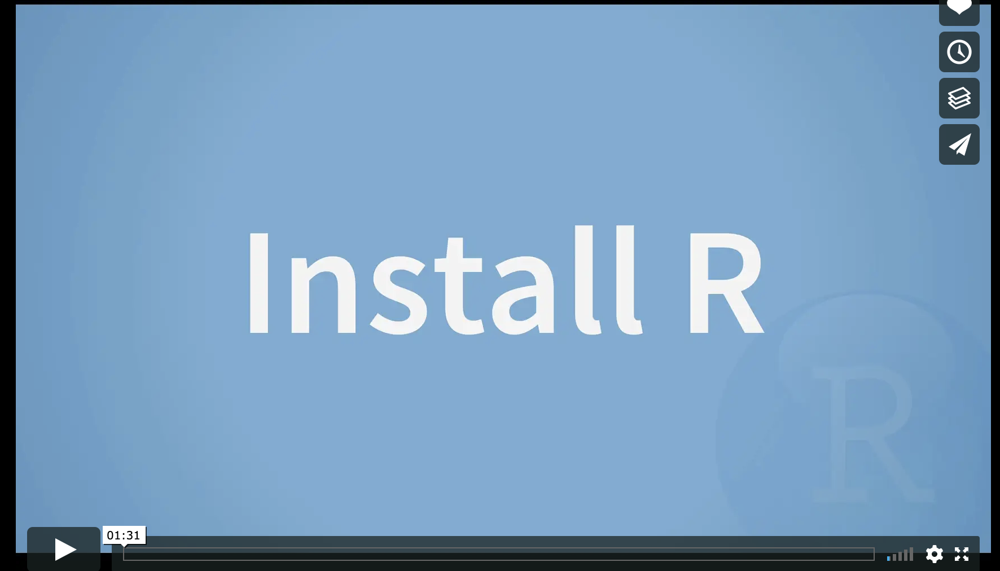](http://vimeo.com/203516510 "Installing R")

To install R-studio, follow this video:

[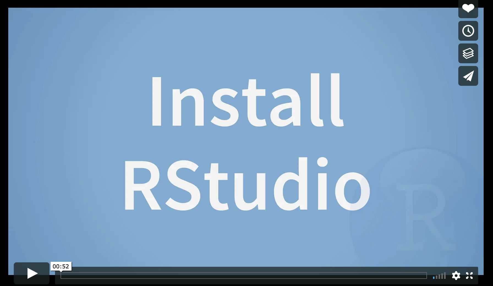](http://vimeo.com/203516968 "Installing R-Studio")


## Getting started

### Open R-studio

```{r, rrstudio, echo=FALSE, fig.cap = "Icons of the R program and R-studio"}
knitr::include_graphics('images/Fig_1_3RRStudio.png')
```

**Open R-studio** (NOT R!).  You should be greeted by three panels:

 - The interactive R console (entire left)
 - Environment/History (tabbed in upper right)
 - Files/Plots/Packages/Help/Viewer (tabbed in lower right)

If you click on the View/Panes/Pane Layout menu item, you can move these around.  I tend to like the console to be top left and scripts to be top right, with the plots and environment on the bottom - but this is totally personal choice. 
 
```{r, basicStudio, echo=FALSE, fig.cap = "The basic R-studio screen when you log on"}
knitr::include_graphics('images/Fig_1_4RStudio.png')
```

If you wish to learn more about what these windows do, have a look at this resource, from the Pirates Guide to R: https://bookdown.org/ndphillips/YaRrr/the-four-rstudio-windows.html

**If you have used R before, you might see that there are variables and plots etc already loaded**.  It is always good to clear these before you start a new analysis.  To do this, click the little broom symbol in your environment tab.

### Change a few settings

R-studio wants to be helpful and will try to re-load exactly where you were in a project when you log back in.  This can get really confusing, so we are going to turn this off.

ON A MAC: Click on the R-studio menu button on the top left of the screen, then click Preferences. 

ON A PC: Click on Tools-> Global Options -> Preferences

Now:

 - UNCLICK "Restore most recently opened project at startup"
 - UNCLICK "Restore .RData into workspace at startup"
 - Set "Save workspace to .RData on" exit to Never

```{r, Options, echo=FALSE, fig.cap = "Change these 3 options, then press Apply and OK"}
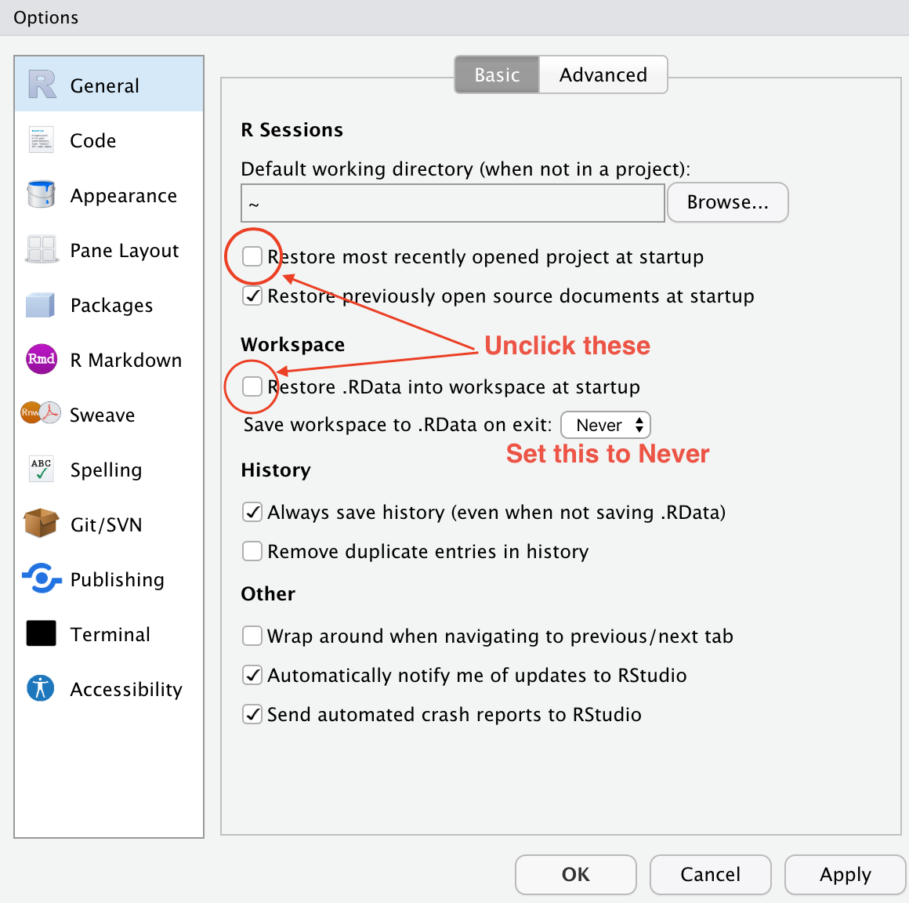
```


### Create an R-project {#project}

We are going to use R-projects to store our lab data in.  An R project is a place to store all your commands, data and output in the same place.  R will know that it is all linked.

This is  useful because say you have Lab-2 open, but want to re-open Lab-1 to check some code, clicking the "Lab 1 project file" will load a whole new version of R with everything you did for Lab 1.  

It is ***really*** important that you stay organised in this course, for example making sure you know where you put your data and your labs. You will return to them in your final project, so it pays to be organised now. 

**To encourage this, choose a place that makes sense on your computer, create a folder called GEOG364.You can either do this outside R studio in your file explorer, or inside the "Files tab" in R studio.  You should store all your 364 files inside this folder**

Now we will create our first project (also see the pic):  

 - open R-Studio and click `New Project`, 
 - then click "new directory" 
 - then "new project". 
 - Name your project Lab 1, then browse to your newly created GEOG364 folder and press open.
 - Press OK and your project is created.

```{r, project, echo=FALSE, fig.cap = "Instructions to create an R project"}
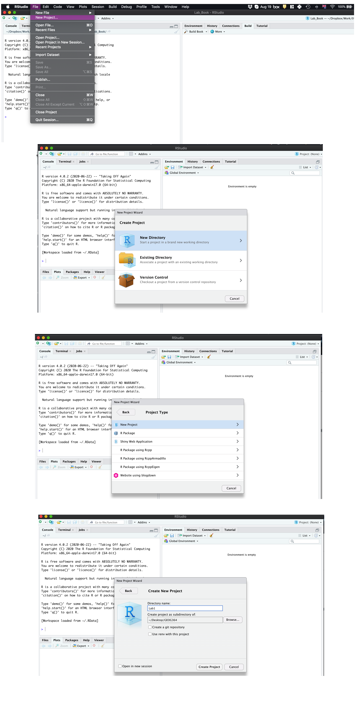
```

Your output should look something like this:

```{r, projectout, echo=FALSE, fig.cap = "Your screen after running the project"}
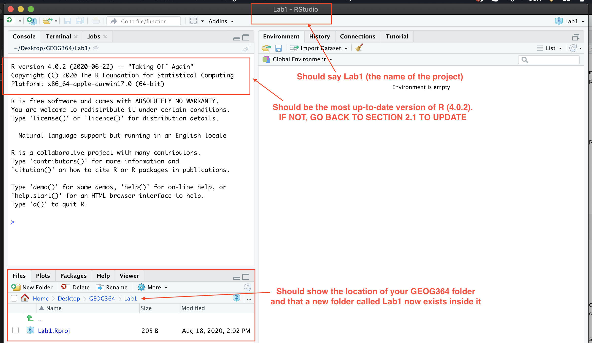
```

Equally, R should now be "looking" inside your Lab 1 folder, making it easier to find your data and output your results.  Try typing this into the console (INCLUDING THE PARANTHESES/BRACKETS) and see if it prints out the location of Lab 1. 

```{r, eval=FALSE}
getwd()
```


##### If you're having issues at this point or haven't managed to get to this step, STOP!  Ask Dr Greatrex, Saumya or Harman for help. {-}


## Lab challenge 1

Now you have opened your project, take a screenshot of your R-studio page. It should look like Figure \@ref(fig:projectout), e.g. with at least R version 4.0.2, with the Lab 1 project and the project stored in your GEOG-364 folder.

 - To take a screenshot on a mac, press Command-3.  The sreenshot will appear on your desktop
 - To take a screenshot on a PC, press Alt + PrtScn  

Rename the screenshot to your "username_Lab1_Fig1"(for example for me it will be hlg5155_Lab1_Fig1), then place it in your Lab 1 sub-folder inside GEOG-364.  This folder was created when you made the project

You will need this later, so don't skip this step.


## R coding basics

So now we FINALLY get to do some R-coding.

### Basic arithmatic

Remember that the aim of R is to type in commands to get R to analyse data.  

The console (see Figure \@ref(fig:basicStudio)) is a space where you can type in those commands and it will directly print out the answer.  You're essentially talking to the computer.  The little ">" symbol in the console means that the computer is waiting for your command.

The simplest thing we could do in R is do arithmetic.  Click on the console and try typing the following. Press enter and R will calculate the answer.

```{r}
1 + 100
```

It should look something like this:

```{r, maths, echo=FALSE, fig.cap = "Starting to enter commands in the console. I choose the sum 1+1"}
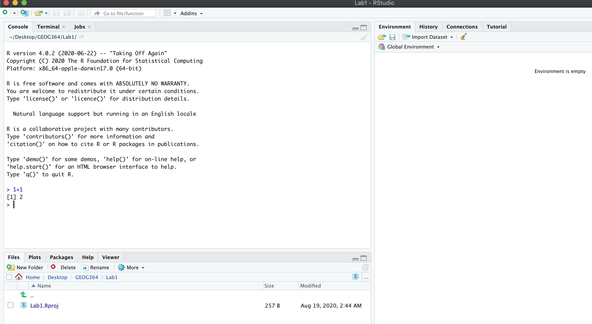
```

When using R as a calculator, the order of operations is the same as you would have learned back in school, so use brackets to force a different order.  For example, try typing in each of the the commands below (in grey)

```{r}
3 + 5 * 2
```

will give a different result to 

```{r}
(3 + 5) * 2
```

Really small or large numbers get a scientific notation:

```{r}
2/10000
```
The e is shorthand for “multiplied by $10^{X}$”. So 2e-4 is shorthand for $2\times10^{-4}$


##### What if I press Enter too soon? {-}

If you type in an incomplete command, R will wait for you to complete it.  For example, if you type
`1 +` and press enter, R will know that you need to complete the command  So it will move onto the next line but the `>` will have changed into a `+`, which means its waiting for you to complete the command.  

**If you want to cancel a command you can simply hit the "Esc" key and R studio will reset.**

Pressing escape isn’t only useful for killing incomplete commands: you can also use it to tell R to stop running code (for example if it’s taking much longer than you expect), or to get rid of the code you’re currently writing.


### Comparing things

We can also do comparisons in R.  Here we are asking R whether 1 is equal to 1.

```{r}
# note two equals signs is read as "is equal to"
1 == 1  
```

```{r}
# inequality (read as "is not equal to")
1 != 2  
```

```{r}
# less than
3 < 2 
```

```{r}
# less than or equal to
1 <= 1  
```

```{r}
# greater than
1 > 0  
```

```{r}
# greater than or equal to
1 >= -9 
```


### Variables and assignment

It's great to be able to do maths easily on the screen, but really we want to be able to save our results, or load in data tables etc, so we can do more complex commands.   

In R, we can give things a name.  This is called a variable.  So then, instead of typing the whole command, we can simply type its name and R will recall the answer.

The way we store data into a variable is using the assignment arrow `<-`, which is made up of the left arrow and a dash.  You can also use the equals sign, but it can cause complications later on.  Try typing this command into the console.

```{r}
x <- 1/40
```

Notice that pressing enter did not print a value onto your screen as it did earlier. Instead, we stored it for later in something called a variable, with the name 'x'. 

So our variable `x` is now associated with the value 0.025, or 1/40.  You can print a variable on screen by typing its name, no quotes, or by using the print command.  Try printing out your variable.  You can do this in two ways, either by typing its name, or by using the print command.

```{r}
x
```

```{r}
print(x)
```

Look for the Environment tab in one of the panes of RStudio, and you will see that 'x' and its value have appeared. This 'x' variable can be used in place of a number in any calculation that expects a number. Try typing

```{r}
log(x)
```

Notice also that variables can be reassigned:

```{r}
x <- 100
print(x)
```

x used to contain the value 0.025 and and now it has the value 100.

*Note, the letter x isn't special in any way, it's just a variable name. You can replace it with any word you like as long as it contains no spaces and doesn't begin with a number*.  Different people use different conventions for long variable names, these include

 - periods.between.words.1
 - underscores_between_words
 - camelCaseToSeparateWords

What you use is up to you, but be consistent.

##### Combining variables {-}

You can now use multiple variables together in more complex commands. For example, try these commands:

```{r}
#Take the variable x, add 1 then save it to a new variable called y
y <- x + 1 
# print the multiple of 2yx onto the screen
y
```

Now you can see that there are two variables in your environment tab, x and y.  Where y is the sum of the contents of x plus 1. 

**The way R works is that first it looks for the commands on the right of the arrow.  It runs all of them, calculates the result, then saves that result with the name on the left of the arrow.

The right hand side of the assignment (right of the `<-`) can be any valid R command. The right hand side is fully evaluated before any assignment occurs.The variable only saves the result, not the command itself.

You can even use this to change your original variable .  Try typing the code below in a few times into the console and see what happens.

**A short cut to do this is to type the commands the first time, then use the up-arrow on your keyboard to cycle back through previous commands you have typed**

```{r}
x <- x + 1 #notice how RStudio updates its description of x on the top right tab
x # print the contents of "x" onto the screen
```

Our variables don't have to be numbers. They could refer to tables of data, or a spatial map, or any other complex things.  We will cover this more in future labs.


### Functions

The power of R lies in its many thousands of built in commands, or *functions*. In fact, we have already come across one - the print command.  Some more examples include:

 - `plot(x=1:10,y=1:10)` 
    + This will plot the numbers 1 to 10 against 1 to 10
 - `x <- nchar("hello")` 
    + This will count the number of letters in the word "hello" (e.g. 5), then save it as a variable called x

Watch this short video to learn three important facts about functions:


[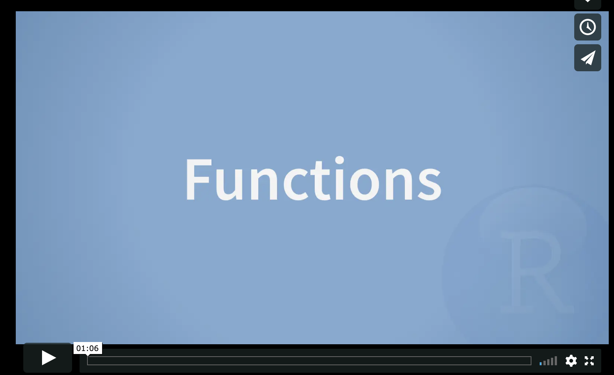](http://vimeo.com/220490105 "Installing R-Studio")

The `file.choose()` command will let you interactively select a file and print the address out onto the screen. Try each of these out in your console for the file.choose() command:
```{r, eval=FALSE}
# Typing this into the console will print out the underlying code
file.choose 

# Typing it WITH parentheses will run the command
file.choose()

# Typing a ? in front will open the help file for that command
?file.choose
```


**The round brackets/parentheses after the name ( ), mean that it is a command.**

Sometimes we need to give the command some additional information.  Anything we wish to tell the command should be included inside the inside the parentheses (separated by commas).  The command will literally only know about the stuff inside the parentheses.

```{r}
sin(1) # trigonometry functions.  Apply the sine function to the number 1. 
```

```{r}
log(10) # natural logarithm.  Take the natural logarithm of the number 10. 
```

This following command will plot the number 1 to 10 against the numbers 12 to 20, along with some axis labels.  When you run this, the plot will show up in the plots tab.  

```{r}
plot(1:10,11:20,col="dark blue", xlab="x values",ylab="GEOG-364 is the best") 
# plot the numbers 1 to 10 against the numbers 11 to 20
```

#### Command help

As mentioned above, typing a ? before the name of a command or function will open the help page for that command in the "environment" box on your screen.  As well as providing a detailed description of the command and how it works, scrolling to the bottom of the help page will usually show a worked example of the code which you can copy into the console.  You can then copy these line by line into the console to understand what is happening. 


```{r, eval=FALSE}
## This provides the help page for file.choose.
?file.choose   
```

```{r, help, echo=FALSE, fig.cap = "What you should see after typing ?file.choose"}
knitr::include_graphics('images/Fig_1_7Help.png')
```

### Packages

There are now several million commands/functions available for you to use in R.  To make sure your computer doesn't get overwhelmed, it doesn't load all of these at once. In fact many need to be downloaded from the internet. 

A close analogy is your phone.  There are several million things you can do on your phone, which are collated into bundles called apps.   To use the features in an app, you need to click on the icon of the app to load it.  Equally you need to download many apps from the internet to start with. 

So we have 

 - R: The programming language itself
 - Functions: Which are specific commands or actions written in the R language
 - Packages: Commands are grouped into bundles called packages, which we need to load every time.

This mini video and tutorial also explains things clearly. Click on the link, work thorugh it and we will install our own packages in the next lab.

[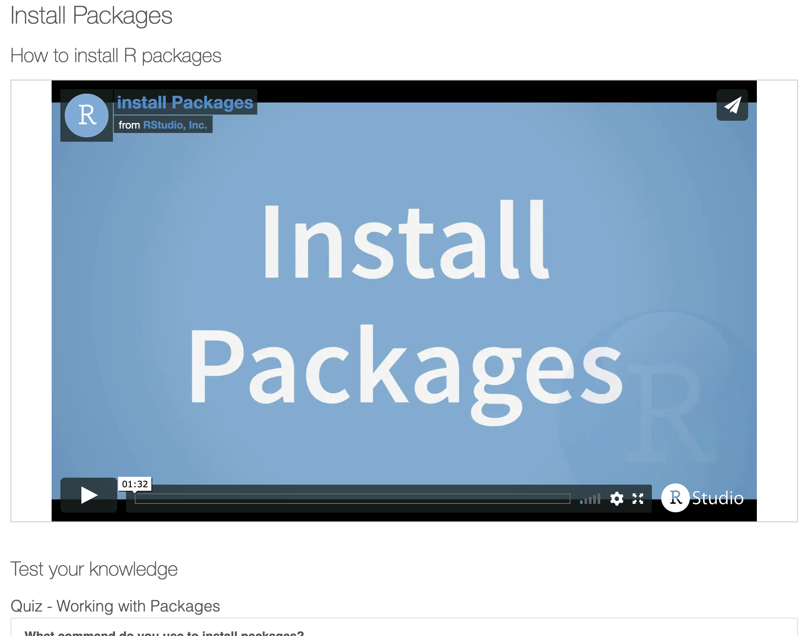](https://learnr-examples.shinyapps.io/ex-setup-r/#section-install-packages "Installing packages")

### Coding help

Don’t worry about trying to remember every function in R.  In this course, you will be provided with most of the functions you need, but you can also simply look up what you need on Google.  

This cartoon from XKCD is a pretty normal way to think about programming!  One of the most important skills you can learn as a programmer is how to effectively google the information you need...

```{r, xkcd, echo=FALSE, fig.cap = "https://xkcd.com/627/"}
knitr::include_graphics('images/Fig_1_6XKCD.png')
```

## Lab Challenge 2

Now we are going to download some packages from the internet and install them.  You must be connected to the internet to make this happen!  In the console, type the following commands, or click the "Install" button in the packages tab (next to plots) and find the package name. If it asks if you want to install dependencies, say yes.

```{r, eval=FALSE}

install.packages("knitr")
install.packages("rmarkdown")
install.packages("tidyverse")

```

You will see a load of red text appear in the console as it tells you its very detailed status of how it's downloading and installing.  Don't panic!  It might also take several minutes to do this, longer on a bad internet connection.

When you have typed all three commands and waited until they have finished running (remember, when it is done, you should see the little ">" symbol in the console waiting for your next command), we want to check if they have installed successfully onto your computer.

To do this we are going to load them using the library command:
```{r, eval=FALSE}

library("knitr")
library("rmarkdown")
library("tidyverse")

```

If you have managed to install them successfully, often nothing happens - this is great!  It means it loaded the package without errors.

Sometimes, it will tell you friendly messages.  For example, this is what shows up when you install the tidyverse package.  It is telling you the sub-packages that it downloaded and also that some commands, like filter - now have a different meaning.  E.g. originally the filter command did one thing, but now the tidyverse package has made filter do something else.

```{r, tidyverse, echo=FALSE, fig.cap = "Tidyverse install messages"}
knitr::include_graphics('images/Fig_1_15Tidyverse.png')
```

To find out if what you are seeing is a friendly message or an error, run the command again.  If you run it a second time, then nothing should happen.

!  **IMPORTANT**  If you see some red errors here after mulitple attempts running the commands, we will have to fix what your computer is doing together.  If you see errors, then take a screenshot of the full page and talk to a TA or Dr Greatrex, or post on piazza under the Lab 1 tab.


## Create a R-Markdown document

### What is markdown?

So far, we've been typing commands into the console, but these will all be lost once you close R. Equally, it's hard to remember or reproduce the analysis you have done . So we will now move onto writing code commands that you can save and submit.

There are several types of document that you can create and save in R-Studio.

 - A basic script (the filetype is .r).  This is simply just a blank document where you can save code commands (a script is shown in (Figure \@ref(fig:Rscreenshot))).  When you "run" the commands in the script, R simply copy/pastes the commands over to the console.
 
 - An R-Notebook or Markdown document (the filetype is .Rmd).  These are documents you can use to write a report with normal text/pictures, but and also include both your R code and output. You can turn these into reports, websites, blogs, presentations or applications. For example these instructions are created using a markdown document.    
 
In this course we are going to focus on the R-Notebook format.  Watch this 1 min video covers markdown files and leads to a comprehensive guide on how to create them. Markdown and Notebook files are almost identical, so I will use the terms interchangeably for now.

[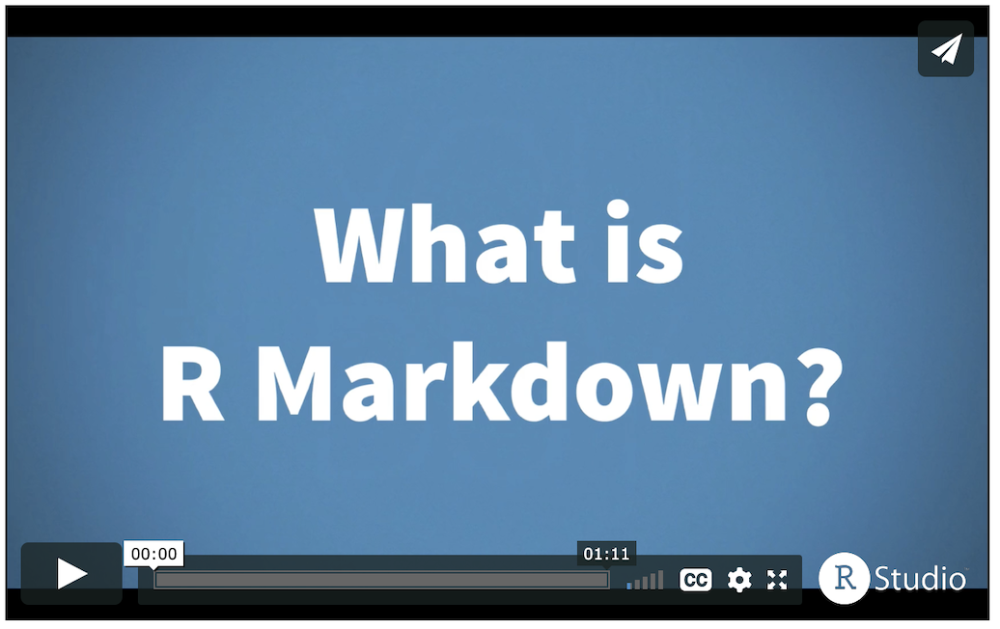](https://rmarkdown.rstudio.com/lesson-1.html "1 min Markdown Tutorial"){target="_blank"}


### Creating a notebook document

Time to make your own. Go to the File menu on the top left, then click New File - Notebook.  A file should appear on your screen - your first notebook script.  Essentially, we have some space for text, some space for code, and a space at the top of the file where we can add information about themes/styles etc.  


```{r, markdown, echo=FALSE, fig.cap = "You should see TWO new files appear in your lab 1 folder"}
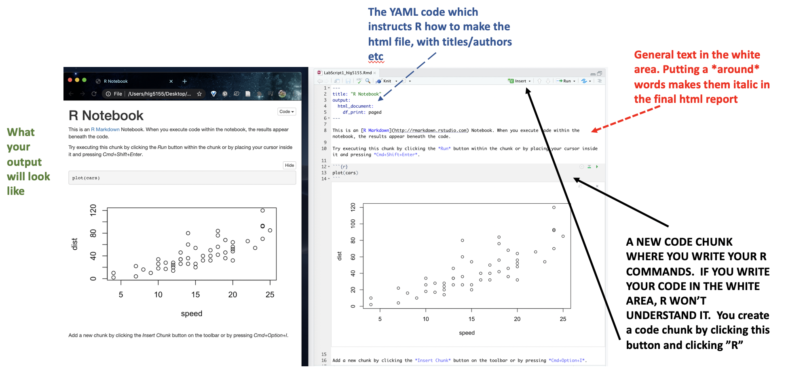
```

If you click on the little right triangle arrow at the top-right of the code chunk, you can run the plot command, and a picture will appear, running the code.  Note, it no longer runs in the console. You can still copy things into the console, by clicking on the line you want to run and pressing Ctrl-Enter / command-Enter.

Let's try this.  On line 11, delete `plot(cars)` and type `1+1`.  Now press the green arrow and the answer should appear directly under your code chunk.  

Now click at the end of the script, around line 20 and press the green insert button (top right in the script menu icons).  Insert a new R code chunk.  Inside, type `1+2` and run it.  So you can see that you can have text/pictures/videos etc, and code chunks interspersed throughout it.

Finally, click on the script then press the save button. Save it as GEOG364_Lab1_PSU.ID   e.g. GEOG364_Lab1_hlg5155

You will see two files appear in your files tab, and your Lab_1 folder. Click on the LabScript1_abc9999.nb.html file then it will open in your file browser - you should see your code output and your formatted text. You have made your first R-html output - congrats!  

**IMPORTANTLY - If you don't "run" each code chunk by clicking the arrow, or clicking the run-all button in the top right, then that code won't run in your final html output that we grade.  If that is the case we can't see if the code works and cannot award you the marks!  SO - get in the habit of pressing "run-all" before you submit your final html file**

```{r, rmdtwo, echo=FALSE, fig.cap = "You should see TWO new files appear in your lab 1 folder"}
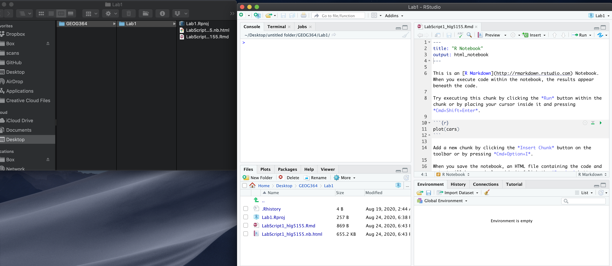
```


### Text formatting (in the white area) {#Format}

If you want to make bold/italic/underline text formatting, or to create section headings in your text, you need a few more commands.  Remember, this is for the text in your final report in the white area - only R commands go in each code chunk!

You need to press enter twice to start a new paragraph.

As another example, if you type 
`*TEXT*`, you will see *TEXT*

On a new line if you type

`# this is a new section header`, then R will interpret that as a new chapter or section header and change the font accordingly. Here is what this text looks like in my script:

```{r, format, echo=FALSE, fig.cap = "My writing"}
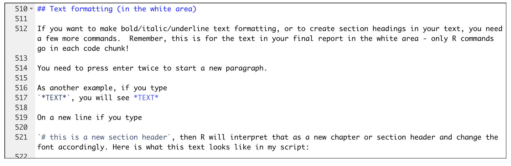
```

The easiest way to learn these is to click the Help/Markdown Quick Reference Menu, which will bring up a cheat-sheet with all the formatting.  Although this feels like a pain, it's actually useful because it makes it very easy for R to change the formatting depending on what output format you need.


```{r, cheat, echo=FALSE, fig.cap = "Bringing up the formatting cheatsheet"}
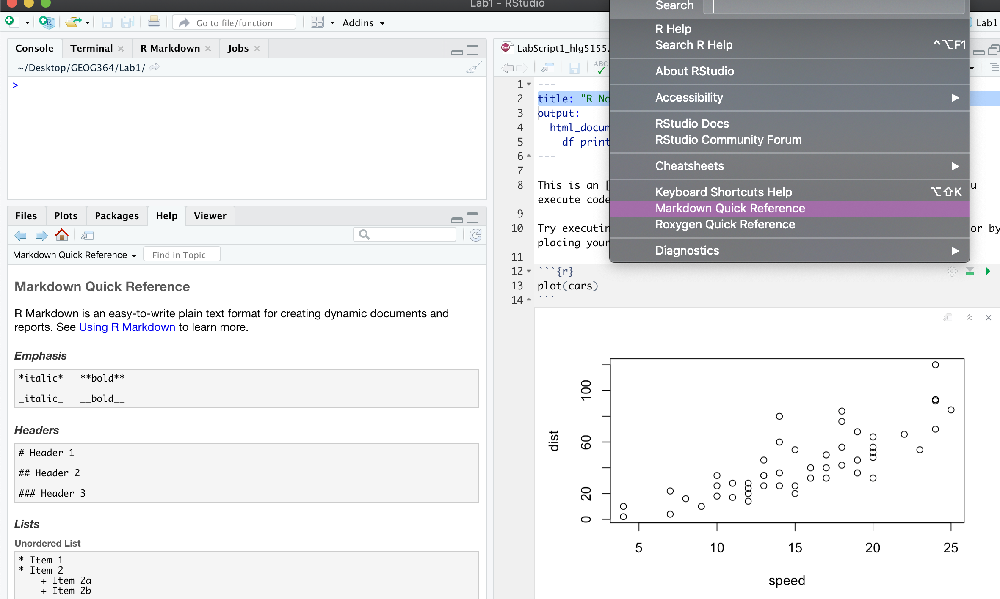
```
**THERE IS ALSO A SPELL-CHECKER NEXT TO THE SAVE BUTTON - REMEMBER TO USE IT!**


## "Friendly text" {#friend}

Much of what you see on your screen when you open a notebook document is simply a friendly introduction to RStudio.

So your notebook file is essentially a Word document with the ability to add in "mini R-consoles", AKA your code chunks.  Imagine every time you opened a new word document, it included some "friendly text" (*"hi, this is a word document, this is how you do bold text, this is how you save"*). This is great the first time you ever use Word, but kind of a pain after that.   

RStudio actually does this.  Every time you open a notebook file, you actually *do* get this friendly text, explaining how to use a notebook file.  Read it, make sure you understand what it is telling you, then delete all of it. So delete from line 6 to the end.  The stuff left over is your YAML code which tells R how to create the final html file. DON'T TOUCH THAT.

```{r, friendly, echo=FALSE, fig.cap = "You should see TWO new files appear in your lab 1 folder"}
knitr::include_graphics('images/Fig_1_16Friendlytext.png')
```


## Lab Challenge 3

Your final challenge.

1. Delete all the "friendly text" in your script - you should be just left with your YAML code and a blank file (see previous section)


2. Create a new level-1 section header called "R-Basics", then press enter a few times (or your header will not work).  See the formatting help if you are not sure how.

```{r, space, echo=FALSE, fig.cap = "Remember to add a blank line BEFORE AND AFTER your headings"}
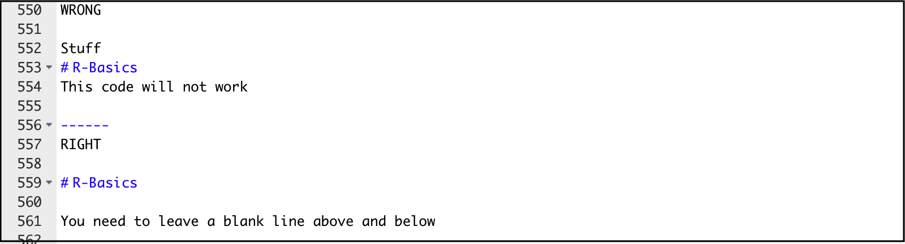
```

   + Now in the space below your header, add an interesting fact or something you learned about R.  Write part of your fact in bold text.
   
   + Below the text, add a code chunk and include some code of your choice that runs without an error. AT A MINIMUM, YOUR CODE CHUNK SHOULD INCLUDE
      + Applying a function to your data
      + Assigning the result to a variable
      + Using the print command to print that variable out
      
A common question is *"but what code should I write?"*. Surprise us!  If you're really new to all of this, you could choose something very similar to the simple exercises above, or if you are more experienced, you could stretch yourself with something more fun and complex (last year, someone made a llama plot..).  

The thing we are testing is that you understand how to create a code chunk and some basic code features.   

3. Below that code chunk, create a new heading called "Project Location"
   
   Remember the screenshot you took in Lab challenge 1?  We are going to add it in here.
   
   + First, lets find the file.  It should be easy as you should have put it in your Lab 1 folder.  R doesn't automatically know which folder to look in, so that file.choose() command can help us find it.
   
   + IN THE CONSOLE, type file.choose()  (including the empty parentheses). A window will pop up.  Find your screenshot then press OK.  You will see in the console the file address has been written down.
   
   + Now, go back to your script. Create a new code chunk and inside type the following, but replace FILEADDRESS with the full address that just appeared on your console (INCLUDING THE QUOTES). 
   
   + Now click run and the chunk should load your screenshot inside your R-script.  As described in Lab challenge 1, we are checking the version of R, that you have created the project and stored it in the right place.
   
   
```{r, eval=FALSE}
# Load the knitr library
library(knitr)
#Add your screenshot
knitr::include_graphics("FILEADDRESS")
```
   
```{r, pic, echo=FALSE, fig.cap = "How your code should look but with your own picture and address"}
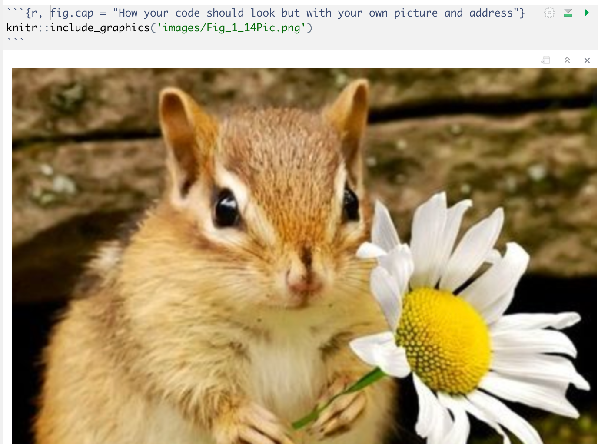
```
     
*Pictures are a little weird in R, which is why we're taking our time with this lab.  If your picture does not show up in the final nb.html:*

   + *Did you run the code chunk in the R-script so that it showed up just below the code chunk? (not in the plots tab) If not, run the code chunk then save again*
   
   + *You can "knit" the file by clicking knit (near the save button), which will create a html rather than a nb.html.  This should include the picture.  You are 100% fine to submit the html instead of the nb.html*
  
   + *If it STILL doesn't work, click in the text oart (outside the code chunk), create a new line and try the command ``, where FILEADDRESS is the output of file.choose() in the console*
   
   
4. **CLICK RUN-ALL, then save your file.**
Go to your Lab 1 folder and click on the nb.html file.  This should now be a professional html file of your work.  If you have issues, try pressing the knit button and look at the html file (either are fine to submit) Go to Canvas, complete the Canvas course and submit.

Congratulations on making it through a long document.  The first time in a new programming language is always tough, so nice work for making it this far.

## Online courses and resources
 
If you want to practice the basics,then there are several places you can take free introductory tutorials - all of which I recommend.  These include:
 
   - https://bookdown.org/ndphillips/YaRrr/ The Pirate's Guide to R.
   - FREE linkedin learning for R (Penn State log-in required): https://www.linkedin.com/learning/learning-r-2/r-for-data-science?u=76811570
   - FREE (basic account) code academy - https://www.codecademy.com/courses/learn-r/lessons/introduction-to-r/
   - Data Camp: First chapter is free - https://www.datacamp.com/courses/free-introduction-to-r

**If you're completely lost - it's OK! This is pretty normal at this stage.  Talk to the instructors and we can point you in the direction of resources to make you feel more comfortable using R.**


